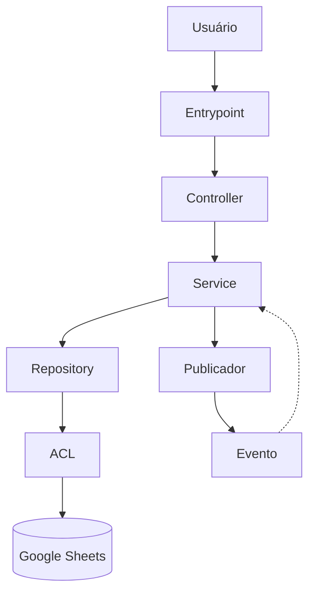

# DATA_FLOW.md

## Objetivo

Este documento descreve o fluxo de dados do sistema TEAR V2 a partir da implementação observada no código-fonte.

O objetivo não é descrever regras de negócio, mas registrar como os dados percorrem as camadas da aplicação, desde os pontos de entrada até sua persistência.

Todas as informações deste documento devem possuir evidência no código. Quando uma informação não puder ser comprovada, ela deverá ser explicitamente identificada como não observada.

---

# 1. Visão Geral

A implementação segue uma arquitetura em camadas.

O fluxo principal observado é:

```text
Entrypoint
        ↓
Controller
        ↓
Service
        ↓
Repository
        ↓
ACL
        ↓
Google Sheets
```

Cada camada possui responsabilidades distintas.

| Camada | Responsabilidade |
|---------|------------------|
| Entrypoint | Expõe funções públicas para a WebApp |
| Controller | Recebe chamadas externas e prepara dependências |
| Service | Executa regras de negócio |
| Repository | Manipula entidades persistidas |
| ACL | Traduz objetos para estrutura física da planilha |
| Google Sheets | Persistência definitiva dos dados |

---

# 2. Fluxo Geral

O fluxo normalmente observado no código é:

1. O usuário executa uma ação na interface.

2. A interface chama uma função pública exposta via Entrypoint.

3. O Entrypoint cria (ou resolve) as dependências necessárias.

4. O Controller delega a operação para um Service.

5. O Service executa validações e regras de negócio.

6. Quando necessário, o Service consulta ou altera dados utilizando um Repository.

7. O Repository utiliza uma ACL para acessar a estrutura física da planilha.

8. A ACL realiza operações utilizando a API do Google Sheets.

9. O resultado percorre o caminho inverso até retornar ao usuário.

---

# 3. Responsabilidades por Camada

## Entrypoint

Responsável por expor funções consumidas pelo Portal.

Não contém regras de negócio.

---

## Controller

Responsável por iniciar o fluxo da operação.

Sua principal responsabilidade é coordenar dependências.

---

## Service

Camada central da aplicação.

Concentra:

- regras de negócio;
- validações;
- criação de entidades;
- publicação de eventos;
- coordenação entre múltiplos repositórios.

---

## Repository

Responsável exclusivamente pelo acesso às entidades persistidas.

Operações normalmente encontradas:

- salvar()
- buscar()
- buscarPor...
- listar()
- remover()

Não deve conter regra de negócio.

---

## ACL

Responsável por converter objetos do domínio para a estrutura física utilizada na planilha.

Também encapsula nomes de abas, colunas e formatos utilizados pela persistência.

---

## Persistência

A persistência observada ocorre utilizando Google Sheets através das ACLs e Repositories.

---

# 4. Fluxo das Entidades de Domínio

## 4.1 Usuário

O fluxo de autenticação observado inicia no método `Usuario.entrar()`.

Fluxo identificado:

```text
Token Google
        ↓
ValidadorDeToken.validar()
        ↓
UsuarioRepository.buscarPorSub()
        ↓
Usuário encontrado?
        │
        ├── NÃO
        │      ↓
        │ buscarCandidataPorEmail()
        │      ↓
        │ CANDIDATA_VINCULACAO
        │ ou
        │ ONBOARDING_REQUERIDO
        │
        └── SIM
               ↓
        validar estado
               ↓
        registrarAcesso()
               ↓
        UsuarioRepository.salvar()
               ↓
        criar Sessao
               ↓
        SessaoRepository.salvar()
               ↓
        publicar UsuarioAutenticado
               ↓
        retornar AUTENTICADO
```

### Operações observadas

| Operação | Evidência |
|----------|-----------|
| Buscar usuário | `usuarioRepository.buscarPorSub()` |
| Atualizar último acesso | `usuario.registrarAcesso()` |
| Persistir usuário | `usuarioRepository.salvar()` |
| Criar sessão | `new Sessao()` |
| Persistir sessão | `sessaoRepository.salvar()` |
| Publicar evento | `publicador.publicar({ nome: 'UsuarioAutenticado' })` |

---

## 4.2 Sessão

A sessão é criada somente após autenticação bem-sucedida.

Fluxo observado:

```text
Usuario autenticado
        ↓
GeradorDeToken
        ↓
TokenDeSessao
        ↓
Sessao
        ↓
SessaoRepository.salvar()
```

### Operações observadas

| Operação | Evidência |
|----------|-----------|
| Gerar token | `geradorDeToken.gerar()` |
| Criar TokenDeSessao | `new TokenDeSessao()` |
| Criar Sessao | `new Sessao()` |
| Persistir Sessao | `sessaoRepository.salvar()` |

Nenhuma evidência de exclusão automática de sessão foi identificada no trecho analisado.

---

## 4.3 Parceira

Durante a autenticação a Parceira participa apenas como consulta.

Fluxo observado:

```text
email Google
        ↓
ParceiraACL.buscarCandidataPorEmail()
        ↓
Existe candidata?
        │
        ├── NÃO
        │      ↓
        │ Onboarding
        │
        └── SIM
               ↓
        confirmação de vinculação
```

### Operações observadas

| Operação | Evidência |
|----------|-----------|
| Buscar candidata por e-mail | `parceiraACL.buscarCandidataPorEmail()` |

Nenhuma operação de criação, alteração ou exclusão de Parceira foi observada no trecho analisado.

---

## 4.4 Vinculação

Após identificar uma candidata, o sistema exige confirmação explícita.

Fluxo observado:

```text
Token Google
        ↓
buscarCandidataPorEmail()
        ↓
comparar parceiroId
        ↓
confirmarVinculacao()
```

O código impede associação automática entre identidade Google e Parceira.

A confirmação depende da reapresentação do `parceiraId`, conforme observado no método `confirmarVinculacao()`.

---

# 5. Persistência Observada

As operações de persistência identificadas concentram-se em Repositories.

Operações observadas:

- buscarPorSub()
- salvar()

Também foram identificadas consultas realizadas através de ACLs:

- buscarCandidataPorEmail()

Não foram observadas chamadas diretas ao Google Sheets dentro do fluxo de autenticação apresentado, indicando que a persistência está encapsulada pelos Repositories e ACLs.

---

# 6. Fluxos Transversais

Além do fluxo específico de autenticação, foram identificados padrões recorrentes na arquitetura.

## Publicação de Eventos

Os Services podem publicar eventos após a conclusão de operações relevantes.

Evidência observada:

```javascript
publicador.publicar(...)
```

Evento identificado durante a análise:

- `UsuarioAutenticado`

Não foi possível determinar, apenas com as evidências analisadas, quais outros eventos são publicados pelo sistema.

---

## Persistência

A persistência ocorre por meio da seguinte cadeia de responsabilidade:

```text
Service
    ↓
Repository
    ↓
ACL
    ↓
Google Sheets
```

O acesso direto à planilha não foi observado dentro das regras de negócio analisadas.

---

## Repositories

Os Repositories concentram operações de leitura e escrita.

Operações identificadas durante a coleta:

- salvar()
- buscarPorSub()

Outras operações encontradas na coleta (`buscar`, `listar`, `obter`, etc.) dependem do Repository analisado e devem ser documentadas individualmente quando houver evidência direta.

---

## ACLs

As ACLs atuam como camada de isolamento entre o domínio e a estrutura física da planilha.

Foi observada a utilização de métodos específicos de consulta, como:

- `buscarCandidataPorEmail()`

A estrutura interna das ACLs não foi analisada neste documento.

---

# 7. Limitações da Engenharia Reversa

Este documento foi produzido exclusivamente a partir das evidências disponíveis no código analisado.

Não foram documentados:

- regras de negócio não observadas;
- fluxos administrativos não analisados;
- estrutura física completa das planilhas;
- implementação interna de todos os Repositories;
- implementação interna de todas as ACLs;
- fluxos completos de Briefing, Entrega, Pagamento, Envio e Documento.

Esses tópicos deverão ser detalhados em documentos específicos.

---

# 8. Diagrama Geral



---

# 9. Conclusões

A análise permitiu confirmar que o sistema segue uma arquitetura em camadas, separando responsabilidades entre Entrypoints, Controllers, Services, Repositories e ACLs.

O fluxo de autenticação é o trecho mais completamente evidenciado, permitindo identificar a criação e persistência de Sessões, atualização de Usuários e publicação de eventos.

Os demais domínios (Briefing, Entrega, Pagamento, Envio e Documento) apresentam evidências de existência, porém exigem uma análise específica para documentar integralmente seus fluxos de dados.

Este documento deve ser considerado uma fotografia fiel das evidências coletadas durante a engenharia reversa, não uma especificação funcional do sistema.