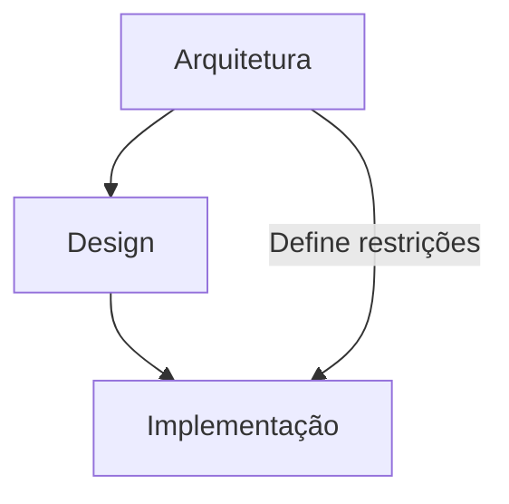

# REF-005 — Arquitetura de Software

> Documento de Referência Arquitetural  
> Versão: 0.1.0 (Em desenvolvimento)

---

# Status

| Campo | Valor |
|-------|-------|
| Documento | REF-005 |
| Nome | Arquitetura de Software |
| Tipo | Documento de Referência |
| Status | Em desenvolvimento |
| Escopo | Arquitetura de software moderna, neutra e independente de tecnologia |
| Público-alvo | Arquitetos de Software, Tech Leads, Desenvolvedores, Revisores de ADR, Product Engineers |
| Responsável | Projeto TEAR |
| Última atualização | YYYY-MM-DD |

---

# Objetivo

Este documento estabelece os princípios, conceitos, padrões e práticas arquiteturais adotados como referência pelo Projeto TEAR.

Diferentemente de uma especificação técnica (SPEC), de um registro de decisão arquitetural (ADR) ou de um documento de requisitos (PRD), este documento não descreve uma implementação específica.

Seu propósito é consolidar conhecimentos arquiteturais amplamente aceitos pela indústria, servindo como fonte normativa para decisões de projeto, revisão técnica e evolução da arquitetura.

Os conceitos aqui apresentados são deliberadamente neutros em relação a linguagem de programação, framework, banco de dados, fornecedor de nuvem ou plataforma de execução.

---

# Escopo

Este documento aborda:

- Fundamentos da arquitetura de software;
- Princípios de engenharia de software;
- Modularidade e fronteiras;
- Topologias arquiteturais;
- Estilos arquiteturais;
- Domain-Driven Design (DDD);
- Padrões Enterprise;
- Comunicação entre sistemas;
- Persistência;
- Preocupações transversais (Cross-cutting Concerns);
- Evolução arquitetural;
- Anti-patterns.

---

# Fora do Escopo

Este documento não aborda:

- regras de negócio do Projeto TEAR;
- requisitos funcionais;
- especificações de funcionalidades;
- decisões arquiteturais específicas do projeto;
- implementação de APIs;
- frameworks específicos;
- tutoriais de programação;
- documentação operacional.

Esses assuntos pertencem, respectivamente, aos documentos PRD, ADR, SPEC e Runbooks.

---

# Como utilizar este documento

Este documento foi concebido como uma referência arquitetural permanente.

Sua leitura não precisa ser linear.

Os capítulos podem ser consultados individualmente, desde que seus pré-requisitos tenham sido compreendidos.

Sempre que um conceito depender de outro capítulo, uma referência cruzada será apresentada.

Exemplo:

> Ver Capítulo 6 — Domain-Driven Design.

---

# Relação com os demais documentos

| Documento | Finalidade |
|------------|------------|
| PRD | Define o problema e os objetivos do produto. |
| REF | Define conceitos, princípios e padrões permanentes. |
| ADR | Registra decisões arquiteturais específicas. |
| RFC | Propõe mudanças ainda em discussão. |
| SPEC | Especifica como uma funcionalidade será construída. |
| Runbook | Descreve procedimentos operacionais. |

---

# Convenções utilizadas

Ao longo deste documento serão utilizadas as seguintes convenções:

| Convenção | Significado |
|-----------|-------------|
| **Importante** | Informação obrigatória para compreensão do tema. |
| **Boa prática** | Recomendação amplamente aceita. |
| **Atenção** | Situações que exigem cuidado. |
| **Trade-off** | Benefícios e custos de uma decisão arquitetural. |
| **Anti-pattern** | Solução recorrente que tende a gerar problemas. |

---

# Referências Normativas

Este documento baseia-se principalmente nas seguintes obras:

- Eric Evans — *Domain-Driven Design*
- Vaughn Vernon — *Implementing Domain-Driven Design*
- Martin Fowler — *Patterns of Enterprise Application Architecture*
- Robert C. Martin — *Clean Architecture*
- Alistair Cockburn — *Hexagonal Architecture*
- Mark Richards & Neal Ford — *Fundamentals of Software Architecture*
- Len Bass, Paul Clements e Rick Kazman — *Software Architecture in Practice*
- Greg Young — CQRS e Event Sourcing
- Michael Nygard — *Release It!*
- Martin Kleppmann — *Designing Data-Intensive Applications*
- Simon Brown — *C4 Model*

---

# Estrutura do Documento

1. Fundamentos da Arquitetura de Software
2. Princípios de Engenharia de Software
3. Modularidade, Fronteiras e Componentização
4. Topologias Arquiteturais
5. Estilos Arquiteturais
6. Domain-Driven Design
7. Padrões Enterprise
8. Comunicação e Integração
9. Persistência e Consistência
10. Cross-Cutting Concerns
11. Documentação da Arquitetura
12. Evolução Arquitetural
13. Anti-patterns

---

# Controle de Versões

| Versão | Data | Alterações |
|---------|------|------------|
| 0.1.0 | YYYY-MM-DD | Criação da estrutura inicial do documento. |

# Capítulo 1 — Fundamentos da Arquitetura de Software

> **Objetivo do capítulo**
>
> Estabelecer os conceitos fundamentais da arquitetura de software, definir seu papel dentro da engenharia de software moderna e apresentar os princípios que justificam sua existência antes da discussão de qualquer padrão, tecnologia ou estilo arquitetural.

---

## Introdução

A arquitetura de software é uma das disciplinas mais importantes da engenharia de software moderna. Embora frequentemente associada apenas à organização de componentes ou à escolha de tecnologias, seu propósito é muito mais amplo: orientar a construção de sistemas capazes de evoluir ao longo do tempo sem comprometer sua qualidade, confiabilidade e sustentabilidade.

Todo sistema de software possui uma arquitetura, independentemente de ela ter sido planejada ou não. A diferença entre uma arquitetura intencional e uma arquitetura acidental está na qualidade das decisões tomadas durante sua concepção e evolução.

Uma arquitetura bem definida não garante, por si só, o sucesso de um projeto. Entretanto, uma arquitetura inadequada tende a impor limitações que se tornam progressivamente mais caras de corrigir à medida que o sistema cresce.

Nesse contexto, arquitetura não deve ser entendida como um documento estático produzido no início de um projeto, mas como um conjunto contínuo de decisões estruturais que orientam a evolução do software durante todo o seu ciclo de vida.

Ao longo deste documento, arquitetura será tratada como uma disciplina de engenharia, baseada em princípios, padrões e compromissos (trade-offs), e não como um conjunto de tecnologias específicas.

---

## Objetivos de Aprendizagem

Ao concluir este capítulo, o leitor deverá ser capaz de:

- compreender o papel da arquitetura dentro da engenharia de software;
- diferenciar arquitetura, design e implementação;
- compreender o conceito de atributos de qualidade;
- identificar requisitos arquiteturalmente significativos;
- entender que toda decisão arquitetural envolve trade-offs;
- compreender a responsabilidade do arquiteto de software na evolução de um sistema.

---

## Estrutura do Capítulo

Este capítulo está organizado nas seguintes seções:

1. O que é Arquitetura de Software
2. Arquitetura, Design e Implementação
3. Atributos de Qualidade
4. Requisitos Arquiteturalmente Significativos
5. Trade-offs Arquiteturais
6. O Papel do Arquiteto de Software

Cada seção estabelece conceitos que serão utilizados pelos capítulos seguintes deste documento.

---

# 1.1 O que é Arquitetura de Software

Uma definição amplamente aceita é apresentada por Bass, Clements e Kazman em *Software Architecture in Practice*:

> "A arquitetura de software de um programa ou sistema computacional é a estrutura ou estruturas do sistema, compostas por seus elementos de software, pelas propriedades visíveis externamente desses elementos e pelos relacionamentos entre eles."

Essa definição destaca três aspectos fundamentais.

Primeiro, arquitetura trata da **estrutura** do sistema. Ela descreve como os diferentes elementos são organizados e como colaboram para atender aos objetivos do software.

Segundo, arquitetura descreve apenas as propriedades que são relevantes para outros componentes. Detalhes internos de implementação pertencem ao domínio do design e da codificação.

Terceiro, arquitetura define os relacionamentos entre os componentes. Em sistemas complexos, compreender como os elementos interagem é frequentemente mais importante do que compreender cada componente isoladamente.

Martin Fowler complementa essa visão ao definir arquitetura como:

> "As decisões importantes, aquelas difíceis de serem alteradas posteriormente."

Essa definição desloca o foco da estrutura para a tomada de decisão. Sob essa perspectiva, arquitetura não é apenas um desenho do sistema, mas o conjunto de escolhas estruturais que possuem elevado custo de mudança.

Mark Richards e Neal Ford ampliam esse entendimento ao afirmar que arquitetura consiste na gestão contínua dos atributos de qualidade e dos trade-offs envolvidos na evolução do software.

Assim, neste documento, adotaremos a seguinte definição normativa:

> **Arquitetura de software é o conjunto de decisões estruturais que definem a organização de um sistema, orientam sua evolução e influenciam diretamente seus atributos de qualidade.**

Essa definição será utilizada como referência para todos os capítulos subsequentes.

---

### Características de uma decisão arquitetural

Uma decisão pode ser considerada arquitetural quando possui uma ou mais das seguintes características:

- influencia múltiplos componentes do sistema;
- possui alto custo de alteração;
- afeta atributos de qualidade;
- estabelece restrições para futuras decisões;
- produz impacto significativo sobre manutenção ou evolução.

Escolhas locais, como a implementação de um algoritmo específico ou a nomenclatura de uma classe, normalmente pertencem ao domínio do design, e não da arquitetura.

Por outro lado, decisões como a adoção de uma arquitetura hexagonal, a separação em microsserviços ou a utilização de mensageria assíncrona possuem impacto sistêmico e, portanto, são consideradas decisões arquiteturais.

---

### Arquitetura como disciplina contínua

Historicamente, arquitetura era tratada como uma atividade realizada exclusivamente no início do projeto.

Essa visão mostrou-se insuficiente diante da evolução contínua dos sistemas modernos.

Hoje entende-se que arquitetura é um processo permanente de tomada de decisões, revisão de hipóteses e adaptação às mudanças de contexto.

Em outras palavras, arquitetura não é um artefato produzido uma única vez; é uma disciplina que acompanha todo o ciclo de vida do software.

Essa perspectiva fundamentará os capítulos posteriores dedicados à governança arquitetural, documentação e evolução da arquitetura.

## 1.2 Arquitetura, Design e Implementação

Uma das principais causas de discussões improdutivas em projetos de software é a falta de distinção entre arquitetura, design e implementação. Embora esses conceitos estejam intimamente relacionados, eles operam em níveis diferentes de abstração e respondem a perguntas distintas.

Compreender essas diferenças é fundamental para delimitar responsabilidades, facilitar a comunicação entre equipes e garantir que decisões sejam tomadas no nível apropriado.

---

### Arquitetura

A arquitetura preocupa-se com a organização global do sistema.

Seu objetivo é definir as estruturas fundamentais, estabelecer limites entre componentes, orientar a comunicação entre partes do sistema e proteger atributos de qualidade como escalabilidade, segurança, disponibilidade e manutenibilidade.

Questões arquiteturais normalmente respondem perguntas como:

- Como o sistema será dividido?
- Quais responsabilidades pertencem a cada camada?
- Como os módulos se comunicam?
- Como garantir escalabilidade?
- Como minimizar o acoplamento?
- Como o sistema poderá evoluir ao longo do tempo?

As decisões arquiteturais possuem alto impacto e elevado custo de alteração. Por esse motivo, costumam ser registradas em documentos como ADRs (Architecture Decision Records).

---

### Design

O design de software atua em um nível intermediário entre arquitetura e implementação.

Seu objetivo é transformar as diretrizes arquiteturais em soluções concretas para problemas específicos dentro do sistema.

Enquanto a arquitetura define *o que deve existir*, o design define *como cada parte será construída*.

Questões típicas de design incluem:

- Como modelar uma entidade?
- Como dividir responsabilidades entre classes?
- Como implementar um fluxo de autenticação?
- Como encapsular regras de negócio?
- Qual padrão de projeto utilizar?

Nesse nível surgem conceitos como:

- Design Patterns (GoF);
- Domain Model;
- Repository Pattern;
- Factory;
- Strategy;
- Builder;
- Adapter;
- Observer.

Essas decisões possuem impacto local e podem ser alteradas com menor custo do que decisões arquiteturais.

---

### Implementação

A implementação corresponde à materialização do design em código executável.

Ela envolve a escrita do software utilizando uma linguagem de programação, bibliotecas, frameworks e ferramentas específicas.

Nesse nível são tomadas decisões como:

- estrutura de arquivos;
- nomenclatura de variáveis;
- sintaxe utilizada;
- tratamento de exceções;
- consultas SQL;
- chamadas HTTP;
- otimizações locais.

Embora importantes, essas decisões normalmente possuem baixo impacto arquitetural e podem ser modificadas com relativa facilidade.

---

### Relação entre os níveis

Os três níveis são complementares e dependem uns dos outros.

A arquitetura estabelece as restrições e diretrizes gerais.

O design transforma essas diretrizes em soluções técnicas.

A implementação converte essas soluções em software executável.



---

### Comparação

| Aspecto | Arquitetura | Design | Implementação |
|----------|-------------|--------|---------------|
| Escopo | Sistema completo | Componentes e módulos | Código |
| Abstração | Alta | Média | Baixa |
| Impacto | Global | Local | Pontual |
| Custo de mudança | Alto | Médio | Baixo |
| Horizonte | Longo prazo | Médio prazo | Curto prazo |
| Principal preocupação | Estrutura | Solução | Execução |

---

### Exemplo

Considere o desenvolvimento de uma plataforma de comércio eletrônico.

#### Decisão arquitetural

Optar por uma arquitetura hexagonal organizada em módulos independentes.

Essa decisão influencia toda a estrutura do sistema e dificilmente poderá ser revertida sem grande esforço.

#### Decisão de design

Criar um agregado `Pedido` composto por entidades de Item e Pagamento, utilizando um Repository para persistência.

Essa decisão afeta apenas o domínio de pedidos.

#### Decisão de implementação

Escrever o Repository utilizando PostgreSQL e uma biblioteca específica de acesso a dados.

Caso a tecnologia de persistência seja substituída, a arquitetura e o design podem permanecer inalterados.

---

### Importante

Embora arquitetura, design e implementação sejam apresentados separadamente para fins didáticos, na prática eles formam um processo contínuo e iterativo.

Decisões tomadas durante a implementação frequentemente revelam limitações do design, que por sua vez podem motivar revisões arquiteturais.

Da mesma forma, mudanças na arquitetura costumam exigir adaptações tanto no design quanto na implementação.

Por esse motivo, arquiteturas modernas são tratadas como artefatos vivos, continuamente refinados ao longo da evolução do software.

---

### Boas práticas

- Tome decisões no nível de abstração adequado.
- Evite discutir detalhes de implementação durante definições arquiteturais.
- Registre decisões arquiteturais de longo prazo em ADRs.
- Mantenha o design alinhado às restrições impostas pela arquitetura.
- Permita que detalhes de implementação evoluam sem comprometer a estrutura do sistema.

---

### Relação com os próximos capítulos

Os conceitos apresentados nesta seção servirão como base para os capítulos seguintes.

No Capítulo 2 serão apresentados os princípios de engenharia que orientam boas decisões arquiteturais e de design.

No Capítulo 3 será discutida a organização estrutural dos sistemas por meio de módulos, fronteiras e componentes.

Esses conceitos serão utilizados posteriormente na análise de estilos arquiteturais, Domain-Driven Design e padrões de aplicação enterprise.

## 1.3 Atributos de Qualidade

Até este ponto, discutimos o que é arquitetura e como ela se diferencia do design e da implementação. Entretanto, ainda não respondemos à pergunta mais importante:

> **Por que decisões arquiteturais existem?**

A resposta está nos **atributos de qualidade**.

Enquanto os requisitos funcionais descrevem **o que** um sistema deve fazer, os atributos de qualidade descrevem **como** esse sistema deve se comportar durante sua operação.

Na prática, quase todas as decisões arquiteturais são motivadas pela necessidade de proteger ou otimizar um ou mais atributos de qualidade.

A escolha entre um monólito e uma arquitetura distribuída, por exemplo, raramente é uma decisão tecnológica. Ela normalmente decorre de prioridades relacionadas à escalabilidade, disponibilidade, desempenho, segurança ou facilidade de evolução.

Por esse motivo, compreender atributos de qualidade é um pré-requisito para compreender arquitetura de software.

---

### O que são atributos de qualidade?

Segundo a norma **ISO/IEC 25010**, atributos de qualidade representam características mensuráveis que determinam a qualidade de um sistema de software.

Eles descrevem propriedades não relacionadas diretamente às funcionalidades do sistema, mas que influenciam sua utilização, manutenção e evolução.

Diferentemente das funcionalidades, que normalmente podem ser verificadas como "implementadas" ou "não implementadas", atributos de qualidade existem em diferentes graus.

Por exemplo:

- um sistema pode ser mais ou menos escalável;
- pode ser mais ou menos seguro;
- pode ser mais ou menos manutenível.

Não existe um software "100% escalável" ou "100% seguro". Existem apenas soluções que atendem melhor ou pior aos objetivos do projeto.

---

## Principais atributos de qualidade

Embora diferentes referências apresentem listas ligeiramente distintas, este documento adotará como principais atributos arquiteturais:

### Disponibilidade (Availability)

Capacidade do sistema permanecer operacional quando necessário.

Um sistema altamente disponível continua oferecendo seus serviços mesmo diante de falhas parciais de infraestrutura, atualizações ou aumento de carga.

Exemplos de mecanismos que aumentam disponibilidade:

- redundância;
- balanceamento de carga;
- failover;
- replicação.

---

### Escalabilidade (Scalability)

Capacidade de atender ao crescimento da demanda sem degradação significativa do serviço.

Escalabilidade não significa apenas suportar mais usuários.

Também envolve crescimento de:

- volume de dados;
- processamento;
- requisições;
- integrações;
- eventos.

Existem diferentes estratégias de escalabilidade:

- vertical (Scale Up);
- horizontal (Scale Out);
- funcional (divisão em serviços ou módulos).

---

### Desempenho (Performance)

Capacidade do sistema responder rapidamente às solicitações recebidas.

Os principais indicadores costumam incluir:

- latência;
- throughput;
- tempo médio de resposta;
- utilização de recursos.

Otimizações de desempenho frequentemente exigem trade-offs com simplicidade, custo ou consistência.

---

### Segurança (Security)

Capacidade do sistema proteger informações, usuários e recursos contra acessos indevidos ou ações maliciosas.

Arquiteturalmente, segurança envolve aspectos como:

- autenticação;
- autorização;
- criptografia;
- isolamento;
- auditoria;
- defesa em profundidade.

Segurança não deve ser tratada como uma funcionalidade adicional, mas como uma característica transversal da arquitetura.

---

### Manutenibilidade (Maintainability)

Capacidade do software ser compreendido, corrigido e modificado com segurança.

Sistemas altamente acoplados tendem a apresentar baixa manutenibilidade.

Boas práticas como modularização, separação de responsabilidades e baixo acoplamento existem justamente para preservar esse atributo.

---

### Evolutibilidade (Evolvability)

Capacidade do sistema adaptar-se a mudanças futuras sem exigir reescritas extensivas.

Embora frequentemente confundida com manutenibilidade, evolutibilidade possui foco diferente.

Enquanto a manutenibilidade preocupa-se com modificar o software existente, a evolutibilidade preocupa-se com incorporar novas capacidades preservando a estabilidade da arquitetura.

Arquiteturas modernas priorizam evolutibilidade porque mudanças são inevitáveis durante o ciclo de vida do software.

---

### Confiabilidade (Reliability)

Capacidade do sistema produzir resultados corretos e consistentes durante seu funcionamento.

Confiabilidade está relacionada à previsibilidade do comportamento do software diante de diferentes condições operacionais.

---

### Testabilidade (Testability)

Capacidade da arquitetura facilitar a construção de testes automatizados.

Arquiteturas fortemente desacopladas normalmente apresentam maior facilidade para testes unitários, integração e testes de contrato.

---

## Relação entre atributos de qualidade e arquitetura

Uma arquitetura pode ser entendida como um conjunto de decisões destinadas a proteger determinados atributos de qualidade.

Por exemplo:

| Decisão arquitetural | Principal atributo protegido |
|----------------------|------------------------------|
| Arquitetura Hexagonal | Manutenibilidade |
| Cache distribuído | Desempenho |
| Replicação de banco | Disponibilidade |
| Microsserviços | Escalabilidade organizacional |
| Circuit Breaker | Resiliência |
| CQRS | Escalabilidade de leitura |
| Event Sourcing | Auditabilidade |

É importante observar que nenhuma dessas decisões melhora todos os atributos simultaneamente.

Cada escolha fortalece alguns aspectos enquanto introduz custos em outros.

---

## Conflitos entre atributos

Um dos princípios fundamentais da arquitetura é que atributos de qualidade frequentemente competem entre si.

Por exemplo:

- maior segurança normalmente aumenta a complexidade;
- maior disponibilidade pode elevar custos de infraestrutura;
- maior consistência pode reduzir desempenho;
- maior flexibilidade pode diminuir simplicidade.

Esses conflitos explicam por que arquitetura é uma disciplina baseada em decisões e não em regras absolutas.

Não existe arquitetura perfeita.

Existe apenas arquitetura adequada para determinado contexto.

---

## Importante

Um erro comum consiste em escolher padrões arquiteturais antes de identificar quais atributos de qualidade realmente são prioritários.

A arquitetura deve responder às necessidades do sistema, e não às tendências tecnológicas do momento.

Por esse motivo, todo processo de definição arquitetural deve começar pela identificação dos atributos de qualidade mais relevantes para o domínio do problema.

Nos próximos capítulos, cada padrão arquitetural será analisado sob essa perspectiva, evidenciando quais atributos procura proteger e quais trade-offs introduz.

## 1.4 Requisitos Arquiteturalmente Significativos (ASRs)

Nem todos os requisitos de um sistema possuem o mesmo impacto sobre sua arquitetura.

Embora centenas ou milhares de requisitos funcionais possam existir em um projeto, apenas um subconjunto deles influencia diretamente as decisões estruturais do sistema.

Esses requisitos são conhecidos como **Requisitos Arquiteturalmente Significativos** (*Architecturally Significant Requirements* — ASRs).

Sua identificação representa uma das primeiras responsabilidades durante a definição da arquitetura de um software.

---

### O que são ASRs?

Um Requisito Arquiteturalmente Significativo é qualquer requisito funcional ou não funcional cuja implementação exija decisões estruturais relevantes para o sistema.

Em outras palavras, um ASR possui potencial para modificar a arquitetura.

Enquanto um requisito comum pode impactar apenas um módulo ou uma funcionalidade específica, um ASR normalmente influencia diversos componentes simultaneamente.

Por esse motivo, eles devem ser identificados antes da escolha de estilos arquiteturais, padrões de integração ou estratégias de persistência.

---

### Requisitos funcionais versus ASRs

É importante compreender que um ASR não precisa ser necessariamente um requisito não funcional.

Determinados requisitos funcionais também possuem impacto arquitetural.

Considere os exemplos abaixo.

#### Requisito funcional comum

> "O sistema deverá permitir que usuários alterem sua senha."

Esse requisito pode ser implementado sem modificar significativamente a arquitetura.

---

#### Requisito arquiteturalmente significativo

> "O sistema deverá processar até um milhão de transações por hora."

Embora expresso como requisito de capacidade, ele influencia diretamente decisões como:

- distribuição de carga;
- persistência;
- processamento assíncrono;
- infraestrutura;
- comunicação entre componentes.

Nesse caso, o requisito torna-se arquiteturalmente significativo.

---

Outro exemplo:

> "O sistema deverá continuar operando mesmo com a indisponibilidade de uma zona de disponibilidade."

Esse requisito implica decisões relacionadas à redundância, replicação, tolerância a falhas e recuperação automática.

Novamente, trata-se de um ASR.

---

### Características de um ASR

Em geral, um requisito arquiteturalmente significativo apresenta uma ou mais das seguintes características:

- influencia múltiplos componentes do sistema;
- afeta atributos de qualidade;
- exige decisões estruturais;
- possui elevado custo de alteração posterior;
- restringe futuras decisões arquiteturais.

Quanto maior o impacto sistêmico do requisito, maior sua relevância para a arquitetura.

---

### Categorias comuns de ASRs

Embora possam assumir diferentes formas, a maioria dos ASRs pertence a uma das categorias abaixo.

#### Escala

Exemplos:

- número de usuários simultâneos;
- volume diário de dados;
- taxa de requisições;
- crescimento esperado.

Esses requisitos influenciam decisões relacionadas à escalabilidade e distribuição.

---

#### Disponibilidade

Exemplos:

- SLA de 99,99%;
- operação contínua;
- recuperação automática.

Esses requisitos motivam mecanismos de redundância e tolerância a falhas.

---

#### Segurança

Exemplos:

- autenticação multifator;
- segregação de permissões;
- criptografia obrigatória;
- trilhas de auditoria.

Esses requisitos influenciam autenticação, autorização e desenho da infraestrutura.

---

#### Integração

Exemplos:

- integração com dezenas de sistemas externos;
- comunicação em tempo real;
- troca de eventos.

Esses requisitos impactam protocolos, contratos, mensageria e padrões de integração.

---

#### Evolução

Exemplos:

- novos módulos serão adicionados continuamente;
- diferentes equipes trabalharão simultaneamente;
- múltiplos produtos compartilharão componentes.

Esses requisitos favorecem arquiteturas modulares e baixo acoplamento.

---

### Identificando ASRs

Durante a fase inicial de um projeto, uma das principais responsabilidades do arquiteto consiste em separar requisitos comuns daqueles que realmente influenciam a arquitetura.

Uma técnica simples consiste em perguntar:

> **"Se este requisito mudar amanhã, precisaremos alterar a estrutura do sistema?"**

Se a resposta for positiva, existe uma forte indicação de que o requisito é arquiteturalmente significativo.

Outra pergunta útil é:

> **"Este requisito influencia atributos de qualidade?"**

Se sim, ele provavelmente merece atenção durante a definição arquitetural.

---

### ASRs orientam decisões arquiteturais

Uma arquitetura não deve ser construída a partir de preferências pessoais, tendências tecnológicas ou ferramentas populares.

Ela deve ser construída para responder aos ASRs do projeto.

Considere os exemplos:

| ASR | Possíveis decisões arquiteturais |
|------|----------------------------------|
| Alta disponibilidade | Replicação, Failover, Balanceamento de carga |
| Grande volume de leitura | Cache, CQRS, Réplicas de leitura |
| Integrações numerosas | Arquitetura orientada a eventos, APIs, Mensageria |
| Evolução constante | Modularização, Hexagonal, DDD |
| Baixa latência | Cache, Processamento local, Otimizações de rede |

Observe que um mesmo requisito pode admitir diversas soluções arquiteturais.

A função da arquitetura não é aplicar padrões, mas selecionar aqueles que melhor respondem aos requisitos identificados.

---

### Importante

Ignorar os ASRs costuma levar à adoção de arquiteturas desnecessariamente complexas ou incapazes de atender às necessidades reais do sistema.

Da mesma forma, superestimar requisitos futuros pode resultar em soluções excessivamente sofisticadas, aumentando custos sem benefício concreto.

Uma boa arquitetura nasce do equilíbrio entre necessidades atuais, projeções realistas de evolução e custo de implementação.

---

### Relação com os próximos capítulos

Os capítulos seguintes apresentarão diferentes estilos arquiteturais, padrões de projeto e estratégias de organização estrutural.

Todos eles deverão ser avaliados à luz dos Requisitos Arquiteturalmente Significativos.

Em outras palavras, não existe uma arquitetura universalmente melhor.

Existe apenas uma arquitetura mais adequada para atender aos ASRs de determinado contexto.

## 1.5 Trade-offs Arquiteturais

Ao longo das seções anteriores, vimos que a arquitetura existe para atender aos atributos de qualidade e responder aos Requisitos Arquiteturalmente Significativos (ASRs). No entanto, esses objetivos frequentemente entram em conflito.

É justamente nesse ponto que surge um dos conceitos mais importantes da arquitetura de software: **trade-off**.

Arquitetura não consiste em encontrar a melhor solução possível, mas em identificar a solução mais adequada para um determinado contexto, reconhecendo que toda decisão produz benefícios e custos.

Essa característica diferencia a arquitetura de outras disciplinas da engenharia de software. Enquanto muitos problemas de implementação possuem respostas objetivamente corretas, decisões arquiteturais quase sempre envolvem múltiplas alternativas válidas, cada uma privilegiando determinados atributos de qualidade em detrimento de outros.

---

### O que é um trade-off?

Um trade-off representa uma relação de compromisso entre objetivos concorrentes.

Ao favorecer determinado atributo de qualidade, normalmente outro atributo é impactado de forma negativa.

Em outras palavras, melhorar um aspecto do sistema quase sempre possui um custo associado.

Esse custo pode assumir diferentes formas:

- aumento da complexidade;
- maior consumo de recursos;
- redução de desempenho;
- aumento do tempo de desenvolvimento;
- maior esforço operacional;
- perda de flexibilidade.

Arquitetura consiste precisamente na gestão consciente desses compromissos.

---

### Não existem soluções universais

Uma armadilha comum consiste em procurar uma arquitetura "ideal".

Na prática, essa arquitetura não existe.

Uma solução excelente para um sistema bancário pode ser inadequada para uma aplicação interna de pequena escala.

Da mesma forma, uma arquitetura distribuída capaz de atender milhões de usuários pode representar complexidade desnecessária para uma equipe reduzida desenvolvendo um produto inicial.

O contexto sempre determina quais compromissos são aceitáveis.

Por esse motivo, decisões arquiteturais devem ser justificadas com base nos objetivos do sistema e não em preferências pessoais, modismos tecnológicos ou experiências anteriores isoladas.

---

### Exemplos de trade-offs

#### Simplicidade versus Flexibilidade

Uma arquitetura simples tende a ser mais fácil de compreender, implementar e manter.

Entretanto, arquiteturas extremamente simples podem limitar a capacidade de evolução do sistema.

Por outro lado, soluções altamente flexíveis costumam introduzir abstrações adicionais, aumentando a complexidade do software.

---

#### Consistência versus Disponibilidade

Em sistemas distribuídos, garantir consistência imediata entre todos os componentes pode reduzir a disponibilidade diante de falhas de comunicação.

Em determinados cenários, aceitar consistência eventual torna-se uma decisão arquitetural mais adequada.

Esse tipo de compromisso será aprofundado nos capítulos dedicados à persistência e sistemas distribuídos.

---

#### Desempenho versus Manutenibilidade

O código mais rápido nem sempre é o mais simples.

Otimizações agressivas podem reduzir a legibilidade, dificultar testes e aumentar o custo de manutenção.

Por esse motivo, otimizações devem ser motivadas por requisitos concretos de desempenho, e não por antecipação.

---

#### Segurança versus Usabilidade

Mecanismos rigorosos de autenticação e autorização aumentam a proteção do sistema.

Entretanto, controles excessivamente restritivos podem prejudicar a experiência do usuário e aumentar a complexidade operacional.

Uma boa arquitetura busca equilibrar esses aspectos conforme o contexto de negócio.

---

#### Escalabilidade versus Complexidade

Escalar horizontalmente um sistema geralmente exige distribuição de componentes, comunicação remota, sincronização de dados e mecanismos adicionais de observabilidade.

Embora essas soluções permitam crescimento significativo, também tornam o sistema mais complexo.

Em muitos projetos, uma arquitetura monolítica bem estruturada atende plenamente aos requisitos existentes.

---

### O custo da complexidade

Toda decisão arquitetural adiciona algum grau de complexidade.

Consequentemente, a complexidade deve ser tratada como um recurso limitado.

Adicionar novos componentes, camadas, serviços ou padrões somente se justifica quando existe um benefício claramente superior ao custo introduzido.

A complexidade desnecessária aumenta:

- tempo de desenvolvimento;
- dificuldade de testes;
- curva de aprendizado;
- custo operacional;
- probabilidade de falhas.

Uma boa arquitetura procura resolver o problema com o menor nível de complexidade compatível com os requisitos do sistema.

---

### Arquitetura baseada em contexto

Nenhuma decisão arquitetural pode ser considerada correta de forma isolada.

Ela precisa ser analisada considerando fatores como:

- objetivos do negócio;
- restrições técnicas;
- orçamento disponível;
- maturidade da equipe;
- prazo do projeto;
- volume esperado de utilização;
- requisitos regulatórios;
- estratégia de evolução do produto.

Alterações em qualquer um desses fatores podem tornar uma decisão anteriormente adequada insuficiente ou desnecessária.

Por esse motivo, arquiteturas devem evoluir continuamente em resposta às mudanças do contexto.

---

### Registrando trade-offs

Como decisões arquiteturais possuem impacto de longo prazo, é importante registrar não apenas a solução adotada, mas também as alternativas consideradas e as razões que motivaram sua escolha.

Documentos como ADRs (Architecture Decision Records) desempenham esse papel.

Um bom ADR responde perguntas como:

- Qual problema estava sendo resolvido?
- Quais alternativas foram avaliadas?
- Por que determinada solução foi escolhida?
- Quais benefícios são esperados?
- Quais limitações foram aceitas?

Registrar esses compromissos reduz ambiguidades e facilita futuras revisões arquiteturais.

---

### Importante

A maturidade de um arquiteto não é medida pela quantidade de padrões utilizados, mas pela capacidade de compreender os compromissos envolvidos em cada decisão.

Arquiteturas excessivamente complexas costumam ser resultado da tentativa de resolver problemas que ainda não existem.

Da mesma forma, arquiteturas simplificadas em excesso podem tornar inviável a evolução do sistema.

O objetivo da arquitetura é encontrar o equilíbrio mais adequado para o contexto presente, preservando a capacidade de adaptação às necessidades futuras.

---

### Relação com o próximo tópico

Compreendidos os fundamentos da arquitetura, os atributos de qualidade, os ASRs e os trade-offs envolvidos nas decisões estruturais, resta responder uma última questão:

**Quem é responsável por conduzir essas decisões ao longo da evolução do sistema?**

A próxima seção apresenta o papel do arquiteto de software, suas responsabilidades, competências e sua atuação dentro do ciclo de vida de um produto.

## 1.6 O Papel do Arquiteto de Software

Ao longo deste capítulo foram apresentados os fundamentos da arquitetura de software, a diferença entre arquitetura, design e implementação, os atributos de qualidade, os requisitos arquiteturalmente significativos e os trade-offs envolvidos nas decisões arquiteturais.

Todos esses conceitos convergem para uma questão prática:

> **Quem é responsável por conduzir essas decisões durante o ciclo de vida de um sistema?**

Tradicionalmente, essa responsabilidade é atribuída ao arquiteto de software.

Entretanto, nas organizações modernas, arquitetura deixou de ser uma atividade isolada desempenhada exclusivamente por um cargo específico. Ela passou a ser uma responsabilidade compartilhada entre arquitetos, tech leads, engenheiros de software e demais profissionais envolvidos na evolução do sistema.

Independentemente da estrutura organizacional adotada, sempre deve existir alguém responsável por preservar a coerência arquitetural do software ao longo do tempo.

---

### Arquitetura é uma atividade contínua

Durante muitos anos foi comum tratar a arquitetura como uma etapa inicial do projeto.

Nesse modelo, um arquiteto produzia diagramas, definia tecnologias e entregava a solução para que a equipe a implementasse.

Essa abordagem mostrou-se insuficiente diante da velocidade com que os sistemas modernos evoluem.

Novos requisitos surgem continuamente.

Tecnologias tornam-se obsoletas.

Restrições mudam.

O negócio evolui.

Consequentemente, a arquitetura também precisa evoluir.

Hoje entende-se que arquitetura é uma atividade permanente de análise, tomada de decisão, comunicação e revisão.

Ela acompanha todo o ciclo de vida do software.

---

### Responsabilidades do arquiteto

Embora diferentes organizações atribuam responsabilidades distintas ao arquiteto de software, algumas atribuições são praticamente universais.

Entre elas destacam-se:

- compreender os objetivos do negócio;
- identificar os requisitos arquiteturalmente significativos;
- definir a estrutura geral do sistema;
- proteger atributos de qualidade;
- avaliar alternativas arquiteturais;
- conduzir discussões técnicas;
- registrar decisões arquiteturais;
- orientar a evolução da arquitetura;
- reduzir riscos técnicos;
- promover consistência entre equipes.

Observe que nenhuma dessas responsabilidades envolve escrever a maior quantidade possível de código.

O foco do arquiteto está na qualidade estrutural do sistema como um todo.

---

### O arquiteto como facilitador

Um equívoco comum consiste em imaginar o arquiteto como alguém que apenas toma decisões técnicas.

Na prática, boa parte do trabalho envolve facilitar decisões coletivas.

Arquitetura é construída por pessoas.

Por esse motivo, comunicação, negociação e alinhamento técnico são competências tão importantes quanto conhecimento de padrões arquiteturais.

Um arquiteto eficaz não centraliza decisões.

Ele cria condições para que decisões consistentes sejam tomadas pela equipe.

---

### Tomada de decisão baseada em evidências

Boas decisões arquiteturais não são fundamentadas em preferências pessoais.

Sempre que possível, devem basear-se em evidências.

Essas evidências podem incluir:

- requisitos do negócio;
- atributos de qualidade;
- restrições técnicas;
- métricas de desempenho;
- resultados de testes;
- experiências anteriores;
- análises de risco;
- custo total da solução.

Quanto maior o impacto de uma decisão, maior deve ser o cuidado na sua fundamentação.

---

### Arquitetura e liderança técnica

Embora frequentemente relacionados, arquitetura e liderança técnica não representam exatamente a mesma função.

A liderança técnica possui foco maior na execução do projeto e no acompanhamento do desenvolvimento.

Já a arquitetura concentra-se na integridade estrutural do sistema e em sua evolução de longo prazo.

Em equipes pequenas, ambas as responsabilidades podem ser exercidas pela mesma pessoa.

Em organizações maiores, normalmente coexistem de forma complementar.

---

### Competências fundamentais

Independentemente da organização, espera-se que profissionais responsáveis pela arquitetura desenvolvam competências em diferentes áreas.

#### Competências técnicas

- padrões arquiteturais;
- sistemas distribuídos;
- integração entre sistemas;
- persistência de dados;
- segurança;
- observabilidade;
- infraestrutura;
- engenharia de software.

#### Competências analíticas

- análise de trade-offs;
- resolução de problemas complexos;
- avaliação de riscos;
- pensamento sistêmico;
- abstração.

#### Competências interpessoais

- comunicação;
- negociação;
- liderança técnica;
- facilitação;
- mentoria.

Arquitetura é uma disciplina multidisciplinar.

Conhecimento exclusivamente técnico raramente é suficiente.

---

### O princípio da menor complexidade

Uma das responsabilidades mais importantes da arquitetura consiste em impedir que a complexidade do sistema cresça além do necessário.

Isso significa resistir à tentação de adotar tecnologias, padrões ou estilos arquiteturais apenas por serem modernos ou populares.

Uma boa arquitetura procura resolver o problema existente utilizando a solução mais simples capaz de atender aos requisitos do sistema.

Complexidade somente deve ser adicionada quando produzir benefícios concretos.

---

### Evolução contínua

Nenhuma arquitetura permanece ideal para sempre.

Mudanças de mercado, crescimento do produto, evolução tecnológica e novos requisitos podem tornar inadequadas decisões anteriormente corretas.

Por esse motivo, arquiteturas devem ser constantemente revisadas.

A evolução arquitetural não representa falha de planejamento.

Ela representa adaptação consciente às mudanças do contexto.

---

### Importante

A principal responsabilidade da arquitetura não é produzir diagramas.

Também não é escolher frameworks.

Nem definir tecnologias da moda.

Sua responsabilidade fundamental é preservar a capacidade do software continuar evoluindo de forma sustentável ao longo dos anos.

Todas as demais atividades existem para apoiar esse objetivo.

---

## Conclusão do Capítulo

Este capítulo apresentou os fundamentos que servirão de base para todo o restante deste documento.

Foram definidos os conceitos de arquitetura de software, sua distinção em relação ao design e à implementação, os atributos de qualidade que orientam decisões estruturais, os requisitos arquiteturalmente significativos, os trade-offs inerentes à atividade arquitetural e o papel desempenhado pelo arquiteto na evolução dos sistemas.

Os próximos capítulos deixam de discutir **o que é arquitetura** e passam a abordar **como construir arquiteturas de qualidade**.

O Capítulo 2 introduz os princípios fundamentais da engenharia de software que sustentam a maior parte das decisões arquiteturais modernas, incluindo separação de responsabilidades, baixo acoplamento, alta coesão, inversão de dependências e outros princípios que servirão de base para todos os estilos arquiteturais apresentados posteriormente.

# Capítulo 2 — Princípios de Engenharia de Software

No capítulo anterior foram apresentados os fundamentos da arquitetura de software, os atributos de qualidade que orientam decisões arquiteturais, os requisitos arquiteturalmente significativos e os trade-offs inerentes ao processo de construção de sistemas.

Entretanto, compreender arquitetura não é suficiente para produzir software de qualidade.

Independentemente do estilo arquitetural adotado — monolítico, em camadas, hexagonal, orientado a eventos ou baseado em microsserviços — existem princípios fundamentais que orientam a organização do código e influenciam diretamente a capacidade de evolução do sistema.

Esses princípios compõem a base da engenharia moderna de software.

Eles não estão vinculados a uma linguagem de programação, framework ou tecnologia específica.

São aplicáveis tanto a pequenos projetos quanto a sistemas distribuídos de grande escala.

Na prática, arquiteturas bem-sucedidas costumam compartilhar um conjunto semelhante de princípios, mesmo quando utilizam tecnologias completamente diferentes.

Este capítulo apresenta esses fundamentos.

Ao longo das próximas seções serão discutidos conceitos como separação de responsabilidades, acoplamento, coesão, abstração, encapsulamento, gerenciamento de dependências e outros princípios que servem de base para praticamente todos os estilos arquiteturais modernos.

Mais do que um conjunto de regras, esses princípios representam critérios para tomada de decisão.

Eles auxiliam engenheiros de software a avaliar alternativas, reduzir complexidade e construir sistemas capazes de evoluir de forma sustentável ao longo do tempo.

---

## Objetivos do capítulo

Ao final deste capítulo o leitor deverá ser capaz de:

- compreender os principais princípios da engenharia de software;
- reconhecer problemas estruturais em um projeto;
- identificar alto acoplamento e baixa coesão;
- compreender o papel das abstrações;
- avaliar dependências entre componentes;
- entender os princípios SOLID em seu contexto;
- aplicar boas práticas de organização estrutural independentemente da tecnologia utilizada.

---

## Organização do capítulo

Este capítulo está dividido nas seguintes seções:

- Separação de Responsabilidades;
- Coesão;
- Acoplamento;
- Encapsulamento;
- Abstração;
- Inversão de Dependências;
- Composição versus Herança;
- Princípios SOLID;
- DRY, KISS e YAGNI;
- Lei de Demeter;
- Princípio da Menor Surpresa;
- Evolução Contínua.

Os conceitos apresentados serão utilizados continuamente nos capítulos seguintes, especialmente durante a análise de estilos arquiteturais, Domain-Driven Design, padrões enterprise e arquiteturas distribuídas.

## 2.1 Separação de Responsabilidades (Separation of Concerns)

Entre todos os princípios da engenharia de software, poucos exercem tanta influência sobre a qualidade de um sistema quanto a **Separação de Responsabilidades** (*Separation of Concerns*, frequentemente abreviado como **SoC**).

Esse princípio estabelece que diferentes aspectos de um sistema devem ser tratados por componentes distintos, cada um responsável por um conjunto específico de responsabilidades.

Embora sua definição seja simples, suas implicações permeiam praticamente todas as decisões de arquitetura e design de software.

A divisão em camadas, a modularização, a orientação a objetos, o Domain-Driven Design, a Arquitetura Hexagonal, o MVC e diversos outros estilos arquiteturais existem, em maior ou menor grau, como formas de aplicar esse princípio.

---

### Motivação

À medida que um sistema cresce, novas funcionalidades, regras de negócio, integrações e requisitos tendem a aumentar sua complexidade.

Quando responsabilidades diferentes são implementadas no mesmo componente, essa complexidade deixa de crescer de maneira linear e passa a crescer de forma combinatória.

Cada alteração passa a afetar diversas partes do sistema simultaneamente.

O resultado costuma ser um software difícil de compreender, testar, evoluir e manter.

A Separação de Responsabilidades procura reduzir esse efeito organizando o sistema em partes menores, cada uma dedicada a um propósito bem definido.

---

### O que é uma responsabilidade?

Uma responsabilidade representa um motivo pelo qual um elemento do software pode precisar ser modificado.

Em outras palavras, componentes que mudam por razões diferentes provavelmente não deveriam estar juntos.

Considere uma classe responsável por:

- validar regras de negócio;
- consultar o banco de dados;
- enviar e-mails;
- gerar arquivos PDF;
- registrar logs.

Cada uma dessas atividades pode sofrer alterações por motivos distintos.

Misturá-las em uma única unidade aumenta o acoplamento interno e dificulta sua evolução.

---

### Separação em diferentes níveis

A Separação de Responsabilidades não se aplica apenas ao código.

Ela pode ser observada em praticamente todos os níveis de abstração de um sistema.

#### Nível arquitetural

Em uma arquitetura em camadas, por exemplo, diferentes responsabilidades são distribuídas entre componentes especializados.

```text
Apresentação
        │
        ▼
Aplicação
        │
        ▼
Domínio
        │
        ▼
Infraestrutura
```

Cada camada possui objetivos próprios e depende das demais de maneira controlada.

---

#### Nível de módulos

Um sistema pode ser organizado em módulos independentes, cada um responsável por um domínio específico.

Exemplo:

```text
Clientes

Pedidos

Pagamentos

Estoque

Logística
```

Essa divisão reduz o impacto de alterações e facilita o trabalho paralelo entre equipes.

---

#### Nível de classes

Mesmo dentro de um módulo, diferentes classes assumem responsabilidades distintas.

Por exemplo:

- uma classe representa uma entidade de domínio;
- outra encapsula regras de negócio;
- outra realiza persistência;
- outra comunica-se com serviços externos.

Cada uma existe por um motivo específico.

---

#### Nível de funções

Funções também devem possuir responsabilidades claramente delimitadas.

Uma função ideal realiza apenas uma tarefa lógica.

Quando uma função executa múltiplas operações independentes, torna-se mais difícil compreendê-la, reutilizá-la e testá-la.

---

### Benefícios

A aplicação consistente da Separação de Responsabilidades produz diversos benefícios.

#### Maior legibilidade

Componentes menores possuem propósito mais claro e tornam o sistema mais fácil de compreender.

---

#### Melhor testabilidade

Quando responsabilidades são isoladas, testes podem ser escritos de maneira independente.

Isso reduz a necessidade de ambientes complexos para validação.

---

#### Evolução facilitada

Mudanças tendem a permanecer restritas ao componente responsável por determinada funcionalidade.

O impacto sobre o restante do sistema torna-se significativamente menor.

---

#### Reutilização

Componentes especializados costumam ser reutilizados com maior facilidade em diferentes contextos.

---

#### Redução do acoplamento

Separar responsabilidades naturalmente reduz dependências desnecessárias entre partes do sistema.

Esse tema será aprofundado nas próximas seções.

---

### Um exemplo prático

Considere uma funcionalidade de criação de pedidos.

Uma implementação inadequada poderia concentrar todas as operações em uma única classe.

```text
PedidoService

- valida estoque
- calcula impostos
- calcula frete
- salva no banco
- envia e-mail
- registra auditoria
- publica evento
```

Embora funcione, essa solução acumula responsabilidades distintas.

Uma abordagem baseada em Separação de Responsabilidades distribui essas atividades entre componentes especializados.

```text
PedidoService
        │
        ├── ValidadorDeEstoque
        ├── CalculadoraDeImpostos
        ├── CalculadoraDeFrete
        ├── PedidoRepository
        ├── EmailService
        ├── AuditoriaService
        └── EventPublisher
```

Cada componente possui uma finalidade específica e pode evoluir independentemente.

---

### Separação não significa isolamento absoluto

Separar responsabilidades não significa impedir comunicação entre componentes.

Pelo contrário.

Sistemas são compostos por partes que cooperam entre si.

O objetivo consiste em tornar essa colaboração explícita, organizada e previsível.

Cada componente deve conhecer apenas aquilo que realmente precisa conhecer para cumprir sua responsabilidade.

---

### Relação com outros princípios

Grande parte dos princípios apresentados nas próximas seções deriva diretamente da Separação de Responsabilidades.

Por exemplo:

- alta coesão procura manter responsabilidades relacionadas no mesmo componente;
- baixo acoplamento evita dependências desnecessárias entre responsabilidades distintas;
- encapsulamento protege a implementação interna de cada responsabilidade;
- abstração reduz o conhecimento necessário entre componentes;
- o princípio da responsabilidade única (SRP) representa uma aplicação direta desse conceito.

Por esse motivo, a Separação de Responsabilidades pode ser considerada um dos pilares da engenharia moderna de software.

---

### Importante

A Separação de Responsabilidades não estabelece quantos componentes um sistema deve possuir, nem determina uma estrutura específica de organização.

Seu objetivo é fornecer um critério para avaliar a distribuição das responsabilidades dentro do software.

Sempre que um componente acumular motivos distintos para sofrer alterações, existe um forte indício de que responsabilidades diferentes estão sendo misturadas.

Reconhecer essas situações é o primeiro passo para construir sistemas mais simples, compreensíveis e preparados para evoluir.

---

### Relação com a próxima seção

Separar responsabilidades é apenas parte da solução.

Uma vez distribuídas, é necessário avaliar **quão relacionadas essas responsabilidades permanecem dentro de cada componente**.

Esse conceito é conhecido como **coesão** e será apresentado na próxima seção.

## 2.2 Coesão

Uma vez que as responsabilidades de um sistema tenham sido separadas, surge uma nova preocupação: **como agrupá-las corretamente?**

Essa preocupação é tratada pelo conceito de **coesão**.

Coesão representa o grau de relacionamento entre os elementos que compõem um mesmo módulo, componente, classe ou função.

Em termos simples, um componente possui alta coesão quando todas as suas partes colaboram para cumprir um único propósito bem definido.

Quanto mais relacionadas forem suas responsabilidades internas, maior será sua coesão.

Por outro lado, quando um componente reúne funcionalidades pouco relacionadas entre si, sua coesão diminui, tornando-o mais difícil de compreender, testar e evoluir.

---

### O que significa alta coesão?

Um componente altamente coeso possui uma responsabilidade claramente definida.

Todas as suas operações existem para atender ao mesmo objetivo.

Considere um serviço responsável exclusivamente pela autenticação de usuários.

```text
AuthService

- autenticar usuário
- validar senha
- renovar token
- invalidar sessão
```

Todas essas operações pertencem ao mesmo domínio de responsabilidade.

Elas compartilham contexto, objetivos e regras de negócio.

Nesse caso, dizemos que o componente possui alta coesão.

---

### Baixa coesão

Agora considere outro exemplo.

```text
SistemaService

- autenticar usuário
- emitir nota fiscal
- enviar e-mails
- calcular impostos
- gerar relatórios
- consultar estoque
- salvar arquivos
```

Embora todas essas operações possam funcionar corretamente, elas possuem propósitos completamente diferentes.

Cada alteração futura tende a impactar esse componente.

Além disso:

- diferentes equipes poderão precisar modificá-lo;
- testes tornam-se maiores;
- reutilização diminui;
- compreensão do código torna-se mais difícil.

Esse é um exemplo clássico de baixa coesão.

---

### Coesão e responsabilidade

Existe uma relação direta entre coesão e Separação de Responsabilidades.

A Separação de Responsabilidades procura distribuir funções entre componentes.

A coesão verifica se essa distribuição foi realizada corretamente.

Em outras palavras:

> Separação de Responsabilidades responde **"onde colocar?"**.

> Coesão responde **"o que deve permanecer junto?"**

Por esse motivo, ambos os conceitos são praticamente inseparáveis.

---

### Benefícios da alta coesão

Componentes altamente coesos apresentam diversas vantagens.

#### Facilidade de compreensão

Quando um componente possui um único propósito, seu comportamento torna-se previsível.

Novos desenvolvedores conseguem compreender sua função rapidamente.

---

#### Facilidade de manutenção

Alterações relacionadas a determinada funcionalidade tendem a permanecer concentradas em um único componente.

Isso reduz efeitos colaterais e simplifica correções.

---

#### Melhor reutilização

Componentes especializados podem ser reutilizados em diferentes partes do sistema sem transportar funcionalidades desnecessárias.

---

#### Melhor testabilidade

Testes tornam-se menores e mais objetivos.

Cada teste verifica apenas um conjunto reduzido de responsabilidades.

---

#### Evolução independente

Mudanças em um domínio específico dificilmente afetam componentes responsáveis por outros domínios.

---

### Coesão em diferentes níveis

Assim como a Separação de Responsabilidades, a coesão pode ser analisada em diferentes escalas.

#### Coesão de módulos

Cada módulo deve representar um domínio específico do sistema.

Exemplo:

```text
Financeiro

Estoque

Pedidos

Clientes
```

Misturar funcionalidades financeiras com operações logísticas reduz a coesão do módulo.

---

#### Coesão de classes

Uma classe deve representar um conceito único do domínio.

Quanto maior a diversidade de responsabilidades, menor sua coesão.

---

#### Coesão de funções

Uma função ideal executa apenas uma tarefa lógica.

Quando uma função realiza validação, persistência, envio de e-mails e geração de relatórios ao mesmo tempo, sua coesão é reduzida.

---

### Identificando baixa coesão

Alguns sinais costumam indicar que um componente possui baixa coesão.

Entre eles:

- nomes excessivamente genéricos (`Utils`, `Manager`, `ServiceHelper`);
- arquivos muito extensos;
- elevado número de métodos sem relação direta;
- alterações frequentes por motivos distintos;
- dificuldade para descrever o propósito do componente em uma única frase;
- testes excessivamente grandes.

Esses indícios não representam regras absolutas, mas frequentemente revelam oportunidades de reorganização.

---

### Coesão não significa componentes minúsculos

Um equívoco comum consiste em acreditar que alta coesão implica criar o maior número possível de classes ou módulos.

Esse entendimento é incorreto.

Componentes excessivamente fragmentados também dificultam a compreensão do sistema.

O objetivo não é maximizar a quantidade de componentes.

O objetivo é garantir que cada componente possua um propósito claro.

Existe um equilíbrio entre componentes excessivamente grandes e componentes excessivamente pequenos.

---

### Relação entre coesão e acoplamento

Coesão e acoplamento costumam ser apresentados em conjunto porque representam duas perspectivas complementares da organização estrutural.

A coesão analisa as relações internas de um componente.

O acoplamento analisa as relações entre componentes diferentes.

Em geral, boas arquiteturas procuram alcançar:

- alta coesão;
- baixo acoplamento.

Essa combinação facilita manutenção, testes, evolução e reutilização.

---

### Importante

Alta coesão não garante, por si só, uma boa arquitetura.

Entretanto, arquiteturas de qualidade dificilmente são construídas sem componentes coesos.

Sempre que um módulo parecer responsável por "muitas coisas", vale questionar se ele realmente representa um único conceito do domínio.

Na maioria das vezes, reduzir responsabilidades excessivas aumenta significativamente a clareza do software.

---

### Relação com a próxima seção

Até aqui analisamos a organização interna dos componentes.

Na próxima seção o foco será a relação entre eles.

Mesmo componentes altamente coesos podem formar uma arquitetura difícil de evoluir caso dependam excessivamente uns dos outros.

Esse conceito é conhecido como **acoplamento** e representa um dos principais critérios para avaliar a qualidade estrutural de um software.

## 2.3 Acoplamento

Se a coesão avalia a organização interna de um componente, o **acoplamento** avalia a intensidade das relações entre componentes diferentes.

Todo sistema é composto por elementos que colaboram entre si.

Módulos comunicam-se com módulos.

Classes utilizam outras classes.

Serviços consomem APIs.

Funções chamam outras funções.

Essas relações são naturais e inevitáveis.

O problema não é a existência de dependências, mas o grau em que elas limitam a evolução do software.

Quanto maior a dependência entre componentes, maior tende a ser o custo de modificar qualquer parte do sistema.

Por esse motivo, um dos principais objetivos da engenharia de software consiste em reduzir o acoplamento sem comprometer a colaboração entre os elementos do sistema.

---

### O que é acoplamento?

Acoplamento representa o grau de dependência existente entre dois ou mais componentes.

Quando um componente depende fortemente de detalhes internos de outro para funcionar, dizemos que existe alto acoplamento.

Quando essa dependência é pequena, estável e baseada em contratos bem definidos, dizemos que existe baixo acoplamento.

Em geral, arquiteturas de qualidade procuram minimizar dependências desnecessárias e tornar explícitas as dependências inevitáveis.

---

### Alto acoplamento

Considere um serviço responsável por processar pedidos.

```text
PedidoService

↓

MySQL

↓

SMTP

↓

Gateway A

↓

Redis

↓

API Externa

↓

Classe Utilitária X

↓

Classe Utilitária Y
```

Nesse cenário, praticamente qualquer alteração em uma dessas dependências pode exigir modificações no próprio `PedidoService`.

Além disso:

- testes tornam-se complexos;
- substituições de tecnologia tornam-se difíceis;
- reutilização diminui;
- manutenção torna-se mais custosa.

Quanto maior o número de dependências diretas e específicas, maior o acoplamento.

---

### Baixo acoplamento

Agora considere uma abordagem baseada em abstrações.

```text
PedidoService

↓

Repository

↓

EmailProvider

↓

PagamentoProvider

↓

EventPublisher
```

Nesse caso, o serviço depende apenas de contratos.

A implementação concreta de cada componente pode mudar sem que o restante do sistema precise ser alterado.

Essa independência reduz significativamente o impacto de mudanças futuras.

---

### Dependência não é um problema

Um equívoco comum consiste em acreditar que bom software não possui dependências.

Isso é impossível.

Todo sistema depende de outros componentes.

O objetivo não é eliminar dependências.

O objetivo é reduzir dependências desnecessárias e controlar aquelas que realmente são necessárias.

Arquitetura consiste em organizar essas relações de maneira previsível.

---

### Tipos de acoplamento

Embora existam diversas classificações acadêmicas, do ponto de vista arquitetural é útil distinguir três situações.

#### Acoplamento forte

O componente conhece detalhes internos da implementação de outro componente.

Mudanças pequenas propagam-se facilmente pelo sistema.

Esse tipo de dependência reduz flexibilidade e dificulta evolução.

---

#### Acoplamento moderado

Os componentes dependem de contratos relativamente estáveis, mas ainda compartilham parte de sua implementação ou infraestrutura.

É comum em aplicações tradicionais organizadas em camadas.

---

#### Acoplamento fraco

A comunicação ocorre exclusivamente por contratos bem definidos.

As implementações podem evoluir independentemente.

Esse modelo é frequentemente utilizado em arquiteturas modulares, orientadas a interfaces ou baseadas em eventos.

---

### Fontes comuns de alto acoplamento

Algumas práticas tendem a aumentar significativamente o acoplamento.

Entre elas:

- dependência direta de implementações concretas;
- uso excessivo de variáveis globais;
- compartilhamento indiscriminado de estado;
- acesso direto ao banco de dados por diversos módulos;
- conhecimento de detalhes internos de outros componentes;
- reutilização baseada em cópia de código;
- dependências circulares.

Sempre que possível, essas situações devem ser evitadas.

---

### Benefícios do baixo acoplamento

Arquiteturas fracamente acopladas apresentam diversas vantagens.

#### Evolução independente

Mudanças permanecem restritas ao componente responsável.

---

#### Melhor testabilidade

Dependências podem ser substituídas por implementações simuladas durante testes.

---

#### Maior reutilização

Componentes especializados podem ser utilizados em diferentes contextos.

---

#### Facilidade de substituição

Bibliotecas, bancos de dados, provedores externos ou frameworks podem ser substituídos com menor impacto.

---

#### Escalabilidade organizacional

Equipes distintas conseguem trabalhar em componentes diferentes com menor interferência.

---

### Técnicas para reduzir o acoplamento

Diversas práticas auxiliam na construção de arquiteturas fracamente acopladas.

Entre elas:

- programação orientada a interfaces;
- inversão de dependências;
- injeção de dependências;
- eventos de domínio;
- mensageria;
- encapsulamento;
- modularização;
- contratos estáveis.

Esses conceitos serão aprofundados nos próximos capítulos.

---

### Coesão e acoplamento

Coesão e acoplamento representam dois lados da mesma decisão arquitetural.

Enquanto a coesão busca fortalecer as relações internas de um componente, o acoplamento procura enfraquecer as relações externas desnecessárias.

Uma arquitetura saudável normalmente apresenta a seguinte combinação:

```text
Alta Coesão

↓

Baixo Acoplamento
```

Esse equilíbrio permite que cada componente evolua de forma relativamente independente sem comprometer o funcionamento do sistema como um todo.

---

### Importante

Reduzir acoplamento não significa criar barreiras artificiais entre todos os componentes.

Abstrações excessivas também possuem custo.

Interfaces desnecessárias, camadas redundantes e mecanismos de comunicação excessivamente complexos podem tornar o sistema mais difícil de compreender.

Como em toda decisão arquitetural, existe um equilíbrio entre simplicidade e flexibilidade.

O objetivo não é minimizar o acoplamento a qualquer custo, mas alcançar um nível de dependência compatível com a evolução esperada do sistema.

---

### Relação com a próxima seção

Até este ponto discutimos como dividir responsabilidades, como agrupá-las e como controlar suas dependências.

A próxima seção introduz outro princípio fundamental da engenharia de software: **Encapsulamento**.

Enquanto o acoplamento controla as relações entre componentes, o encapsulamento controla quais detalhes internos de cada componente permanecem ocultos para o restante do sistema.

## 2.4 Encapsulamento

Até este ponto foram apresentados três princípios fundamentais da engenharia de software:

- Separação de Responsabilidades define como dividir um sistema;
- Coesão avalia a organização interna de cada componente;
- Acoplamento analisa as dependências entre componentes.

O próximo passo consiste em compreender **como proteger cada componente de interferências externas**.

Esse é o objetivo do **Encapsulamento**.

Encapsulamento é o princípio segundo o qual um componente deve expor apenas aquilo que é necessário para sua utilização, ocultando detalhes internos de implementação que não fazem parte de seu contrato público.

Em outras palavras, componentes devem ser utilizados pelo que fazem, e não por como fazem.

---

## O que é encapsulamento?

Todo componente de software possui duas partes distintas.

A primeira corresponde ao conjunto de operações que outros componentes podem utilizar.

A segunda corresponde aos detalhes internos responsáveis por implementar essas operações.

O encapsulamento estabelece que apenas a primeira deve ser conhecida externamente.

A implementação interna deve permanecer protegida.

Essa separação pode ser representada da seguinte forma.

```text
                 Componente

        ┌────────────────────────────┐
        │        Interface Pública    │
        ├────────────────────────────┤
        │                            │
        │  Implementação Interna     │
        │                            │
        └────────────────────────────┘
```

Quem utiliza o componente depende apenas da interface pública.

Como a implementação interna permanece oculta, ela pode evoluir sem impactar os consumidores.

---

## Motivação

Imagine um sistema no qual diversos módulos acessam diretamente os atributos internos de uma entidade.

```text
Pedido

status
valor
itens
desconto
dataCriacao
```

Caso a estrutura interna da entidade precise ser modificada, todos os consumidores poderão ser afetados.

Agora considere outra abordagem.

```text
Pedido

obterStatus()

calcularTotal()

cancelar()

adicionarItem()
```

Os consumidores deixam de depender da representação interna dos dados.

O componente passa a controlar como seu estado é manipulado.

Essa é a essência do encapsulamento.

---

## Encapsulamento protege invariantes

Uma das funções mais importantes do encapsulamento consiste em preservar as regras que mantêm um objeto em estado válido.

Considere uma conta bancária.

Seria inadequado permitir que qualquer componente alterasse diretamente o saldo.

```text
conta.saldo = -5000
```

Uma abordagem encapsulada expõe operações compatíveis com o domínio.

```text
conta.depositar()

conta.sacar()

conta.transferir()
```

Cada operação verifica regras de negócio antes de modificar o estado interno.

O objeto deixa de ser apenas um conjunto de dados e passa a proteger sua própria consistência.

---

## Interface versus implementação

O encapsulamento estabelece uma distinção clara entre contrato e implementação.

O contrato define aquilo que o componente promete oferecer.

A implementação define como essa promessa é cumprida.

Desde que o contrato permaneça estável, a implementação pode sofrer inúmeras alterações sem afetar os consumidores.

Essa característica reduz significativamente o impacto de mudanças ao longo da evolução do sistema.

---

## Benefícios do encapsulamento

### Redução do acoplamento

Como consumidores conhecem apenas o contrato público, mudanças internas tendem a permanecer isoladas.

---

### Evolução facilitada

Algoritmos, estruturas de dados e tecnologias podem ser substituídos sem alterar quem utiliza o componente.

---

### Proteção das regras de negócio

O próprio componente garante que seu estado permaneça consistente.

---

### Melhor legibilidade

Interfaces públicas pequenas tornam mais evidente o propósito do componente.

---

### Melhor testabilidade

Quando responsabilidades e contratos são bem definidos, testes tornam-se menores e mais previsíveis.

---

## Encapsulamento em diferentes níveis

Embora frequentemente associado à programação orientada a objetos, o encapsulamento pode ser aplicado em diversos níveis.

### Funções

Uma função deve ocultar detalhes internos de processamento.

Quem a utiliza precisa conhecer apenas seus parâmetros e seu resultado.

---

### Classes

Classes encapsulam estado e comportamento relacionados a um conceito do domínio.

---

### Módulos

Módulos expõem apenas operações públicas necessárias para outros módulos.

Detalhes internos permanecem privados.

---

### Serviços

Serviços expõem contratos de comunicação, enquanto regras internas permanecem ocultas.

Consumidores não precisam conhecer bancos de dados, algoritmos ou integrações utilizadas internamente.

---

## Encapsulamento não é ocultação absoluta

Ocultar tudo não significa encapsular corretamente.

Um componente excessivamente fechado pode tornar-se difícil de reutilizar.

Por outro lado, componentes que expõem detalhes desnecessários aumentam o acoplamento.

O objetivo consiste em encontrar o equilíbrio entre flexibilidade e proteção.

Interfaces públicas devem conter apenas aquilo que realmente representa uma capacidade do componente.

---

## Sinais de baixo encapsulamento

Alguns indícios sugerem que um componente expõe detalhes além do necessário.

Entre eles:

- acesso direto ao estado interno;
- grande quantidade de atributos públicos;
- consumidores dependentes da estrutura interna do componente;
- necessidade frequente de alterar vários consumidores após pequenas mudanças;
- métodos públicos utilizados apenas internamente.

Esses sinais indicam oportunidades para revisar a interface pública do componente.

---

## Relação com os demais princípios

Encapsulamento complementa os princípios discutidos anteriormente.

A Separação de Responsabilidades organiza o sistema.

A Coesão garante que cada componente possua um propósito claro.

O Acoplamento controla as dependências entre componentes.

O Encapsulamento protege cada componente contra interferências externas desnecessárias.

Esses quatro princípios formam a base da organização estrutural da maior parte dos sistemas modernos.

---

## Importante

Encapsular não significa esconder informações indiscriminadamente.

Significa proteger decisões de implementação para que possam evoluir sem comprometer o restante do sistema.

Quanto menor o número de detalhes internos expostos, maior tende a ser a liberdade para modificar um componente no futuro.

Esse princípio permite que arquiteturas evoluam de maneira incremental, reduzindo o impacto das mudanças inevitáveis durante o ciclo de vida do software.

---

## Relação com a próxima seção

Até aqui discutimos como organizar componentes e proteger suas implementações.

Entretanto, ainda existe uma questão fundamental:

**como representar conceitos complexos sem expor detalhes desnecessários?**

A resposta está na **Abstração**, princípio que permite modelar sistemas concentrando-se nos aspectos essenciais de cada problema e ignorando detalhes irrelevantes para determinado contexto.

## 2.5 Abstração

Entre todos os princípios da engenharia de software, poucos são tão fundamentais quanto a **abstração**.

Toda arquitetura, linguagem de programação e paradigma moderno utiliza abstrações para controlar a complexidade dos sistemas.

À medida que um software cresce, torna-se impossível compreender simultaneamente todos os seus detalhes de implementação.

A abstração permite lidar com esse problema ocultando informações que não são relevantes em determinado contexto e destacando apenas os aspectos essenciais para resolver um problema específico.

Em outras palavras, abstrair significa representar um conceito por meio de uma visão simplificada, preservando apenas as características necessárias para seu uso.

---

## O que é abstração?

Abstração é o processo de identificar as características essenciais de um conceito e ignorar detalhes que não influenciam a tarefa em questão.

Esse princípio está presente muito antes da programação.

Quando utilizamos um mapa de uma cidade, por exemplo, não esperamos encontrar nele cada árvore, poste, janela ou calçada.

O mapa representa apenas as informações necessárias para navegação.

Ele é uma abstração da cidade.

Da mesma forma, um software trabalha constantemente com representações simplificadas da realidade.

Uma entidade "Cliente" não representa uma pessoa em todos os seus detalhes.

Ela representa apenas os aspectos relevantes para aquele sistema.

---

## A abstração reduz a complexidade

O principal objetivo da abstração é reduzir a carga cognitiva.

Sem abstrações, qualquer alteração exigiria compreender todos os detalhes internos do sistema.

Com abstrações adequadas, desenvolvedores conseguem trabalhar em níveis diferentes de conhecimento.

Um componente pode utilizar um serviço de armazenamento sem conhecer seu banco de dados.

Um serviço de pagamentos pode processar transações sem conhecer o funcionamento interno do gateway bancário.

Uma interface gráfica pode solicitar uma operação sem compreender toda a lógica de negócio envolvida.

Cada camada trabalha apenas com o nível de informação necessário para cumprir sua responsabilidade.

---

## Níveis de abstração

Sistemas modernos são construídos sobre diversas camadas sucessivas de abstração.

```text
Problema de negócio

        ↓

Modelo de domínio

        ↓

Serviços

        ↓

Componentes

        ↓

Bibliotecas

        ↓

Sistema Operacional

        ↓

Hardware
```

Cada nível utiliza abstrações oferecidas pelo nível inferior sem precisar conhecer sua implementação completa.

Esse princípio permite construir sistemas extremamente complexos de forma incremental.

---

## Abstração não significa simplificação excessiva

Uma abstração de qualidade não elimina informações importantes.

Ela elimina apenas aquilo que é irrelevante para determinado contexto.

Considere um serviço responsável por enviar notificações.

Para quem utiliza esse serviço, basta conhecer uma operação semelhante a:

```text
enviarNotificacao(destinatario, mensagem)
```

O consumidor não precisa conhecer:

- protocolo utilizado;
- servidor SMTP;
- filas de processamento;
- tentativas de reenvio;
- autenticação;
- criptografia;
- monitoramento.

Todos esses detalhes permanecem ocultos atrás da abstração.

---

## Abstrações representam contratos

Uma abstração estabelece um contrato entre componentes.

Esse contrato descreve:

- quais operações estão disponíveis;
- quais informações são necessárias;
- quais resultados podem ser esperados.

Em contrapartida, ele não descreve como essas operações são implementadas.

Essa separação permite que diferentes implementações satisfaçam o mesmo contrato.

Por exemplo, diferentes provedores de armazenamento podem oferecer exatamente a mesma interface pública, apesar de utilizarem tecnologias completamente distintas internamente.

---

## Benefícios da abstração

### Redução da complexidade

Cada componente precisa compreender apenas os conceitos relevantes para sua responsabilidade.

---

### Flexibilidade

Implementações podem ser substituídas sem alterar consumidores.

---

### Reutilização

Uma boa abstração pode ser utilizada em diferentes contextos e implementações.

---

### Evolução

Mudanças internas tendem a permanecer restritas ao componente responsável.

---

### Comunicação

Abstrações bem definidas tornam o software mais próximo da linguagem do domínio e facilitam a comunicação entre equipes técnicas e especialistas do negócio.

---

## Abstração em diferentes níveis

A abstração pode ser aplicada em praticamente todas as escalas da arquitetura.

### Funções

Uma função representa uma operação específica sem expor seus algoritmos internos.

---

### Classes

Uma classe representa um conceito do domínio ocultando sua implementação.

---

### Interfaces

Interfaces definem capacidades sem especificar como serão implementadas.

---

### APIs

Uma API expõe funcionalidades para outros sistemas enquanto protege toda a infraestrutura responsável por executá-las.

---

### Arquiteturas

Até mesmo estilos arquiteturais representam abstrações.

Quando afirmamos que um sistema possui uma camada de persistência ou um domínio independente, estamos criando modelos simplificados para organizar responsabilidades.

---

## Boas abstrações

Nem toda abstração é uma boa abstração.

Uma abstração de qualidade apresenta algumas características importantes.

Ela deve:

- representar um conceito real do domínio;
- possuir propósito claro;
- permanecer relativamente estável ao longo do tempo;
- ocultar detalhes internos;
- evitar conhecimento desnecessário sobre implementações concretas.

Quanto mais próxima a abstração estiver da linguagem do domínio, maior tende a ser seu valor para a arquitetura.

---

## O risco das abstrações prematuras

Embora abstrações sejam fundamentais, criá-las antes que exista uma necessidade real pode aumentar a complexidade do sistema.

Interfaces criadas "para o futuro", camadas desnecessárias e modelos excessivamente genéricos costumam tornar o software mais difícil de compreender.

Por esse motivo, boas abstrações normalmente surgem para resolver problemas concretos, e não apenas possibilidades futuras.

Esse princípio está diretamente relacionado ao YAGNI (*You Aren't Gonna Need It*), que será apresentado posteriormente neste capítulo.

---

## Abstração e encapsulamento

Abstração e encapsulamento costumam ser apresentados juntos, mas representam conceitos diferentes.

A abstração define **o que** um componente representa e quais capacidades oferece.

O encapsulamento protege **como** essas capacidades são implementadas.

Em outras palavras:

- a abstração reduz a complexidade visível;
- o encapsulamento protege a complexidade existente.

Ambos trabalham em conjunto para construir componentes independentes e preparados para evoluir.

---

## Importante

A principal finalidade da abstração não é esconder código.

Sua finalidade é permitir que pessoas resolvam problemas complexos concentrando-se apenas nas informações relevantes para cada contexto.

Boas abstrações tornam sistemas maiores mais compreensíveis.

Más abstrações apenas escondem complexidade sem realmente organizá-la.

A qualidade de uma arquitetura depende, em grande parte, da qualidade das abstrações utilizadas para representar seu domínio.

---

## Relação com a próxima seção

Até aqui foram apresentados princípios que organizam responsabilidades, controlam dependências, protegem implementações e reduzem a complexidade dos componentes.

O próximo passo consiste em utilizar essas abstrações para diminuir ainda mais o acoplamento entre módulos.

Esse objetivo é alcançado por meio da **Inversão de Dependências**, princípio que estabelece que componentes de alto nível não devem depender diretamente de implementações concretas, mas de abstrações estáveis capazes de desacoplar diferentes partes do sistema.

## 2.6 Inversão de Dependências (Dependency Inversion Principle)

Até este ponto foram apresentados princípios que ajudam a organizar responsabilidades, controlar dependências, proteger implementações e construir abstrações.

Entretanto, ainda permanece uma questão importante:

**quem deve depender de quem?**

Essa pergunta é respondida pelo princípio da **Inversão de Dependências** (*Dependency Inversion Principle*, ou **DIP**), um dos princípios mais importantes da engenharia de software moderna.

Seu objetivo é reduzir o acoplamento entre componentes por meio do uso de abstrações estáveis.

Ao contrário do que o nome pode sugerir, esse princípio não trata de "inverter chamadas de métodos" ou "executar código ao contrário".

Ele propõe inverter a direção tradicional das dependências entre módulos.

---

## O problema

Considere uma aplicação responsável por processar pedidos.

Uma implementação simplificada poderia ser representada da seguinte forma.

```text
PedidoService

↓

MySQLRepository
```

Nesse cenário, o componente responsável pelas regras de negócio depende diretamente de uma implementação específica de persistência.

Caso o banco de dados seja substituído, ou seja necessário criar uma implementação para testes, o próprio serviço poderá precisar ser alterado.

O componente de maior importância para o negócio tornou-se dependente de um detalhe técnico.

Essa relação aumenta o acoplamento e reduz a flexibilidade da arquitetura.

---

## A inversão

Em vez de depender diretamente da implementação concreta, o componente passa a depender de uma abstração.

```text
PedidoService

↓

PedidoRepository
        ▲
        │
MySQLRepository
```

Agora o serviço conhece apenas o contrato representado por `PedidoRepository`.

A implementação concreta pode variar sem alterar o restante do sistema.

A dependência continua existindo, mas foi deslocada para um nível mais estável.

---

## Definição formal

Robert C. Martin define o princípio da seguinte forma:

> Módulos de alto nível não devem depender de módulos de baixo nível. Ambos devem depender de abstrações.
>
> Abstrações não devem depender de detalhes. Os detalhes devem depender das abstrações.

Essa definição resume a essência da inversão de dependências.

Em vez de organizar o sistema em torno de tecnologias específicas, organiza-se a arquitetura em torno de contratos.

---

## Módulos de alto e baixo nível

Para compreender o princípio, é importante distinguir esses dois conceitos.

### Módulos de alto nível

Representam regras de negócio e casos de uso.

Exemplos:

- processamento de pedidos;
- cálculo de preços;
- autorização de pagamentos;
- gestão de estoque.

Esses componentes expressam o comportamento esperado pelo negócio.

---

### Módulos de baixo nível

Representam detalhes técnicos da implementação.

Exemplos:

- banco de dados;
- sistema de arquivos;
- provedores de e-mail;
- gateways de pagamento;
- APIs externas;
- filas de mensagens.

Esses componentes executam operações necessárias, mas não definem as regras do negócio.

---

## O princípio

Na arquitetura tradicional, regras de negócio dependem da infraestrutura.

```text
Negócio

↓

Banco de Dados
```

Com a Inversão de Dependências, ambos passam a depender de uma abstração.

```text
Negócio

↓

Contrato

↑

Infraestrutura
```

Dessa forma, a infraestrutura adapta-se ao domínio, e não o contrário.

Essa mudança aparentemente simples produz um impacto profundo na arquitetura.

---

## Benefícios

### Menor acoplamento

Mudanças em tecnologias específicas tendem a permanecer restritas às suas implementações.

---

### Melhor testabilidade

Implementações reais podem ser substituídas por versões simuladas durante testes.

Isso permite validar regras de negócio sem necessidade de bancos de dados ou serviços externos.

---

### Flexibilidade tecnológica

A troca de um banco de dados, framework ou provedor externo exige poucas alterações na lógica do sistema.

---

### Evolução independente

Domínio e infraestrutura podem evoluir em ritmos diferentes.

Isso reduz significativamente o custo de manutenção.

---

## A relação com Arquiteturas Modernas

Grande parte das arquiteturas modernas baseia-se nesse princípio.

Entre elas:

- Arquitetura Hexagonal;
- Clean Architecture;
- Onion Architecture;
- Ports and Adapters;
- Screaming Architecture.

Todas procuram impedir que decisões de infraestrutura dominem a organização do domínio.

Embora utilizem terminologias diferentes, compartilham a mesma ideia fundamental: o núcleo do sistema deve permanecer independente de detalhes tecnológicos.

---

## Inversão de Dependências e Injeção de Dependências

Esses conceitos são frequentemente confundidos.

Entretanto, representam coisas diferentes.

A **Inversão de Dependências** é um princípio arquitetural.

A **Injeção de Dependências** é uma técnica utilizada para implementá-lo.

Uma aplicação pode utilizar injeção de dependências sem seguir corretamente o princípio.

Da mesma forma, é possível aplicar o princípio sem utilizar um framework de injeção.

Frameworks apenas automatizam a criação e o fornecimento das dependências.

O princípio continua sendo independente da tecnologia utilizada.

---

## Quando aplicar

Nem todo projeto exige abstrações para todas as dependências.

Criar interfaces para componentes que provavelmente nunca terão outra implementação pode aumentar a complexidade sem gerar benefícios concretos.

A decisão deve considerar fatores como:

- estabilidade da implementação;
- possibilidade de substituição futura;
- necessidade de testes independentes;
- impacto da dependência sobre o domínio.

Como qualquer decisão arquitetural, trata-se de um equilíbrio entre simplicidade e flexibilidade.

---

## Relação com os princípios anteriores

A Inversão de Dependências depende diretamente dos princípios apresentados anteriormente.

A abstração fornece contratos estáveis.

O encapsulamento protege as implementações concretas.

O baixo acoplamento reduz o impacto das mudanças.

A separação de responsabilidades define claramente o papel de cada componente.

Assim, a Inversão de Dependências pode ser entendida como uma aplicação prática desses princípios para organizar as relações entre domínio e infraestrutura.

---

## Importante

A principal contribuição da Inversão de Dependências não é facilitar a troca de tecnologias.

Sua maior contribuição consiste em preservar a independência das regras de negócio.

Bancos de dados, frameworks, APIs e bibliotecas mudam com frequência.

As regras fundamentais do domínio costumam permanecer estáveis por muito mais tempo.

Uma arquitetura bem estruturada garante que essas regras não sejam constantemente modificadas por decisões de infraestrutura.

---

## Relação com a próxima seção

A Inversão de Dependências mostrou como utilizar abstrações para reduzir o acoplamento entre componentes.

Entretanto, ainda existe uma decisão importante relacionada à reutilização de comportamento.

Historicamente, muitos sistemas recorreram à herança como mecanismo principal de reutilização.

Nas últimas décadas, porém, a composição passou a ser considerada uma alternativa mais flexível e menos acoplada.

A próxima seção discute essas duas abordagens e apresenta critérios para decidir quando utilizar **composição** e quando utilizar **herança**.

## 2.7 Composição versus Herança

Desde os primeiros paradigmas orientados a objetos, a herança foi apresentada como um dos principais mecanismos para reutilização de código.

Durante muitos anos, era comum construir grandes hierarquias de classes na tentativa de compartilhar comportamento entre diferentes partes do sistema.

Com o amadurecimento da engenharia de software, entretanto, tornou-se evidente que o uso indiscriminado da herança frequentemente produz arquiteturas rígidas, altamente acopladas e difíceis de evoluir.

Como consequência, consolidou-se uma recomendação amplamente aceita na literatura e na prática profissional:

> **Prefira composição à herança.**

Essa recomendação não significa que a herança seja inadequada.

Ela continua sendo uma ferramenta importante quando utilizada para representar relações naturais do domínio.

O problema surge quando é utilizada apenas como mecanismo de reutilização de código.

---

## Herança

Herança é um mecanismo pelo qual uma classe especializada deriva características de uma classe mais geral.

Ela estabelece uma relação permanente entre dois tipos.

```text
Animal
   │
   ├── Cachorro
   │
   ├── Gato
   │
   └── Pássaro
```

Nesse exemplo, existe uma relação conceitual clara.

Um cachorro é um animal.

Um gato é um animal.

Essa relação faz parte do próprio domínio.

A herança torna-se uma representação natural desse conhecimento.

---

## O problema da reutilização por herança

Agora considere outro cenário.

```text
RelatorioBase

↓

RelatorioPDF

↓

RelatorioPDFComLogo

↓

RelatorioPDFComLogoColorido

↓

RelatorioPDFComLogoColoridoCompacto
```

Embora essa estrutura permita reutilizar código, ela cria uma hierarquia rígida.

Cada nova necessidade exige novas subclasses.

Com o tempo, surgem dezenas de combinações diferentes, tornando a manutenção cada vez mais difícil.

Além disso, alterações realizadas na classe base podem afetar todas as subclasses simultaneamente.

Esse forte acoplamento reduz significativamente a flexibilidade da arquitetura.

---

## Composição

Na composição, um componente não herda comportamento.

Ele utiliza outros componentes especializados para realizar seu trabalho.

Em vez de estabelecer uma relação de herança, estabelece uma relação de colaboração.

```text
Relatorio

├── FormatadorPDF

├── GeradorLogo

├── Compactador

└── Exportador
```

Cada responsabilidade permanece isolada.

Novas funcionalidades podem ser adicionadas combinando componentes existentes sem alterar a estrutura geral do sistema.

---

## Relação "é um" versus "tem um"

Uma forma prática de decidir entre herança e composição consiste em analisar a relação existente entre os conceitos do domínio.

Quando um objeto realmente representa uma especialização de outro, a herança costuma ser apropriada.

```text
Cachorro

é um

Animal
```

Quando um objeto apenas utiliza outro componente para realizar determinada tarefa, a composição tende a ser mais adequada.

```text
Pedido

tem um

CalculadorDeFrete
```

Essa distinção aparentemente simples evita grande parte das hierarquias artificiais encontradas em projetos de software.

---

## Benefícios da composição

A composição oferece diversas vantagens arquiteturais.

### Menor acoplamento

Componentes permanecem independentes e podem ser substituídos individualmente.

---

### Maior flexibilidade

Novos comportamentos podem ser obtidos pela combinação de componentes existentes.

Não é necessário criar novas subclasses para cada variação.

---

### Melhor reutilização

Componentes especializados podem ser utilizados em diferentes contextos sem depender de uma hierarquia específica.

---

### Evolução incremental

Alterações em um componente tendem a produzir impacto reduzido sobre os demais.

---

### Melhor testabilidade

Como cada responsabilidade permanece isolada, componentes podem ser testados individualmente.

---

## Quando utilizar herança

A herança continua sendo uma ferramenta válida quando representa uma relação conceitual estável do domínio.

Alguns critérios úteis são:

- existe uma verdadeira relação "é um";
- subclasses preservam o comportamento esperado da classe base;
- a hierarquia representa conceitos naturais do domínio;
- mudanças na classe base fazem sentido para todas as subclasses.

Quando essas condições não são atendidas, a composição geralmente oferece melhores resultados.

---

## Quando utilizar composição

A composição costuma ser preferível quando:

- diferentes comportamentos precisam ser combinados;
- funcionalidades podem variar independentemente;
- implementações devem ser substituídas facilmente;
- componentes precisam ser reutilizados em diferentes contextos;
- deseja-se reduzir o acoplamento entre módulos.

Grande parte dos frameworks modernos utiliza composição como principal mecanismo de extensão.

---

## Relação com outros princípios

A preferência pela composição está diretamente relacionada aos princípios apresentados anteriormente.

A composição favorece:

- alta coesão, ao distribuir responsabilidades entre componentes especializados;
- baixo acoplamento, ao reduzir dependências rígidas;
- encapsulamento, ao ocultar implementações internas;
- abstração, ao permitir colaboração baseada em contratos;
- inversão de dependências, ao facilitar a substituição de implementações concretas.

Por esse motivo, ela tornou-se uma prática recorrente em arquiteturas modernas.

---

## Herança ainda possui espaço

Apesar da preferência atual pela composição, a herança continua desempenhando um papel importante em diversas situações.

Modelos de domínio, componentes de interface gráfica, frameworks e bibliotecas frequentemente utilizam herança para representar especializações legítimas.

O objetivo não é eliminar a herança.

O objetivo é utilizá-la quando ela expressa corretamente a estrutura conceitual do domínio, e não apenas como estratégia de reutilização de código.

---

## Importante

A composição e a herança não competem entre si.

São mecanismos diferentes, destinados a resolver problemas diferentes.

Enquanto a herança representa relações permanentes entre tipos, a composição representa colaboração entre componentes.

Em arquiteturas modernas, a colaboração costuma produzir sistemas mais flexíveis, mais testáveis e mais preparados para evoluir.

Por esse motivo, a composição tornou-se a abordagem preferencial para a maior parte das situações.

---

## Relação com a próxima seção

Os princípios apresentados até aqui representam fundamentos independentes da engenharia de software.

Na próxima seção eles serão reunidos em um dos conjuntos de diretrizes mais conhecidos da programação orientada a objetos: os **princípios SOLID**.

Embora frequentemente estudado como um tema isolado, o SOLID pode ser compreendido como uma consolidação prática de diversos conceitos já apresentados neste capítulo, como separação de responsabilidades, abstração, encapsulamento, baixo acoplamento e inversão de dependências.

## 2.8 Princípios SOLID

Os princípios **SOLID** constituem um conjunto de diretrizes para o desenvolvimento de software orientado a objetos, amplamente utilizado para produzir sistemas mais coesos, desacoplados, testáveis e preparados para evolução. O acrônimo foi popularizado por Michael Feathers a partir de cinco princípios sistematizados por Robert C. Martin (*Uncle Bob*).  [oai_citation:0‡Baeldung on Kotlin](https://www.baeldung.com/solid-principles?utm_source=chatgpt.com)

Embora frequentemente apresentados como regras independentes, os princípios SOLID compartilham um objetivo comum: **reduzir a complexidade e facilitar a manutenção do software conforme ele cresce**.  [oai_citation:1‡necrifede.github.io](https://necrifede.github.io/software-designs-and-algorithms/docs/solid-principles/introduction/?utm_source=chatgpt.com)

Neste capítulo, vários desses conceitos já foram discutidos de forma individual, como separação de responsabilidades, abstração, encapsulamento e inversão de dependências. O SOLID pode ser entendido como uma consolidação dessas ideias aplicada ao projeto de componentes orientados a objetos.

Os cinco princípios são:

| Letra | Princípio | Objetivo |
|-------|-----------|----------|
| **S** | Single Responsibility Principle | Um componente deve possuir apenas uma responsabilidade. |
| **O** | Open/Closed Principle | Componentes devem ser extensíveis sem exigir alterações em código existente. |
| **L** | Liskov Substitution Principle | Subtipos devem poder substituir seus tipos base sem alterar o comportamento esperado. |
| **I** | Interface Segregation Principle | Interfaces devem permanecer pequenas e específicas para seus consumidores. |
| **D** | Dependency Inversion Principle | Componentes devem depender de abstrações, e não de implementações concretas. |

Os princípios SOLID não constituem regras absolutas nem garantem, por si só, uma boa arquitetura. Seu valor está em servir como critérios para avaliar decisões de projeto e orientar a construção de sistemas mais flexíveis, compreensíveis e evolutivos. A aplicação indiscriminada desses princípios também pode introduzir abstrações desnecessárias e aumentar a complexidade do software.  [oai_citation:2‡Reddit](https://www.reddit.com/r/softwarearchitecture/comments/1qjxzgn/solid_principles_explained_for_modern_developers/?utm_source=chatgpt.com)

As próximas seções apresentam cada princípio individualmente.

## 2.9 Single Responsibility Principle (SRP)

O **Single Responsibility Principle (SRP)** estabelece que um componente deve possuir **uma única responsabilidade**, ou, conforme a definição original de Robert C. Martin, **uma única razão para mudar**.  [oai_citation:0‡System Overflow](https://www.systemoverflow.com/learn/solid-principles/single-responsibility-principle/single-responsibility-principle-definition-and-core-problem?utm_source=chatgpt.com)

Na prática, isso significa que cada classe, módulo ou função deve concentrar-se em um único propósito do sistema. Componentes que acumulam responsabilidades tendem a apresentar baixa coesão, maior acoplamento e maior dificuldade de manutenção.  [oai_citation:1‡System Overflow](https://www.systemoverflow.com/learn/solid-principles/single-responsibility-principle/single-responsibility-principle-definition-and-core-problem?utm_source=chatgpt.com)

O SRP não determina o tamanho de uma classe ou módulo. Um componente pode ser grande desde que todas as suas responsabilidades estejam relacionadas ao mesmo objetivo.

Neste capítulo, esse princípio já foi explorado por meio dos conceitos de **Separação de Responsabilidades** e **Coesão**. O SRP pode ser entendido como a aplicação prática desses conceitos no projeto de componentes orientados a objetos.

Em resumo, um componente bem projetado deve possuir um propósito claro, concentrar responsabilidades relacionadas e apresentar apenas um motivo legítimo para sofrer alterações.

## 2.10 Open/Closed Principle (OCP)

O **Open/Closed Principle (OCP)** estabelece que componentes de software devem estar **abertos para extensão, mas fechados para modificação**. O objetivo é permitir a introdução de novos comportamentos sem alterar código existente e já validado.  [oai_citation:0‡Wikipedia](https://en.wikipedia.org/wiki/Open%E2%80%93closed_principle?utm_source=chatgpt.com)

Na prática, esse princípio é aplicado por meio de abstrações, polimorfismo e composição. Em vez de modificar um componente para atender a novos requisitos, cria-se uma nova implementação capaz de estender seu comportamento preservando o contrato existente.  [oai_citation:1‡reflectoring.io](https://reflectoring.io/open-closed-principle-explained/?utm_source=chatgpt.com)

O OCP não significa que um componente nunca possa ser alterado. Durante seu desenvolvimento, modificações são naturais. O princípio orienta que componentes estáveis e reutilizados evoluam, preferencialmente, por extensão em vez de alterações diretas.

Neste capítulo, os fundamentos necessários para aplicar o OCP já foram apresentados nas seções sobre **Abstração**, **Composição** e **Inversão de Dependências**. O princípio representa a aplicação conjunta desses conceitos para reduzir o impacto das mudanças e preservar a estabilidade da arquitetura.

## 2.11 Liskov Substitution Principle (LSP) e Interface Segregation Principle (ISP)

Os dois princípios restantes do SOLID complementam os conceitos apresentados anteriormente ao definir como componentes devem ser especializados e como seus contratos devem ser projetados.  [oai_citation:1‡Baeldung on Kotlin](https://www.baeldung.com/solid-principles?utm_source=chatgpt.com)

O **Liskov Substitution Principle (LSP)** estabelece que um subtipo deve poder substituir seu tipo base sem alterar o comportamento esperado da aplicação. Em outras palavras, heranças só são adequadas quando preservam o contrato definido pela classe original. Esse princípio evita hierarquias artificiais e reforça a preferência por composição quando não existe uma verdadeira relação de especialização.  [oai_citation:2‡Design Principles](https://principles.design/examples/solid-design-principles?utm_source=chatgpt.com)

O **Interface Segregation Principle (ISP)** estabelece que componentes não devem depender de interfaces maiores do que realmente necessitam. Em vez de contratos genéricos contendo diversas operações, prefere-se um conjunto de interfaces pequenas e específicas para cada consumidor. Isso reduz o acoplamento, simplifica implementações e favorece a evolução independente dos componentes.  [oai_citation:3‡Baeldung on Kotlin](https://www.baeldung.com/solid-principles?utm_source=chatgpt.com)

Em conjunto, os princípios SOLID representam recomendações para construir componentes coesos, fracamente acoplados e preparados para evolução. Sua aplicação deve ser guiada pelo contexto do sistema, evitando abstrações e interfaces criadas sem necessidade.

## 2.11 DRY, KISS e YAGNI

Além dos princípios SOLID, algumas heurísticas auxiliam na tomada de decisões arquiteturais e na redução da complexidade do software. Entre as mais difundidas estão **DRY**, **KISS** e **YAGNI**, que incentivam soluções simples, consistentes e orientadas às necessidades reais do sistema. ([The Pragmatic Programmer](https://pragprog.com/titles/tpp20/the-pragmatic-programmer-20th-anniversary-edition/))

O **DRY (Don't Repeat Yourself)** estabelece que cada conhecimento ou regra de negócio deve possuir uma única representação no sistema. Seu objetivo é evitar duplicação de lógica, reduzir inconsistências e facilitar a manutenção.

O **KISS (Keep It Simple, Stupid)** recomenda que soluções sejam tão simples quanto possível. Em geral, arquiteturas simples são mais fáceis de compreender, testar, evoluir e manter.

O **YAGNI (You Aren't Gonna Need It)** orienta que funcionalidades, abstrações ou mecanismos de extensão sejam implementados apenas quando houver uma necessidade concreta, evitando complexidade antecipada.

Esses princípios não são regras absolutas, mas heurísticas que auxiliam arquitetos e desenvolvedores a controlar a complexidade ao longo da evolução do software.

---

## 2.12 Lei de Demeter e Princípio da Menor Surpresa

A **Lei de Demeter (Law of Demeter)** recomenda que um componente interaja apenas com seus colaboradores diretos, evitando navegar profundamente pela estrutura interna de outros objetos. Esse princípio reduz o acoplamento e limita o impacto das mudanças. ([Object Mentor](https://www.objectmentor.com/resources/articles/demeter.pdf))

O **Princípio da Menor Surpresa (Principle of Least Astonishment)** estabelece que componentes devem se comportar da maneira mais previsível possível. Interfaces, APIs e comportamentos inesperados aumentam a curva de aprendizado, dificultam a manutenção e favorecem erros.

Embora tratem de aspectos diferentes, ambos os princípios buscam tornar sistemas mais compreensíveis, previsíveis e fáceis de evoluir.

---

## 2.13 Conclusão do Capítulo

Os princípios apresentados neste capítulo constituem a base para o projeto de arquiteturas sustentáveis. Conceitos como separação de responsabilidades, coesão, acoplamento, encapsulamento, abstração, composição, inversão de dependências e as heurísticas de projeto oferecem critérios para avaliar decisões arquiteturais e controlar a complexidade do software.

Nenhum desses princípios deve ser aplicado de forma isolada ou absoluta. A construção de uma boa arquitetura depende da capacidade de equilibrá-los de acordo com os requisitos, restrições e objetivos de cada sistema.

Com esses fundamentos estabelecidos, os próximos capítulos aprofundam como esses princípios são aplicados na organização estrutural de sistemas, na definição de módulos, camadas e componentes arquiteturais.

# Capítulo 3 — Modularidade e Organização Estrutural

## 3.1 Introdução

À medida que um sistema cresce, torna-se inviável tratá-lo como uma única unidade de software. A modularidade surge como um princípio fundamental para organizar a solução em partes menores, cada uma responsável por um conjunto bem definido de funcionalidades.

Uma boa organização estrutural reduz a complexidade, facilita a evolução do sistema e permite que diferentes equipes trabalhem de forma independente. Mais do que uma técnica de implementação, a modularidade representa uma decisão arquitetural que influencia diretamente a manutenção, a escalabilidade e a reutilização do software.

Este capítulo apresenta os principais conceitos utilizados para estruturar sistemas em módulos, componentes e camadas, bem como diferentes estratégias de organização adotadas na arquitetura de software moderna.

---

## 3.2 O que é um Módulo

Um **módulo** é uma unidade lógica de organização que agrupa elementos relacionados por uma responsabilidade comum. Dependendo da tecnologia utilizada, um módulo pode ser representado por um pacote, biblioteca, projeto, serviço ou qualquer outra divisão estrutural do sistema.

O objetivo da modularização é dividir a complexidade em partes menores e independentes, permitindo que cada módulo evolua com o mínimo impacto sobre os demais.

Um módulo bem projetado apresenta alta coesão, baixo acoplamento, responsabilidades claramente definidas e interfaces explícitas para comunicação com outros módulos.

---

## 3.3 Componentes e Interfaces

Enquanto módulos organizam responsabilidades, **componentes** representam unidades executáveis ou reutilizáveis que implementam parte do comportamento do sistema.

A comunicação entre componentes ocorre por meio de **interfaces**, que definem contratos públicos independentes de detalhes de implementação. Essa separação permite substituir implementações, reduzir dependências diretas e favorecer a evolução independente dos componentes.

Quanto menor o conhecimento que um componente possui sobre a implementação interna de outro, maior tende a ser a flexibilidade da arquitetura.

---

## 3.4 Camadas Arquiteturais

Uma das formas mais tradicionais de organizar módulos é por meio de **camadas arquiteturais**. Nesse modelo, componentes com responsabilidades semelhantes são agrupados em níveis distintos, cada um oferecendo serviços à camada imediatamente superior e consumindo serviços da camada inferior.

Uma arquitetura em camadas normalmente separa responsabilidades como apresentação, aplicação, domínio e infraestrutura, reduzindo o acoplamento entre diferentes partes do sistema.

Embora amplamente utilizada, a organização em camadas não é a única estratégia possível e deve ser escolhida considerando as necessidades do domínio e os requisitos arquiteturais.

---

## 3.5 Organização por Camadas versus Organização por Funcionalidades

Existem duas estratégias amplamente utilizadas para estruturar sistemas.

A **organização por camadas** agrupa elementos conforme sua natureza técnica, reunindo controladores, serviços, repositórios e modelos em diretórios distintos. Essa abordagem facilita a padronização da arquitetura e é comum em aplicações tradicionais.

Já a **organização por funcionalidades** (feature-based organization) agrupa todos os elementos relacionados a um mesmo domínio de negócio em um único módulo. Cada funcionalidade contém seus próprios componentes, serviços, modelos e interfaces, favorecendo o isolamento e reduzindo dependências entre diferentes partes do sistema.

Nenhuma das abordagens é universalmente superior. A escolha depende da complexidade do projeto, da estrutura das equipes e dos objetivos arquiteturais estabelecidos para o sistema.

## 3.6 Fronteiras de Módulos (Module Boundaries)

As fronteiras de um módulo definem quais elementos fazem parte de sua implementação interna e quais são expostos aos demais módulos. Uma boa fronteira limita o acesso aos detalhes internos, reduz o acoplamento e preserva a autonomia do módulo.

Idealmente, módulos compartilham apenas contratos públicos, mantendo ocultas suas decisões de implementação.

---

## 3.7 Dependências entre Módulos

Nenhum sistema é completamente independente. Entretanto, as dependências devem ser explícitas, direcionadas e minimizadas.

Dependências cíclicas dificultam testes, implantação, manutenção e evolução do software. Sempre que possível, dependências devem apontar para abstrações e refletir as responsabilidades do domínio, e não detalhes de infraestrutura.

Uma arquitetura saudável apresenta um fluxo claro de dependências entre seus módulos.

---

## 3.8 Estabilidade e Evolução dos Módulos

Nem todos os módulos mudam com a mesma frequência. Alguns permanecem relativamente estáveis, enquanto outros evoluem constantemente para atender novas regras de negócio.

Módulos estáveis tendem a concentrar contratos, modelos compartilhados e conceitos centrais do domínio. Já módulos mais voláteis devem permanecer isolados para reduzir o impacto das mudanças sobre o restante do sistema.

Essa separação favorece a evolução contínua da arquitetura sem comprometer sua estabilidade.

---

## 3.9 Modularidade em Sistemas Distribuídos

Os princípios de modularidade permanecem válidos mesmo quando módulos são implantados como processos independentes, serviços ou microsserviços.

A distribuição física de componentes não substitui uma boa modularização lógica. Pelo contrário, fronteiras mal definidas tornam-se ainda mais problemáticas em sistemas distribuídos devido ao aumento da latência, da complexidade operacional e do custo de comunicação.

Antes de distribuir um sistema, é recomendável que sua modularização esteja bem estabelecida.

---

## 3.10 Conclusão

A modularidade constitui um dos pilares da arquitetura de software. A organização do sistema em módulos, componentes e camadas reduz a complexidade, favorece a reutilização e permite que diferentes partes evoluam de forma relativamente independente.

Os princípios apresentados neste capítulo fornecem a base estrutural sobre a qual são construídos os principais estilos arquiteturais modernos. Nos próximos capítulos, serão exploradas arquiteturas em camadas, arquiteturas orientadas ao domínio e outros modelos amplamente adotados pela indústria.

# Capítulo 4 — Estilos Arquiteturais

## 4.1 Introdução

Ao longo da evolução da engenharia de software, diferentes formas de organizar sistemas deram origem aos chamados **estilos arquiteturais**. Um estilo arquitetural descreve uma maneira recorrente de estruturar componentes, organizar dependências e definir a comunicação entre as partes do sistema.

Não existe um estilo universalmente superior. Cada abordagem apresenta vantagens, limitações e cenários de aplicação específicos. A escolha depende dos requisitos funcionais, atributos de qualidade e restrições do projeto.

Este capítulo apresenta os principais estilos arquiteturais utilizados na indústria e os problemas que cada um procura resolver.

---

## 4.2 Arquitetura Monolítica

Na arquitetura **monolítica**, toda a aplicação é desenvolvida, implantada e executada como uma única unidade. Embora internamente possa existir modularização, o sistema é distribuído como um único artefato executável.

Esse modelo simplifica o desenvolvimento inicial, a implantação e a depuração, sendo adequado para sistemas pequenos e médios ou produtos em fase inicial.

À medida que o sistema cresce, entretanto, aumentam os desafios relacionados à manutenção, escalabilidade e implantação independente de funcionalidades.

---

## 4.3 Arquitetura em Camadas (Layered Architecture)

A arquitetura em camadas organiza o sistema em níveis de responsabilidade, como apresentação, aplicação, domínio e infraestrutura.

Cada camada fornece serviços para a camada superior e depende apenas das camadas inferiores, promovendo separação de responsabilidades e facilitando a manutenção do sistema.

Por sua simplicidade e ampla adoção, esse estilo tornou-se um dos modelos arquiteturais mais utilizados em aplicações corporativas.

---

## 4.4 Arquitetura Cliente-Servidor

A arquitetura **cliente-servidor** divide o sistema em consumidores de serviços (clientes) e provedores de serviços (servidores).

Os clientes concentram a interface com o usuário, enquanto os servidores executam regras de negócio, persistência de dados e processamento compartilhado.

Grande parte das aplicações web modernas segue esse modelo, independentemente do estilo arquitetural adotado internamente pelo servidor.

---

## 4.5 Arquitetura Orientada a Eventos (Event-Driven Architecture)

Na arquitetura orientada a eventos, componentes comunicam-se por meio da publicação e do consumo de eventos, reduzindo o acoplamento entre produtores e consumidores.

Essa abordagem favorece processamento assíncrono, escalabilidade e integração entre sistemas distribuídos. Em contrapartida, aumenta a complexidade relacionada ao fluxo de eventos, consistência dos dados e observabilidade da aplicação.

Arquiteturas orientadas a eventos são amplamente utilizadas em sistemas distribuídos, plataformas de integração e aplicações que demandam alto grau de desacoplamento.

## 4.6 Arquitetura Hexagonal (Ports and Adapters)

A Arquitetura Hexagonal, proposta por Alistair Cockburn, organiza o sistema de forma que as regras de negócio permaneçam independentes de tecnologias externas.

Nesse modelo, o domínio ocupa o centro da arquitetura. A comunicação com bancos de dados, interfaces gráficas, APIs, sistemas externos e mecanismos de mensageria ocorre por meio de portas (ports) e adaptadores (adapters).

As portas representam contratos definidos pelo domínio. Os adaptadores implementam esses contratos utilizando tecnologias específicas.

Essa abordagem reduz o acoplamento entre regras de negócio e infraestrutura, facilita testes automatizados e aumenta a capacidade de evolução do sistema.

Seu principal benefício é preservar a independência do domínio em relação a detalhes de implementação.

---

## 4.7 Arquitetura Orientada a Serviços (SOA)

A Arquitetura Orientada a Serviços (Service-Oriented Architecture — SOA) organiza sistemas como um conjunto de serviços independentes que comunicam-se por contratos bem definidos.

Cada serviço representa uma capacidade de negócio reutilizável e pode ser consumido por diferentes aplicações.

Historicamente, SOA foi amplamente utilizada para integração entre sistemas corporativos, normalmente utilizando barramentos de serviços (Enterprise Service Bus — ESB).

Embora tenha perdido espaço para arquiteturas baseadas em microsserviços, muitos de seus princípios continuam presentes em soluções modernas de integração.

---

## 4.8 Microsserviços

Microsserviços constituem um estilo arquitetural no qual uma aplicação é dividida em serviços pequenos, independentes e implantáveis separadamente.

Cada serviço possui responsabilidade claramente definida, controla seu próprio ciclo de vida e comunica-se com os demais por meio de contratos de integração.

Essa abordagem favorece escalabilidade independente, autonomia entre equipes e evolução incremental do sistema.

Entretanto, também introduz desafios relacionados à comunicação distribuída, observabilidade, consistência de dados e complexidade operacional.

Microsserviços são mais adequados para sistemas cuja escala técnica ou organizacional justifique essa complexidade adicional.

---

## 4.9 Comparação entre Estilos Arquiteturais

Cada estilo arquitetural procura resolver problemas distintos.

| Estilo | Principal objetivo | Pontos fortes | Principais desafios |
|---------|--------------------|---------------|---------------------|
| Monolítico | Simplicidade | Facilidade de desenvolvimento | Escalabilidade limitada |
| Em Camadas | Organização estrutural | Separação de responsabilidades | Acoplamento entre camadas |
| Cliente-Servidor | Distribuição de responsabilidades | Simplicidade conceitual | Dependência do servidor |
| Orientado a Eventos | Desacoplamento | Escalabilidade e integração | Observabilidade e consistência |
| Hexagonal | Independência do domínio | Testabilidade e flexibilidade | Maior abstração inicial |
| SOA | Integração corporativa | Reutilização de serviços | Complexidade de infraestrutura |
| Microsserviços | Escalabilidade e autonomia | Implantação independente | Complexidade distribuída |

---

## 4.10 Conclusão

Nenhum estilo arquitetural pode ser considerado universalmente superior.

Cada abordagem representa um conjunto diferente de compromissos entre simplicidade, flexibilidade, escalabilidade, custo operacional e facilidade de evolução.

A escolha deve sempre ser orientada pelos atributos de qualidade prioritários, pelos Requisitos Arquiteturalmente Significativos (ASRs) e pelo contexto do sistema.

Nos próximos capítulos, a atenção deixa de estar na estrutura geral da aplicação e passa a concentrar-se na modelagem do domínio.

O Capítulo 5 apresenta os fundamentos do **Domain-Driven Design (DDD)**, abordando conceitos como domínio, linguagem ubíqua, entidades, objetos de valor, agregados, serviços de domínio e bounded contexts, que servirão como base para a construção de sistemas complexos orientados ao negócio.

# Capítulo 5 — Domain-Driven Design (DDD)

> **Objetivo do capítulo**
>
> Apresentar os fundamentos do Domain-Driven Design (DDD), seus princípios, sua terminologia e os elementos estratégicos utilizados para modelar sistemas complexos orientados ao domínio do negócio.
>
> Este capítulo não aborda tecnologias específicas nem frameworks, concentrando-se exclusivamente nos conceitos propostos por Eric Evans e posteriormente expandidos por diversos autores da área.

---

# Introdução

Nos capítulos anteriores foram apresentados os fundamentos da arquitetura de software, os princípios da engenharia de software e os principais estilos arquiteturais.

Esses conceitos respondem principalmente à pergunta:

> **Como organizar um sistema?**

Entretanto, existe outra questão igualmente importante:

> **Como representar corretamente o negócio dentro do software?**

O Domain-Driven Design (DDD) surge justamente para responder essa pergunta.

Diferentemente de uma arquitetura ou de um framework, o DDD constitui uma abordagem para desenvolvimento de software cujo foco está na construção de modelos capazes de representar, com precisão, a realidade do domínio de negócio.

Seu objetivo não é apenas produzir código organizado, mas criar um modelo compartilhado entre especialistas do negócio e equipe técnica, reduzindo ambiguidades e aproximando a implementação da linguagem utilizada pela organização.

Embora frequentemente associado a arquiteturas modernas, o DDD é independente de tecnologias específicas e pode ser aplicado em diferentes estilos arquiteturais.

---

# Objetivos do capítulo

Ao final deste capítulo o leitor deverá ser capaz de:

- compreender o propósito do Domain-Driven Design;
- distinguir domínio, subdomínio e modelo de domínio;
- compreender a importância da linguagem ubíqua;
- identificar os principais blocos táticos do DDD;
- compreender os conceitos estratégicos utilizados na divisão de sistemas complexos;
- reconhecer quando o DDD é apropriado e quando sua adoção não se justifica.

---

# Organização do capítulo

Este capítulo está organizado nas seguintes seções:

1. O que é Domain-Driven Design
2. Domínio e Complexidade
3. Modelo de Domínio
4. Linguagem Ubíqua (Ubiquitous Language)
5. Especialistas do Domínio
6. Subdomínios
7. Bounded Context
8. Context Mapping
9. Entidades
10. Objetos de Valor
11. Agregados
12. Serviços de Domínio
13. Repositórios
14. Eventos de Domínio
15. Conclusão

---

# 5.1 O que é Domain-Driven Design

O **Domain-Driven Design (DDD)** é uma abordagem de desenvolvimento de software proposta por Eric Evans em 2003, cujo princípio central consiste em colocar o **domínio do negócio** no centro das decisões de modelagem.

Em vez de iniciar o desenvolvimento pela tecnologia, pelo banco de dados ou pela interface do usuário, o DDD propõe compreender profundamente o problema que o software pretende resolver.

A partir desse entendimento, constrói-se um modelo capaz de representar os conceitos, regras e processos do domínio de maneira consistente.

Nesse contexto, o software deixa de ser apenas uma coleção de funcionalidades e passa a representar explicitamente o conhecimento da organização.

---

## O foco do DDD

O principal objetivo do Domain-Driven Design não é organizar código.

Também não é definir uma arquitetura específica.

Seu propósito é reduzir a distância entre o negócio e o software.

Quando essa distância é pequena:

- regras tornam-se mais claras;
- mudanças de negócio são incorporadas com menor impacto;
- comunicação entre equipes melhora;
- ambiguidades diminuem;
- o modelo permanece compreensível ao longo do tempo.

O software passa a refletir a maneira como o negócio realmente funciona.

---

## DDD não é uma arquitetura

Uma confusão frequente consiste em tratar o Domain-Driven Design como um estilo arquitetural.

Na realidade, o DDD é uma abordagem de modelagem.

Ele pode ser aplicado em arquiteturas em camadas, hexagonais, orientadas a eventos, microsserviços e diversos outros estilos arquiteturais.

Enquanto a arquitetura responde perguntas como:

- Como dividir o sistema?
- Como organizar dependências?
- Como integrar componentes?

o DDD procura responder perguntas diferentes:

- Quais conceitos existem no domínio?
- Como esses conceitos se relacionam?
- Quais regras governam o negócio?
- Como representar essas regras no software?

As duas disciplinas são complementares.

---

## Quando o DDD faz sentido

O Domain-Driven Design foi concebido para lidar com **complexidade de negócio**.

Nem todo sistema necessita dessa abordagem.

Aplicações simples, cujo comportamento consiste basicamente em operações de cadastro ou processamento direto de dados, normalmente não justificam o investimento adicional exigido pelo DDD.

Por outro lado, sistemas que concentram grande quantidade de regras, exceções, processos e decisões costumam se beneficiar significativamente dessa abordagem.

Em geral, quanto maior a complexidade do domínio, maior tende a ser o retorno obtido com uma boa modelagem.

---

## Benefícios do Domain-Driven Design

A adoção consistente do DDD proporciona diversos benefícios.

Entre os principais destacam-se:

- aproximação entre especialistas do negócio e equipe técnica;
- redução de ambiguidades na modelagem;
- maior clareza das regras de negócio;
- software mais aderente à realidade da organização;
- facilidade para evolução do domínio;
- melhor organização do código em torno de conceitos de negócio.

Esses benefícios tornam-se mais evidentes em sistemas cuja principal dificuldade não está na tecnologia, mas na própria complexidade do negócio.

---

## DDD é uma disciplina colaborativa

Ao contrário de muitas abordagens tradicionais, o Domain-Driven Design não considera que o conhecimento do domínio esteja exclusivamente na documentação.

Grande parte desse conhecimento encontra-se nas pessoas que trabalham diariamente com o negócio.

Consequentemente, o desenvolvimento do modelo depende de colaboração contínua entre desenvolvedores, analistas, especialistas do domínio, gestores e demais envolvidos.

O modelo não é produzido isoladamente.

Ele emerge do diálogo permanente entre conhecimento técnico e conhecimento de negócio.

---

## Importante

O Domain-Driven Design não procura modelar toda a realidade.

Seu objetivo consiste em representar apenas os aspectos relevantes para o problema que o software pretende resolver.

Esse princípio evita modelos excessivamente complexos e mantém o foco naquilo que realmente agrega valor ao sistema.

---

## Relação com a próxima seção

Compreendido o propósito geral do Domain-Driven Design, é necessário entender o conceito que lhe dá origem.

A próxima seção apresenta a noção de **domínio**, explicando por que a complexidade do negócio representa o principal desafio enfrentado pelo DDD.

---

# 5.2 Domínio e Complexidade

No contexto do Domain-Driven Design, o termo **domínio** representa a área de conhecimento ou atividade sobre a qual o software atua.

Não se trata do sistema em si, mas do problema que ele procura resolver.

Exemplos de domínios incluem operações bancárias, logística, comércio eletrônico, saúde, educação, seguros, gestão industrial e inúmeros outros contextos organizacionais.

Cada domínio possui conceitos próprios, regras específicas, terminologia característica e processos particulares.

O desafio do software consiste em representar essas características de forma consistente.

---

## O domínio antecede o software

Uma característica fundamental do DDD é reconhecer que o domínio existe independentemente do sistema.

Empresas realizavam vendas antes da existência de plataformas de comércio eletrônico.

Hospitais administravam pacientes antes da informatização.

Bancos executavam operações financeiras muito antes do desenvolvimento dos sistemas bancários modernos.

O software não cria o domínio.

Ele procura representá-lo.

Essa distinção evita que decisões técnicas distorçam conceitos de negócio.

---

## Complexidade técnica versus complexidade de negócio

Nem toda complexidade encontrada em um sistema possui a mesma natureza.

É útil distinguir dois tipos principais.

### Complexidade técnica

Relaciona-se à infraestrutura necessária para executar o software.

Exemplos:

- bancos de dados;
- redes;
- protocolos;
- escalabilidade;
- segurança;
- comunicação distribuída.

Essa complexidade costuma ser tratada pela arquitetura.

---

### Complexidade de negócio

Relaciona-se às regras, exceções, políticas e processos que caracterizam o funcionamento da organização.

Exemplos:

- critérios para concessão de crédito;
- cálculo tributário;
- precificação dinâmica;
- regras de aprovação;
- políticas de cancelamento;
- elegibilidade de benefícios.

É justamente essa complexidade que o Domain-Driven Design procura modelar.

---

## O conhecimento do domínio

Grande parte do conhecimento do domínio não está documentada.

Ela encontra-se distribuída entre especialistas, operadores, gestores e demais profissionais envolvidos no negócio.

Muitas regras surgem de experiências acumuladas ao longo dos anos.

Outras existem apenas como convenções internas.

Por esse motivo, compreender o domínio exige investigação contínua, entrevistas, observação de processos e validação frequente das hipóteses levantadas durante a modelagem.

---

## O domínio evolui continuamente

Assim como o software, o domínio também muda.

Mudanças regulatórias, novas estratégias comerciais, alterações organizacionais e evolução do mercado modificam continuamente as regras do negócio.

Consequentemente, o modelo de domínio também deve evoluir.

O objetivo do DDD não é produzir um modelo definitivo, mas um modelo capaz de acompanhar a transformação contínua da organização.

---

## Importante

Grande parte da dificuldade de sistemas complexos não está na tecnologia utilizada, mas na correta representação do domínio.

Arquiteturas sofisticadas não compensam um modelo de negócio inadequado.

Antes de otimizar infraestrutura ou escolher padrões arquiteturais, é necessário compreender profundamente o problema que o software pretende resolver.

---

## Relação com a próxima seção

Uma vez compreendido o conceito de domínio, surge uma nova questão:

**Como representar esse conhecimento dentro do software?**

A próxima seção apresenta o conceito de **Modelo de Domínio**, elemento central de todo projeto baseado em Domain-Driven Design.

# 5.3 Modelo de Domínio

O conceito central do Domain-Driven Design é o **Modelo de Domínio**.

Um modelo de domínio representa uma abstração do negócio construída para apoiar o desenvolvimento do software.

Ele não procura reproduzir toda a realidade, mas representar apenas os conceitos, comportamentos e regras relevantes para o problema que o sistema pretende resolver.

Nesse sentido, o modelo atua como uma linguagem comum entre especialistas do domínio e desenvolvedores, servindo simultaneamente como instrumento de comunicação e como base para a implementação do software.

---

## O que é um modelo?

Um modelo é uma representação simplificada de uma realidade complexa.

Assim como mapas representam cidades e plantas representam edifícios, um modelo de domínio representa o funcionamento do negócio.

Seu propósito não é ser completo, mas suficientemente preciso para orientar decisões e permitir que o software reflita corretamente o comportamento esperado.

Modelos excessivamente detalhados tornam-se difíceis de compreender e evoluir.

Modelos excessivamente simplificados deixam de representar aspectos importantes do domínio.

O equilíbrio entre simplicidade e precisão é um dos principais objetivos do DDD.

---

## O modelo é o centro do software

No Domain-Driven Design, o modelo não é apenas um documento produzido durante a análise.

Ele influencia diretamente:

- nomes utilizados no código;
- estrutura dos componentes;
- regras de negócio;
- comunicação entre equipes;
- decisões arquiteturais.

Em projetos bem conduzidos, existe pouca diferença entre a linguagem utilizada nas reuniões de negócio e aquela encontrada na implementação.

O código torna-se uma expressão direta do modelo.

---

## O modelo evolui continuamente

O conhecimento sobre o domínio aumenta ao longo do desenvolvimento.

Novas regras são descobertas.

Exceções aparecem.

Processos mudam.

Consequentemente, o modelo também precisa evoluir.

Essa evolução não representa falha de planejamento.

Pelo contrário, ela demonstra que a equipe está refinando continuamente sua compreensão do negócio.

No DDD, modelagem e implementação caminham juntas durante todo o ciclo de vida do sistema.

---

## Descoberta do modelo

Modelos de domínio não são criados isoladamente.

Eles emergem da colaboração entre especialistas do negócio e equipe técnica.

Esse processo normalmente envolve:

- entrevistas;
- observação de processos;
- análise de documentos;
- refinamento contínuo;
- validação das hipóteses levantadas.

O objetivo não é produzir um diagrama perfeito, mas construir uma compreensão compartilhada do domínio.

---

## Características de um bom modelo

Independentemente da tecnologia utilizada, modelos de qualidade costumam apresentar características semelhantes.

### Clareza

Os conceitos utilizados possuem significados bem definidos e compreendidos por todos os envolvidos.

---

### Consistência

Conceitos iguais representam sempre a mesma ideia.

O mesmo termo não deve assumir significados diferentes dentro do mesmo contexto.

---

### Expressividade

O modelo deve representar explicitamente as regras do negócio, evitando que decisões importantes permaneçam ocultas em detalhes de implementação.

---

### Evolutibilidade

Novas capacidades devem poder ser incorporadas sem exigir reconstrução completa do modelo.

---

## Modelo de domínio e banco de dados

Um erro comum consiste em construir o modelo de domínio a partir da estrutura do banco de dados.

No DDD, essa relação ocorre na direção oposta.

Primeiro compreende-se o domínio.

Depois constrói-se o modelo.

Somente então define-se como esse modelo será persistido.

O banco de dados representa uma decisão de infraestrutura.

O modelo representa conhecimento de negócio.

Confundir esses papéis tende a produzir sistemas excessivamente orientados à persistência, dificultando sua evolução.

---

## Importante

O modelo de domínio não pertence exclusivamente aos desenvolvedores.

Ele representa conhecimento compartilhado por toda a equipe envolvida no produto.

Quanto maior a aderência entre o modelo e a realidade do negócio, maior tende a ser a qualidade do software construído sobre ele.

---

## Relação com a próxima seção

Para que um modelo permaneça consistente ao longo do tempo, todos os participantes precisam utilizar os mesmos conceitos e a mesma terminologia.

A próxima seção apresenta um dos princípios mais importantes do Domain-Driven Design: a **Linguagem Ubíqua (Ubiquitous Language)**.

---

# 5.4 Linguagem Ubíqua (Ubiquitous Language)

Uma das maiores causas de erros em projetos de software é a utilização de terminologias diferentes para representar o mesmo conceito.

Especialistas do negócio utilizam determinados termos.

Analistas utilizam outros.

Desenvolvedores criam nomes próprios para classes, métodos e tabelas.

Com o tempo, pequenas diferenças de vocabulário tornam-se grandes fontes de ambiguidades.

O Domain-Driven Design procura eliminar esse problema por meio da **Linguagem Ubíqua** (*Ubiquitous Language*).

---

## O que é Linguagem Ubíqua?

A Linguagem Ubíqua é um vocabulário compartilhado por especialistas do domínio e equipe técnica.

Ela estabelece um conjunto comum de termos que deve ser utilizado em:

- reuniões;
- documentação;
- diagramas;
- histórias de usuário;
- código-fonte;
- APIs;
- testes;
- nomes de componentes.

O objetivo é garantir que todos estejam falando exatamente sobre os mesmos conceitos.

---

## O código deve refletir a linguagem

No DDD, o código não possui nomenclatura arbitrária.

Classes, métodos, entidades e serviços devem utilizar os mesmos termos empregados pelo negócio.

Se a organização utiliza o termo **Pedido**, o software também deve utilizar **Pedido**, e não nomes alternativos como:

- Ordem;
- Solicitação;
- Registro;
- Documento Comercial.

Quanto menor a diferença entre linguagem técnica e linguagem de negócio, menor tende a ser o risco de interpretações equivocadas.

---

## Linguagem compartilhada

A Linguagem Ubíqua não pertence apenas ao domínio técnico.

Ela é construída coletivamente.

Sempre que ambiguidades surgem, a equipe procura estabelecer definições claras e consistentes.

Por exemplo, um mesmo termo pode possuir significados diferentes em áreas distintas da organização.

Nesses casos, torna-se necessário explicitar o contexto em que cada conceito é utilizado.

Esse princípio será aprofundado posteriormente com o conceito de **Bounded Context**.

---

## Benefícios

A utilização consistente de uma Linguagem Ubíqua produz diversos benefícios.

Entre eles:

- redução de ambiguidades;
- comunicação mais eficiente;
- documentação mais clara;
- código mais legível;
- maior aderência entre software e negócio;
- menor custo de manutenção.

Em projetos complexos, esses benefícios costumam superar significativamente o esforço necessário para manter a linguagem consistente.

---

## A linguagem evolui junto com o domínio

Assim como o modelo, a Linguagem Ubíqua não é estática.

Novos conceitos surgem.

Termos deixam de fazer sentido.

Processos mudam.

Sempre que isso ocorre, a linguagem utilizada pela equipe também deve evoluir.

A consistência entre domínio, documentação e implementação deve ser preservada continuamente.

---

## Importante

Sempre que um conceito importante do negócio não puder ser identificado facilmente no código, existe um forte indício de que o modelo deixou de refletir corretamente o domínio.

No Domain-Driven Design, código e linguagem devem evoluir em conjunto.

---

## Relação com a próxima seção

A construção de uma Linguagem Ubíqua depende diretamente das pessoas que conhecem profundamente o domínio.

A próxima seção apresenta o papel dos **Especialistas do Domínio (Domain Experts)** e sua importância na descoberta e evolução do modelo.

# 5.5 Especialistas do Domínio (Domain Experts)

O conhecimento necessário para construir um bom modelo de domínio raramente está concentrado em documentos, diagramas ou sistemas legados.

Na maior parte das organizações, esse conhecimento encontra-se distribuído entre pessoas que convivem diariamente com os processos do negócio.

Essas pessoas são chamadas, no contexto do Domain-Driven Design, de **Especialistas do Domínio (Domain Experts)**.

Seu papel é fornecer conhecimento sobre regras, exceções, processos, terminologias e decisões que caracterizam o funcionamento da organização.

Sem essa colaboração, o risco de construir um modelo incorreto aumenta significativamente.

---

## Quem são os especialistas do domínio?

Especialistas do domínio não precisam possuir formação técnica.

São profissionais que compreendem profundamente determinada área do negócio.

Dependendo da organização, podem incluir:

- analistas de negócio;
- operadores;
- gestores;
- consultores;
- especialistas regulatórios;
- profissionais de atendimento;
- usuários experientes.

O fator determinante não é o cargo, mas o conhecimento acumulado sobre o domínio.

---

## O papel do especialista durante a modelagem

No Domain-Driven Design, especialistas não participam apenas da validação final.

Eles colaboram continuamente com a equipe durante a descoberta e evolução do modelo.

Entre suas principais contribuições destacam-se:

- explicar conceitos do negócio;
- esclarecer regras complexas;
- validar hipóteses;
- identificar exceções;
- revisar terminologias;
- participar da construção da Linguagem Ubíqua.

Essa colaboração reduz significativamente interpretações equivocadas.

---

## Colaboração contínua

A participação dos especialistas não deve ocorrer apenas no início do projeto.

Novos conhecimentos surgem constantemente durante o desenvolvimento.

Sempre que novas funcionalidades são discutidas, o modelo pode precisar ser refinado.

Por esse motivo, o DDD incentiva comunicação permanente entre especialistas e equipe técnica.

O modelo evolui junto com o conhecimento adquirido.

---

## Benefícios dessa colaboração

Quando especialistas participam ativamente da modelagem, diversos benefícios tornam-se evidentes.

Entre eles:

- redução de ambiguidades;
- menor retrabalho;
- maior aderência do software ao negócio;
- descoberta precoce de inconsistências;
- melhoria contínua da Linguagem Ubíqua.

O conhecimento deixa de permanecer restrito às pessoas e passa a ser incorporado ao próprio software.

---

## Importante

O Domain-Driven Design não propõe substituir especialistas por documentação.

Pelo contrário.

Documentação e código devem representar o conhecimento obtido junto às pessoas que conhecem profundamente o domínio.

A qualidade do modelo depende diretamente da qualidade dessa colaboração.

---

## Relação com a próxima seção

Uma vez compreendido o domínio e estabelecida uma linguagem comum, torna-se necessário reconhecer que nem todas as áreas do negócio possuem a mesma importância estratégica.

A próxima seção apresenta o conceito de **Subdomínio**, utilizado para dividir problemas complexos em áreas menores e mais especializadas.

---

# 5.6 Subdomínios (Subdomains)

Domínios complexos raramente constituem uma única área homogênea de conhecimento.

Na maioria das organizações existem diferentes áreas responsáveis por atividades específicas, cada uma possuindo objetivos, regras e terminologias próprias.

O Domain-Driven Design utiliza o conceito de **Subdomínio** para representar essas divisões naturais.

Cada subdomínio corresponde a uma parte especializada do domínio principal.

Essa divisão reduz a complexidade e facilita tanto a modelagem quanto a evolução do sistema.

---

## O que é um subdomínio?

Um subdomínio representa uma área específica de conhecimento dentro do domínio da organização.

Por exemplo, em uma plataforma de comércio eletrônico podem existir subdomínios como:

- catálogo;
- pedidos;
- pagamentos;
- logística;
- atendimento;
- faturamento.

Cada um possui regras próprias e pode evoluir de maneira relativamente independente.

---

## Tipos de subdomínio

Eric Evans e Vaughn Vernon classificam os subdomínios em três categorias principais.

### Core Domain

O **Core Domain** representa a principal vantagem competitiva da organização.

É a área responsável por diferenciar o negócio de seus concorrentes.

Normalmente concentra as regras mais complexas e recebe a maior parte do investimento em modelagem.

---

### Supporting Subdomain

Os **Supporting Subdomains** apoiam o funcionamento do Core Domain.

Embora importantes, não constituem o diferencial competitivo da organização.

Frequentemente possuem regras específicas, mas menor complexidade estratégica.

---

### Generic Subdomain

Os **Generic Subdomains** representam capacidades comuns a diversas organizações.

Exemplos incluem:

- autenticação;
- envio de e-mails;
- armazenamento de arquivos;
- notificações;
- pagamentos genéricos.

Sempre que possível, essas funcionalidades podem ser obtidas por soluções prontas ou serviços especializados.

---

## Por que dividir o domínio?

A divisão em subdomínios produz diversos benefícios.

Entre eles:

- redução da complexidade;
- especialização das equipes;
- maior clareza do modelo;
- facilidade de evolução;
- melhor organização arquitetural.

Além disso, essa divisão prepara o terreno para a definição de Bounded Contexts, apresentada na próxima seção.

---

## Subdomínio não é módulo

Embora frequentemente relacionados, subdomínio e módulo representam conceitos diferentes.

O subdomínio pertence ao negócio.

O módulo pertence à implementação.

Um sistema pode organizar seus módulos de diversas formas.

Entretanto, uma boa arquitetura procura respeitar as fronteiras naturais identificadas durante a análise do domínio.

---

## Importante

A classificação entre Core, Supporting e Generic não é permanente.

Mudanças estratégicas podem alterar a importância relativa de determinado subdomínio ao longo do tempo.

Essa classificação deve refletir os objetivos atuais da organização.

---

## Relação com a próxima seção

Depois de identificar os subdomínios, surge uma nova questão:

**Como impedir que conceitos de áreas diferentes se misturem dentro do software?**

O Domain-Driven Design responde essa pergunta por meio do conceito de **Bounded Context**, considerado um dos pilares do DDD estratégico.

---

# 5.7 Bounded Context

À medida que sistemas crescem, torna-se comum que um mesmo termo passe a assumir significados diferentes em áreas distintas da organização.

Esse fenômeno é uma das principais causas de ambiguidades em projetos complexos.

O conceito de **Bounded Context** foi criado para resolver esse problema.

Um Bounded Context define uma fronteira explícita dentro da qual determinado modelo possui significado preciso e consistente.

Dentro desse limite, todos os participantes utilizam os mesmos conceitos e a mesma Linguagem Ubíqua.

---

## O problema da ambiguidade

Considere o termo **Cliente**.

Na área comercial, pode representar um potencial comprador.

Na área financeira, representa alguém com contrato ativo.

Na logística, representa o destinatário de uma entrega.

Embora o nome seja o mesmo, o conceito muda conforme o contexto.

Forçar todas essas interpretações em um único modelo tende a aumentar significativamente sua complexidade.

---

## Fronteiras explícitas

O Bounded Context estabelece limites claros para cada modelo.

Dentro de um contexto:

- termos possuem significado único;
- regras permanecem consistentes;
- o modelo evolui independentemente.

Quando diferentes contextos precisam colaborar, essa comunicação ocorre por contratos bem definidos.

---

## Benefícios

A utilização de Bounded Contexts proporciona diversas vantagens.

Entre elas:

- redução de ambiguidades;
- modelos menores e mais coesos;
- evolução independente;
- menor acoplamento conceitual;
- melhor alinhamento entre software e negócio.

Esses benefícios tornam-se especialmente importantes em sistemas distribuídos e organizações de grande porte.

---

## Bounded Context não é microsserviço

Embora frequentemente implementado por meio de microsserviços, um Bounded Context não depende desse estilo arquitetural.

Ele representa uma decisão de modelagem.

Um único sistema monolítico pode conter diversos Bounded Contexts bem definidos.

Da mesma forma, um microsserviço pode conter mais de um contexto se sua modelagem não respeitar as fronteiras conceituais do domínio.

---

## Importante

O principal objetivo do Bounded Context não é dividir código.

Seu objetivo é preservar a consistência do modelo.

Arquitetura e implementação devem respeitar essas fronteiras sempre que possível.

---

## Relação com a próxima seção

Uma vez definidos diferentes Bounded Contexts, torna-se necessário compreender como eles se relacionam entre si.

A próxima seção apresenta o conceito de **Context Mapping**, responsável por descrever os relacionamentos existentes entre diferentes modelos dentro de um mesmo ecossistema de software.

# 5.8 Context Mapping

À medida que um sistema cresce, torna-se comum a existência de múltiplos **Bounded Contexts**, cada um responsável por uma parte específica do domínio.

Entretanto, esses contextos raramente operam de forma completamente isolada.

Informações precisam ser compartilhadas.

Processos dependem de outros processos.

Eventos atravessam diferentes áreas do sistema.

O **Context Mapping** descreve precisamente essas relações.

Seu objetivo é documentar como diferentes Bounded Contexts colaboram, preservando a autonomia de cada modelo.

---

## O que é Context Mapping?

Context Mapping é a representação explícita das relações existentes entre diferentes Bounded Contexts.

Ele identifica:

- quais contextos interagem;
- quais contratos são utilizados;
- qual contexto fornece determinado conhecimento;
- quais dependências existem;
- como mudanças podem propagar-se entre modelos.

Essa visão auxilia arquitetos e equipes a compreender o ecossistema completo do sistema.

---

## Por que mapear contextos?

Mesmo quando cada contexto possui um modelo consistente internamente, problemas podem surgir durante sua integração.

Sem fronteiras claras:

- conceitos passam a ser compartilhados indevidamente;
- modelos tornam-se dependentes entre si;
- mudanças propagam-se por todo o sistema;
- equipes perdem autonomia.

O Context Mapping procura evitar esses problemas documentando explicitamente os relacionamentos entre os contextos.

---

## Relações entre contextos

O Domain-Driven Design descreve diversos padrões de relacionamento entre Bounded Contexts.

Entre os mais conhecidos destacam-se:

### Partnership

Duas equipes colaboram continuamente e evoluem seus modelos de forma coordenada.

---

### Customer–Supplier

Um contexto depende de outro como fornecedor de informações ou capacidades.

Mudanças precisam considerar as necessidades do consumidor.

---

### Conformist

Um contexto aceita integralmente o modelo de outro, sem realizar adaptações.

Essa abordagem reduz esforço de integração, mas aumenta dependência.

---

### Anti-Corruption Layer (ACL)

Um contexto cria uma camada intermediária responsável por traduzir conceitos provenientes de outro modelo.

Essa estratégia evita que modelos externos contaminem o domínio interno.

---

### Open Host Service

Um contexto disponibiliza contratos públicos estáveis para consumo por outros contextos.

---

## Importante

O objetivo do Context Mapping não é eliminar dependências.

Seu propósito é torná-las explícitas, compreensíveis e gerenciáveis.

Dependências ocultas representam uma das principais causas de degradação arquitetural em sistemas complexos.

---

## Relação com a próxima seção

Até este ponto foram apresentados os elementos estratégicos do Domain-Driven Design.

As próximas seções concentram-se nos chamados **blocos táticos**, utilizados para construir efetivamente o modelo dentro do software.

---

# 5.9 Blocos Táticos do Domain-Driven Design

Enquanto o DDD estratégico organiza grandes áreas do domínio, o **DDD Tático** fornece os elementos utilizados para implementar esse modelo no software.

Esses elementos representam padrões recorrentes de modelagem e organização das regras de negócio.

Os principais blocos táticos são:

- Entidades;
- Objetos de Valor (Value Objects);
- Agregados;
- Serviços de Domínio;
- Repositórios;
- Eventos de Domínio.

Eles não devem ser utilizados como uma lista obrigatória.

Cada um existe para resolver problemas específicos de modelagem.

A adoção de um bloco tático deve decorrer das necessidades do domínio e não de uma regra de implementação.

---

## Entidades

Entidades representam objetos cuja identidade permanece relevante ao longo do tempo.

Mesmo que seus atributos sejam alterados, continuam representando o mesmo conceito do domínio.

Exemplos comuns incluem:

- Cliente;
- Pedido;
- Contrato;
- Funcionário.

Sua principal característica é possuir identidade própria.

---

## Objetos de Valor (Value Objects)

Objetos de Valor representam conceitos definidos exclusivamente por seus atributos.

Não possuem identidade própria.

Se dois objetos possuem exatamente os mesmos valores, eles são considerados equivalentes.

Exemplos incluem:

- Endereço;
- Dinheiro;
- Período;
- Coordenada Geográfica.

Normalmente são imutáveis.

---

## Agregados

Agregados representam conjuntos de objetos tratados como uma única unidade de consistência.

Seu objetivo é proteger invariantes do domínio e controlar alterações relacionadas.

Todo agregado possui uma **Aggregate Root**, responsável por controlar o acesso aos demais elementos internos.

Essa organização reduz inconsistências e fortalece o encapsulamento das regras de negócio.

---

## Serviços de Domínio

Nem toda regra pertence naturalmente a uma entidade ou objeto de valor.

Quando determinado comportamento representa uma operação importante do domínio, mas não possui identidade própria, utiliza-se um Serviço de Domínio.

Esses serviços encapsulam comportamentos que envolvem múltiplos conceitos do modelo sem concentrar estado próprio.

---

## Repositórios

Repositórios representam mecanismos responsáveis por recuperar e persistir agregados.

Seu papel consiste em abstrair detalhes de armazenamento, permitindo que o domínio permaneça independente da infraestrutura.

Eles fazem parte do modelo conceitual do domínio, embora suas implementações normalmente pertençam à camada de infraestrutura.

---

## Eventos de Domínio

Eventos de Domínio representam fatos relevantes que ocorreram dentro do negócio.

Eles descrevem acontecimentos já concluídos.

Exemplos:

- Pedido Confirmado;
- Pagamento Aprovado;
- Cliente Cadastrado.

Além de registrar mudanças importantes, esses eventos permitem desacoplamento entre diferentes partes do sistema.

---

## Importante

Os blocos táticos não devem ser utilizados mecanicamente.

Sua função é tornar o modelo mais expressivo e aderente ao domínio.

Criar entidades, agregados ou serviços desnecessários tende apenas a aumentar a complexidade do software.

---

# Conclusão do Capítulo

Este capítulo apresentou os principais fundamentos do Domain-Driven Design.

Foram discutidos os conceitos de domínio, modelo de domínio, Linguagem Ubíqua, especialistas do domínio, subdomínios, Bounded Contexts, Context Mapping e os principais blocos táticos utilizados na construção de modelos orientados ao negócio.

Mais do que um conjunto de padrões, o DDD representa uma forma de compreender sistemas complexos a partir do conhecimento da organização.

Seu objetivo é aproximar software e negócio, reduzindo ambiguidades e permitindo que a evolução do sistema acompanhe a evolução do domínio.

Os próximos capítulos deixam de concentrar-se na modelagem do domínio e passam a abordar os padrões utilizados na construção de aplicações corporativas.

O **Capítulo 6 — Padrões Enterprise** apresentará conceitos como Layer Supertype, Repository, Unit of Work, Data Mapper, Service Layer, Specification, CQRS e outros padrões amplamente utilizados na engenharia moderna de software.

# Capítulo 6 — Padrões Enterprise

> **Objetivo do capítulo**
>
> Apresentar os principais padrões utilizados na construção de aplicações corporativas modernas, explicando seus objetivos, responsabilidades, benefícios, limitações e contexto de aplicação.
>
> Este capítulo aborda padrões conceituais amplamente consolidados na engenharia de software, independentemente de linguagem, framework ou tecnologia específica.

---

# Introdução

Os capítulos anteriores apresentaram os fundamentos da arquitetura de software, os princípios da engenharia de software, os estilos arquiteturais e os conceitos fundamentais do Domain-Driven Design.

Esses conhecimentos respondem a questões estruturais importantes, como a organização do sistema, a modelagem do domínio e a definição das fronteiras arquiteturais.

Entretanto, durante a implementação de aplicações corporativas, surgem problemas recorrentes que transcendem tecnologias específicas.

Como organizar regras de negócio?

Onde concentrar a lógica de aplicação?

Como desacoplar persistência do domínio?

Como representar operações complexas?

Como evitar duplicação de lógica?

Ao longo das últimas décadas, esses problemas deram origem a diversos padrões arquiteturais e de design voltados especificamente para aplicações corporativas.

Grande parte desses padrões foi sistematizada por Martin Fowler na obra *Patterns of Enterprise Application Architecture*, tornando-se referência para sistemas de média e grande complexidade.

Embora muitos desses padrões tenham surgido antes de arquiteturas modernas como Clean Architecture, Hexagonal Architecture e Domain-Driven Design, eles continuam amplamente utilizados.

Na prática, essas abordagens são complementares.

Enquanto uma arquitetura define a organização estrutural do sistema, os padrões enterprise oferecem soluções para problemas recorrentes encontrados durante sua implementação.

---

# Objetivos do capítulo

Ao final deste capítulo o leitor deverá ser capaz de:

- compreender o propósito dos principais padrões enterprise;
- identificar quando utilizar cada padrão;
- reconhecer responsabilidades distintas entre serviços, repositórios e objetos de domínio;
- compreender padrões de persistência utilizados em aplicações corporativas;
- avaliar benefícios e limitações de cada abordagem;
- distinguir padrões complementares de anti-patterns frequentemente associados.

---

# Organização do capítulo

Este capítulo está organizado nas seguintes seções:

1. Introdução aos Padrões Enterprise
2. Layer Supertype
3. Service Layer
4. Repository
5. Unit of Work
6. Identity Map
7. Data Mapper
8. Active Record
9. Lazy Load
10. Specification
11. CQRS
12. Event Sourcing
13. Comparação entre padrões
14. Considerações finais

---

# 6.1 Introdução aos Padrões Enterprise

Aplicações corporativas costumam compartilhar diversos desafios.

Independentemente do domínio de negócio, é comum que precisem:

- persistir dados;
- coordenar transações;
- encapsular regras de negócio;
- integrar diferentes sistemas;
- controlar concorrência;
- manter consistência entre operações.

Resolver esses problemas de maneira completamente diferente em cada projeto tende a aumentar a complexidade e reduzir a previsibilidade da arquitetura.

Os padrões enterprise surgem justamente para padronizar soluções para esses problemas recorrentes.

Eles representam conhecimentos consolidados pela prática da engenharia de software ao longo de décadas de desenvolvimento de sistemas corporativos.

---

## O que é um padrão?

Um padrão não representa uma implementação pronta.

Também não é um framework.

Um padrão descreve uma solução recorrente para um problema recorrente.

Ele fornece uma estrutura conceitual capaz de orientar decisões de projeto, preservando liberdade de implementação.

O objetivo não é impor uma única forma de construir software, mas oferecer alternativas amplamente validadas pela experiência da indústria.

---

## Características dos padrões enterprise

Embora cada padrão possua finalidades distintas, a maioria compartilha algumas características.

Em geral, eles procuram:

- reduzir acoplamento;
- aumentar coesão;
- separar responsabilidades;
- facilitar manutenção;
- preservar regras de negócio;
- abstrair detalhes de infraestrutura.

Esses objetivos estão alinhados aos princípios apresentados nos capítulos anteriores.

---

## Relação com o Domain-Driven Design

Diversos padrões enterprise aparecem frequentemente em projetos baseados em Domain-Driven Design.

Por exemplo:

- Repository é utilizado para persistência de agregados;
- Specification representa regras reutilizáveis;
- Service Layer coordena casos de uso;
- Unit of Work controla transações.

Entretanto, esses padrões não pertencem exclusivamente ao DDD.

Eles podem ser aplicados em diferentes estilos arquiteturais e modelos de desenvolvimento.

---

## Quando utilizar padrões

A existência de um padrão não implica sua adoção obrigatória.

Todo padrão introduz algum nível de abstração e complexidade.

Em aplicações simples, determinadas camadas podem representar custo superior ao benefício produzido.

Por outro lado, em sistemas corporativos complexos, esses padrões frequentemente reduzem duplicações, facilitam manutenção e tornam a arquitetura mais consistente.

Sua adoção deve decorrer das necessidades do sistema e não da intenção de seguir um catálogo de padrões.

---

## Importante

Padrões enterprise não substituem uma boa arquitetura.

Eles complementam a arquitetura, oferecendo soluções para problemas específicos encontrados durante a implementação de aplicações corporativas.

Uma arquitetura inadequada dificilmente será corrigida apenas pela utilização desses padrões.

---

## Relação com a próxima seção

Entre os diversos padrões existentes, alguns estabelecem estruturas fundamentais utilizadas por vários outros.

O primeiro deles é o **Layer Supertype**, responsável por centralizar comportamentos comuns compartilhados por diferentes elementos do sistema.

---

# 6.2 Layer Supertype

À medida que aplicações crescem, diferentes componentes frequentemente passam a compartilhar comportamentos semelhantes.

Entidades podem possuir identificadores comuns.

Objetos persistentes podem compartilhar mecanismos de auditoria.

Diversos elementos podem necessitar de funcionalidades equivalentes para controle de versões, validação ou rastreamento.

Implementar essas capacidades repetidamente aumenta duplicação e dificulta manutenção.

O padrão **Layer Supertype** procura resolver esse problema concentrando comportamentos comuns em um elemento compartilhado.

---

## O que é Layer Supertype?

Layer Supertype consiste em um componente responsável por reunir funcionalidades comuns utilizadas por diferentes objetos pertencentes a uma mesma camada da aplicação.

Seu objetivo é reduzir duplicações e promover consistência entre componentes semelhantes.

Embora frequentemente implementado por meio de herança, o conceito não depende de um mecanismo específico de reutilização.

O aspecto mais importante é a centralização de comportamentos compartilhados.

---

## Motivação

Considere um conjunto de entidades persistentes.

Todas elas podem possuir características semelhantes, como:

- identificador único;
- data de criação;
- data de atualização;
- controle de versão;
- auditoria.

Sem um mecanismo compartilhado, essas propriedades precisariam ser repetidas em cada entidade.

Além do aumento de código, qualquer alteração exigiria modificações em diversos componentes.

O Layer Supertype reduz esse problema oferecendo um ponto único para funcionalidades comuns.

---

## Benefícios

A utilização desse padrão proporciona diversas vantagens.

Entre elas:

- redução de duplicação;
- padronização de comportamentos;
- manutenção centralizada;
- maior consistência estrutural;
- simplificação da evolução.

Esses benefícios tornam-se mais evidentes em aplicações que possuem grande quantidade de objetos semelhantes.

---

## Cuidados

Embora útil, o Layer Supertype deve ser utilizado com moderação.

Concentrar responsabilidades excessivamente distintas em um único componente tende a produzir supertipos grandes, difíceis de compreender e fortemente acoplados.

O componente compartilhado deve conter apenas comportamentos realmente comuns a todos os seus descendentes.

Caso contrário, a abstração deixa de representar corretamente o domínio.

---

## Layer Supertype e Domain-Driven Design

Projetos baseados em Domain-Driven Design frequentemente utilizam algum mecanismo semelhante para representar comportamentos compartilhados entre entidades.

Entretanto, esse componente deve permanecer suficientemente genérico para não introduzir regras específicas do domínio.

O conhecimento de negócio continua pertencendo às entidades e agregados responsáveis por representá-lo.

---

## Importante

O objetivo do Layer Supertype não é criar hierarquias profundas de herança.

Seu propósito consiste em eliminar duplicações estruturais mantendo a simplicidade da arquitetura.

Sempre que funcionalidades compartilhadas deixarem de representar um comportamento realmente comum, a abstração deverá ser revista.

---

## Relação com a próxima seção

Enquanto o Layer Supertype concentra comportamentos compartilhados entre componentes semelhantes, o próximo padrão organiza a coordenação das operações executadas pela aplicação.

A próxima seção apresenta o **Service Layer**, responsável por orquestrar casos de uso e coordenar a interação entre domínio, persistência e infraestrutura.

# 6.3 Service Layer

À medida que aplicações corporativas crescem, torna-se comum que uma única funcionalidade envolva múltiplos componentes do sistema.

Uma operação aparentemente simples pode exigir:

- validações de negócio;
- recuperação de dados;
- atualização de múltiplas entidades;
- persistência;
- publicação de eventos;
- comunicação com serviços externos;
- controle transacional.

Permitir que interfaces de usuário ou APIs coordenem diretamente todas essas etapas tende a produzir forte acoplamento entre apresentação, domínio e infraestrutura.

O padrão **Service Layer** procura resolver esse problema introduzindo uma camada responsável por coordenar os casos de uso da aplicação.

---

## O que é Service Layer?

O Service Layer representa uma camada responsável por definir as operações disponibilizadas pela aplicação.

Cada operação normalmente corresponde a um caso de uso do negócio.

Seu papel consiste em coordenar a execução dessas operações sem assumir responsabilidades que pertencem ao domínio ou à infraestrutura.

Em outras palavras, o Service Layer atua como um orquestrador.

Ele organiza a colaboração entre diferentes componentes, preservando a separação de responsabilidades.

---

## Responsabilidades

Entre suas principais responsabilidades destacam-se:

- coordenar casos de uso;
- iniciar e finalizar transações;
- recuperar agregados;
- invocar regras do domínio;
- persistir alterações;
- acionar integrações externas;
- publicar eventos;
- devolver resultados ao consumidor.

Observe que o Service Layer não implementa regras de negócio complexas.

Essas regras pertencem ao domínio.

---

## Service Layer e Domínio

Uma confusão comum consiste em utilizar serviços de aplicação para concentrar toda a lógica do sistema.

Quando isso acontece, entidades passam a representar apenas estruturas de dados, enquanto toda a inteligência permanece distribuída pelos serviços.

Esse modelo caracteriza o conhecido **Anemic Domain Model**, considerado um anti-pattern em projetos orientados ao domínio.

No DDD, o Service Layer coordena operações.

Quem executa as regras do negócio são as entidades, agregados e serviços de domínio.

---

## Benefícios

A utilização consistente do Service Layer oferece diversas vantagens.

Entre elas:

- isolamento da camada de apresentação;
- melhor organização dos casos de uso;
- redução de duplicação;
- centralização da orquestração;
- facilidade de testes;
- maior independência entre domínio e infraestrutura.

---

## Cuidados

O Service Layer não deve tornar-se um componente excessivamente grande.

Serviços que concentram centenas de operações ou implementam regras complexas frequentemente indicam distribuição inadequada das responsabilidades.

Sempre que uma regra representar conhecimento do domínio, ela deve permanecer no modelo de domínio.

---

## Service Layer e Arquiteturas Modernas

Embora tenha surgido em arquiteturas tradicionais em camadas, o conceito continua presente em abordagens modernas.

Na Clean Architecture corresponde frequentemente aos **Use Cases** ou **Application Services**.

Na Arquitetura Hexagonal costuma representar a camada responsável por coordenar os casos de uso.

No Domain-Driven Design desempenha papel semelhante aos **Application Services**.

A nomenclatura pode variar.

A responsabilidade permanece essencialmente a mesma.

---

## Importante

O Service Layer coordena.

O domínio decide.

A infraestrutura executa detalhes técnicos.

Misturar essas responsabilidades reduz coesão e aumenta acoplamento.

---

## Relação com a próxima seção

Após coordenar um caso de uso, normalmente torna-se necessário recuperar ou persistir objetos pertencentes ao domínio.

A próxima seção apresenta o padrão **Repository**, responsável por abstrair mecanismos de persistência.

---

# 6.4 Repository

Persistência constitui uma das principais preocupações de aplicações corporativas.

Entretanto, detalhes relacionados a bancos de dados, consultas, armazenamento e infraestrutura não fazem parte do domínio do negócio.

Permitir que entidades ou serviços conheçam diretamente esses mecanismos aumenta significativamente o acoplamento.

O padrão **Repository** procura eliminar essa dependência.

Seu objetivo consiste em oferecer uma abstração responsável pelo acesso a objetos persistentes.

---

## O que é Repository?

Repository representa um componente responsável por recuperar, armazenar e remover objetos pertencentes ao domínio.

Ele funciona como uma coleção conceitual de agregados.

Quem utiliza um repositório não precisa conhecer:

- banco de dados;
- consultas;
- SQL;
- ORM;
- arquivos;
- APIs externas;
- qualquer outro mecanismo de persistência.

Toda essa complexidade permanece encapsulada.

---

## Motivação

Sem um Repository, diferentes partes da aplicação tendem a acessar diretamente mecanismos de persistência.

Isso produz problemas como:

- duplicação de consultas;
- forte acoplamento;
- lógica de persistência espalhada;
- dificuldade de testes;
- dependência excessiva de tecnologia.

O Repository concentra essas responsabilidades em um único componente especializado.

---

## Responsabilidades

Um Repository normalmente é responsável por:

- recuperar agregados;
- persistir alterações;
- remover objetos;
- realizar consultas específicas do domínio;
- abstrair detalhes de armazenamento.

Observe que seu objetivo não é representar tabelas do banco de dados.

Seu objetivo é representar coleções de objetos do domínio.

---

## Repository e DDD

No Domain-Driven Design, Repositories são definidos para **Agregados**, e não para qualquer entidade individual.

Essa abordagem preserva as fronteiras do modelo de domínio e reduz inconsistências.

Além disso, apenas a **Aggregate Root** deve ser obtida diretamente por meio de um Repository.

Objetos internos permanecem encapsulados pelo agregado.

---

## Repository não é DAO

Historicamente, muitas aplicações utilizaram o padrão DAO (*Data Access Object*).

Embora semelhantes, Repository e DAO possuem objetivos diferentes.

Um DAO normalmente abstrai operações de acesso aos dados.

Um Repository abstrai uma coleção de objetos do domínio.

Enquanto o DAO costuma refletir estruturas de armazenamento, o Repository procura refletir conceitos do domínio.

Essa diferença torna-se especialmente importante em projetos baseados em DDD.

---

## Benefícios

Entre os principais benefícios do padrão destacam-se:

- desacoplamento entre domínio e persistência;
- centralização do acesso aos dados;
- maior testabilidade;
- substituição facilitada da infraestrutura;
- reutilização de consultas;
- maior clareza arquitetural.

---

## Cuidados

Repositories não devem tornar-se componentes genéricos responsáveis por qualquer tipo de consulta.

Consultas excessivamente específicas, projeções complexas ou relatórios podem exigir padrões complementares, como CQRS.

Da mesma forma, um Repository não deve assumir responsabilidades relacionadas à lógica de negócio.

Seu foco permanece na persistência do domínio.

---

## Importante

O Repository representa uma abstração do domínio.

Sua implementação pertence à infraestrutura.

Essa separação permite que o modelo permaneça independente das tecnologias utilizadas para armazenamento.

---

## Relação com a próxima seção

Embora o Repository simplifique o acesso ao domínio, aplicações corporativas frequentemente precisam controlar diversas alterações antes de persisti-las definitivamente.

A próxima seção apresenta o padrão **Unit of Work**, responsável por coordenar esse processo.

# 6.5 Unit of Work

Em aplicações corporativas, um único caso de uso frequentemente altera diversos objetos do domínio.

Considere, por exemplo, a confirmação de um pedido.

Essa operação pode envolver:

- atualização do pedido;
- redução do estoque;
- registro do pagamento;
- geração da nota fiscal;
- criação de eventos de domínio.

Persistir cada alteração de maneira independente pode produzir inconsistências caso alguma etapa falhe.

O padrão **Unit of Work** foi criado para resolver esse problema.

Seu objetivo consiste em controlar um conjunto de alterações relacionadas, garantindo que sejam persistidas como uma única unidade lógica de trabalho.

---

## O que é Unit of Work?

O Unit of Work representa um componente responsável por acompanhar alterações realizadas durante a execução de um caso de uso.

Ao final da operação, ele coordena a persistência dessas alterações.

Caso alguma etapa falhe, todas as modificações podem ser descartadas, preservando a consistência do sistema.

Esse comportamento aproxima-se do conceito de transação encontrado em bancos de dados, embora o padrão possua escopo mais amplo.

---

## Motivação

Sem um Unit of Work, cada Repository poderia persistir alterações imediatamente.

Considere o fluxo abaixo.

```text
Atualizar Pedido

↓

Salvar Pedido

↓

Atualizar Estoque

↓

Salvar Estoque

↓

Registrar Pagamento

↓

Falha
```

Nesse cenário, parte das alterações já teria sido persistida.

O sistema permaneceria inconsistente.

Com um Unit of Work, todas as alterações são coordenadas antes da persistência definitiva.

---

## Responsabilidades

Entre suas principais responsabilidades destacam-se:

- acompanhar objetos modificados;
- registrar novos objetos;
- registrar objetos removidos;
- coordenar persistência;
- controlar transações;
- sincronizar alterações com o mecanismo de armazenamento.

Essas responsabilidades permanecem transparentes para o domínio.

---

## Relação com Repository

Repository e Unit of Work frequentemente trabalham em conjunto.

Enquanto o Repository representa uma coleção conceitual de agregados, o Unit of Work controla quando suas alterações serão efetivamente persistidas.

Em muitos frameworks modernos essa coordenação ocorre automaticamente.

Mesmo assim, compreender o padrão continua importante para entender o comportamento da persistência.

---

## Benefícios

A utilização do Unit of Work proporciona diversos benefícios.

Entre eles:

- preservação da consistência;
- redução de operações redundantes;
- coordenação de múltiplas alterações;
- melhor gerenciamento transacional;
- separação entre domínio e infraestrutura.

---

## Cuidados

O Unit of Work deve possuir escopo limitado.

Mantê-lo ativo durante longos períodos aumenta consumo de memória, dificulta controle de concorrência e pode comprometer desempenho.

Em aplicações corporativas, normalmente corresponde ao ciclo de vida de um único caso de uso.

---

## Importante

O Unit of Work representa uma preocupação da infraestrutura.

O domínio não deve conhecer mecanismos de controle transacional nem detalhes de persistência.

Essa separação preserva a independência do modelo de negócio.

---

## Relação com a próxima seção

Após controlar alterações durante uma operação, surge outro problema recorrente.

Como impedir que o mesmo objeto seja carregado repetidamente durante a mesma execução?

A resposta está no padrão **Identity Map**.

---

# 6.6 Identity Map

Durante a execução de um caso de uso, diferentes componentes podem solicitar repetidamente o mesmo objeto ao mecanismo de persistência.

Sem um mecanismo de controle, múltiplas cópias independentes desse objeto podem coexistir na memória.

Esse comportamento aumenta consumo de recursos e pode gerar inconsistências.

O padrão **Identity Map** resolve esse problema mantendo apenas uma instância de cada objeto identificado por uma determinada chave.

---

## O que é Identity Map?

Identity Map é uma estrutura responsável por registrar objetos já carregados durante uma unidade de trabalho.

Sempre que um componente solicita determinado objeto, o mecanismo verifica primeiro se ele já foi carregado anteriormente.

Caso exista, a instância existente é reutilizada.

Caso contrário, ela é recuperada da persistência e registrada no mapa.

---

## Motivação

Considere o fluxo abaixo.

```text
PedidoRepository

↓

Buscar Pedido #125

↓

Banco de Dados

↓

Pedido
```

Posteriormente, outro componente realiza exatamente a mesma consulta.

Sem Identity Map, uma nova instância será criada.

Com Identity Map, o mesmo objeto será reutilizado.

Isso garante identidade consistente dentro da operação.

---

## Benefícios

Entre os principais benefícios destacam-se:

- redução de consultas redundantes;
- menor consumo de memória;
- preservação da identidade dos objetos;
- maior consistência durante alterações;
- melhoria de desempenho.

---

## Relação com Unit of Work

Identity Map costuma trabalhar em conjunto com Unit of Work.

Enquanto o Unit of Work controla alterações, o Identity Map controla quais objetos já estão carregados.

Essa colaboração evita atualizações conflitantes durante uma mesma operação.

---

## Limitações

O Identity Map não substitui mecanismos de cache.

Seu escopo normalmente limita-se à duração de uma única unidade de trabalho.

Após seu encerramento, o mapa deixa de existir.

---

## Importante

Identity Map representa um mecanismo interno da infraestrutura.

Seu funcionamento deve permanecer transparente para as regras de negócio.

---

## Relação com a próxima seção

Até aqui foram apresentados padrões responsáveis por controlar objetos persistentes.

A próxima seção aborda o padrão **Data Mapper**, responsável por separar definitivamente o modelo de domínio da representação utilizada para armazenamento.

---

# 6.7 Data Mapper

Uma das principais preocupações da arquitetura corporativa consiste em impedir que detalhes da persistência contaminem o modelo de domínio.

Quando entidades passam a conhecer estruturas de banco de dados, consultas SQL ou mecanismos específicos de armazenamento, sua independência diminui significativamente.

O padrão **Data Mapper** foi criado para preservar essa separação.

---

## O que é Data Mapper?

Data Mapper é um componente responsável por transferir dados entre objetos do domínio e mecanismos de persistência.

Seu objetivo consiste em converter representações sem que o domínio conheça detalhes relacionados ao armazenamento.

Assim, entidades permanecem dedicadas exclusivamente às regras de negócio.

---

## Motivação

Considere uma entidade de domínio.

```text
Pedido
```

No banco de dados, entretanto, sua representação pode envolver:

- múltiplas tabelas;
- chaves estrangeiras;
- formatos específicos;
- otimizações para armazenamento.

Essas diferenças não devem ser conhecidas pela entidade.

O Data Mapper realiza essa tradução.

---

## Responsabilidades

Entre suas responsabilidades destacam-se:

- converter registros em objetos;
- converter objetos em registros;
- sincronizar alterações;
- ocultar detalhes da persistência;
- preservar a independência do domínio.

---

## Benefícios

A utilização do Data Mapper oferece diversas vantagens.

Entre elas:

- desacoplamento entre domínio e banco de dados;
- maior testabilidade;
- independência tecnológica;
- evolução facilitada da persistência;
- modelos de domínio mais expressivos.

---

## Data Mapper e ORM

Diversos ORMs modernos implementam internamente comportamentos semelhantes ao Data Mapper.

Entretanto, compreender o padrão permanece importante para distinguir responsabilidades conceituais da forma como determinada ferramenta as implementa.

---

## Data Mapper versus Active Record

Esses dois padrões representam abordagens distintas para persistência.

No **Active Record**, o próprio objeto conhece como persistir seu estado.

No **Data Mapper**, a persistência permanece completamente separada do domínio.

Projetos baseados em Domain-Driven Design normalmente favorecem o Data Mapper por preservar melhor a independência do modelo.

---

## Importante

O Data Mapper não elimina a necessidade de Repositories.

Enquanto o Repository representa uma coleção conceitual do domínio, o Data Mapper representa um mecanismo técnico de conversão entre domínio e persistência.

Esses padrões são complementares.

---

## Relação com a próxima seção

Embora o Data Mapper preserve a independência do domínio, diferentes estratégias podem ser utilizadas para carregar dados da persistência.

A próxima seção apresenta o padrão **Lazy Load**, responsável por adiar o carregamento de informações até que elas sejam realmente necessárias.

# Capítulo 7 — Comunicação e Integração

> **Objetivo do capítulo**
>
> Apresentar os principais mecanismos utilizados para comunicação entre componentes, serviços e sistemas distribuídos, estabelecendo os conceitos fundamentais de APIs, comunicação síncrona e assíncrona, protocolos, mensageria, eventos e padrões de integração utilizados na arquitetura moderna de software.

---

# Introdução

Nenhum sistema moderno existe de forma isolada.

Mesmo aplicações aparentemente simples comunicam-se continuamente com bancos de dados, serviços externos, aplicações móveis, navegadores, sistemas legados, plataformas de pagamento, provedores de autenticação, mecanismos de mensageria e inúmeros outros componentes distribuídos.

Essa comunicação representa uma das maiores fontes de complexidade arquitetural.

Ao contrário da comunicação entre funções ou objetos executando no mesmo processo, sistemas distribuídos operam sobre redes sujeitas a latência, falhas, indisponibilidade, perda de mensagens, diferenças de versão e limitações operacionais.

Por esse motivo, a arquitetura de integração tornou-se uma disciplina própria dentro da engenharia de software.

Projetar corretamente a comunicação entre sistemas exige compreender muito mais do que protocolos ou formatos de dados.

É necessário decidir quando utilizar comunicação síncrona ou assíncrona, como lidar com falhas, como preservar contratos, como versionar interfaces e como garantir que sistemas independentes possam evoluir sem comprometer a estabilidade do ecossistema.

Este capítulo apresenta os principais conceitos utilizados na integração entre aplicações modernas.

---

# Objetivos do capítulo

Ao concluir este capítulo, o leitor deverá ser capaz de:

- compreender os princípios da comunicação distribuída;
- diferenciar comunicação síncrona e assíncrona;
- compreender o conceito de APIs;
- distinguir REST, GraphQL e RPC;
- compreender Webhooks e WebSockets;
- entender mensageria e sistemas orientados a eventos;
- compreender filas, brokers e publish/subscribe;
- conhecer padrões como Saga, Outbox e Idempotência;
- avaliar trade-offs entre diferentes estratégias de integração.

---

# Organização do capítulo

Este capítulo está dividido nas seguintes seções:

1. Comunicação entre Sistemas
2. APIs
3. REST
4. Richardson Maturity Model
5. GraphQL
6. RPC e gRPC
7. WebSockets
8. Webhooks
9. Mensageria
10. Filas
11. Message Brokers
12. Publish/Subscribe
13. Event-Driven Architecture
14. Saga Pattern
15. Outbox Pattern
16. Idempotência
17. Comparação entre abordagens
18. Boas práticas
19. Anti-patterns

---

# 7.1 Comunicação entre Sistemas

Toda arquitetura distribuída existe para permitir colaboração entre componentes independentes.

Um sistema de pagamentos consulta um serviço bancário.

Uma aplicação móvel envia dados para uma API.

Um marketplace comunica-se com transportadoras.

Um sistema ERP recebe eventos produzidos por uma plataforma de vendas.

Embora esses exemplos pareçam distintos, todos representam o mesmo conceito fundamental: troca de informações entre partes independentes de um ecossistema de software.

---

## O problema da comunicação distribuída

Quando duas funções pertencem ao mesmo processo, a comunicação costuma ser extremamente simples.

```text
Função A

↓

Função B
```

Entretanto, quando dois sistemas independentes precisam colaborar, surgem novos fatores.

Entre eles:

- latência;
- indisponibilidade;
- autenticação;
- segurança;
- serialização;
- compatibilidade de versões;
- perda de conexão;
- timeout;
- retransmissão.

Esses fatores fazem com que comunicação distribuída seja significativamente mais complexa do que chamadas locais.

---

## Comunicação local versus distribuída

Uma chamada local normalmente possui características previsíveis.

Ela:

- executa rapidamente;
- compartilha memória;
- possui baixo custo;
- falha de maneira relativamente previsível.

Já uma chamada remota apresenta características diferentes.

Ela depende da rede.

Pode sofrer atrasos.

Pode nunca chegar ao destino.

Pode ser processada mais de uma vez.

Pode produzir respostas fora de ordem.

Essas diferenças justificam diversas decisões arquiteturais apresentadas ao longo deste capítulo.

---

## Comunicação síncrona

Na comunicação síncrona, o consumidor aguarda imediatamente pela resposta do fornecedor.

```text
Sistema A

↓

Solicitação

↓

Sistema B

↓

Resposta

↓

Sistema A continua
```

Esse modelo é intuitivo e simples.

Entretanto, cria forte dependência temporal entre os sistemas envolvidos.

Caso o fornecedor fique indisponível, o consumidor também tende a falhar.

---

## Comunicação assíncrona

Na comunicação assíncrona, o emissor não precisa aguardar a conclusão da operação.

```text
Sistema A

↓

Mensagem

↓

Fila

↓

Sistema B

↓

Processamento
```

Esse modelo reduz acoplamento temporal.

O emissor pode continuar executando outras atividades enquanto o processamento ocorre posteriormente.

---

## Acoplamento temporal

Um conceito importante da comunicação distribuída é o acoplamento temporal.

Dois sistemas estão temporalmente acoplados quando ambos precisam permanecer disponíveis simultaneamente para que uma operação seja concluída.

Chamadas HTTP tradicionais normalmente apresentam esse comportamento.

Mensageria, por outro lado, reduz esse tipo de dependência.

---

## Comunicação baseada em contratos

Independentemente do protocolo utilizado, integrações modernas devem ocorrer por meio de contratos explícitos.

Esses contratos definem:

- operações disponíveis;
- formatos das mensagens;
- regras de autenticação;
- códigos de resposta;
- restrições de uso.

Quanto mais estável o contrato, menor tende a ser o impacto de mudanças internas.

---

## Evolução independente

Um dos principais objetivos da arquitetura de integração consiste em permitir que sistemas evoluam independentemente.

Isso significa que alterações internas em um serviço não devem obrigar consumidores a sofrer modificações sempre que uma nova versão for publicada.

Essa preocupação influencia diretamente estratégias de versionamento, compatibilidade e design de APIs.

---

## Importante

A arquitetura de comunicação não deve ser escolhida apenas com base em desempenho.

Ela precisa considerar:

- disponibilidade;
- escalabilidade;
- simplicidade;
- tolerância a falhas;
- custo operacional;
- evolução do ecossistema.

Esses fatores determinarão qual abordagem oferece o melhor equilíbrio para determinado contexto.

---

# 7.2 APIs

A forma mais comum de comunicação entre aplicações modernas ocorre por meio de APIs.

API significa **Application Programming Interface**.

Apesar do termo ser frequentemente associado à comunicação HTTP, seu significado é muito mais amplo.

Uma API representa qualquer contrato que permita a interação entre componentes de software.

Ela define quais capacidades um componente oferece e como essas capacidades podem ser utilizadas por outros consumidores.

---

## O que é uma API?

Uma API pode ser entendida como a interface pública de um sistema.

Ela estabelece:

- quais operações estão disponíveis;
- quais parâmetros podem ser enviados;
- quais respostas podem ser retornadas;
- quais erros podem ocorrer;
- quais regras devem ser respeitadas.

A implementação interna permanece oculta.

Consumidores dependem apenas do contrato.

Essa característica reduz o acoplamento entre sistemas.

---

## APIs como contratos

Uma API representa um compromisso entre fornecedor e consumidor.

Uma vez publicada, alterações incompatíveis podem afetar diversos sistemas simultaneamente.

Por esse motivo, APIs devem ser tratadas como ativos arquiteturais.

Seu projeto merece o mesmo cuidado dedicado ao modelo de domínio ou à estrutura interna da aplicação.

---

## Características de uma boa API

Boas APIs costumam apresentar características semelhantes.

Entre elas:

- consistência;
- previsibilidade;
- documentação clara;
- contratos estáveis;
- versionamento controlado;
- mensagens de erro compreensíveis;
- baixo acoplamento.

Esses atributos facilitam integração e reduzem custos de manutenção.

---

## APIs públicas e privadas

Nem toda API possui o mesmo público.

Arquiteturalmente, costuma-se distinguir:

### APIs Públicas

Disponibilizadas para consumidores externos.

Exigem maior estabilidade, documentação e políticas de compatibilidade.

---

### APIs Internas

Utilizadas apenas dentro da organização.

Embora possuam maior liberdade de evolução, continuam representando contratos importantes entre equipes.

---

### APIs de Parceiros

Expostas para organizações específicas.

Normalmente possuem regras próprias de autenticação, versionamento e governança.

---

## API First

Em arquiteturas modernas tornou-se comum adotar a abordagem **API First**.

Nesse modelo, o contrato da API é projetado antes da implementação.

Essa estratégia oferece diversos benefícios.

Entre eles:

- alinhamento entre equipes;
- documentação antecipada;
- geração de clientes;
- validação de contratos;
- redução de ambiguidades.

A implementação passa a seguir um contrato previamente acordado.

---

## Versionamento

Como APIs evoluem continuamente, torna-se necessário definir estratégias para preservar compatibilidade.

As abordagens mais comuns incluem:

- versionamento na URL;
- versionamento por cabeçalhos;
- versionamento por mídia;
- evolução compatível sem quebra de contrato.

Independentemente da estratégia adotada, mudanças incompatíveis devem ser planejadas cuidadosamente para minimizar impacto sobre consumidores existentes.

---

## APIs e Arquitetura

APIs representam muito mais do que mecanismos técnicos de comunicação.

Elas definem fronteiras arquiteturais entre componentes.

Essas fronteiras estabelecem quais capacidades pertencem a cada sistema e quais dependências passam a existir entre eles.

Projetar boas APIs significa projetar bons limites arquiteturais.

---

## Relação com a próxima seção

Embora APIs possam utilizar diferentes protocolos e estilos de comunicação, o modelo mais difundido atualmente é o **REST**.

A próxima seção apresenta seus princípios fundamentais, restrições arquiteturais e principais características.

# Capítulo 8 — Persistência e Consistência

> **Objetivo do capítulo**
>
> Apresentar os principais conceitos relacionados à persistência de dados em sistemas modernos, explorando modelos de armazenamento, consistência, transações, distribuição de dados e os trade-offs envolvidos nas decisões arquiteturais sobre gerenciamento de informações.

---

# Introdução

Poucos aspectos exercem tanta influência sobre a arquitetura de um sistema quanto a forma como seus dados são armazenados, organizados e compartilhados.

Independentemente do domínio de negócio, praticamente todo software precisa registrar informações, recuperá-las posteriormente e garantir que permaneçam corretas mesmo diante de falhas, acessos concorrentes e crescimento contínuo da aplicação.

Durante muitos anos, aplicações eram construídas assumindo um único banco de dados relacional executando em um único servidor.

Com a evolução da internet, da computação distribuída e da necessidade de escalabilidade, essa realidade mudou significativamente.

Hoje arquitetos precisam lidar com bancos distribuídos, múltiplos modelos de persistência, replicação, cache, consistência eventual, processamento paralelo e diferentes estratégias para garantir integridade dos dados.

Nenhuma dessas decisões possui uma solução universal.

Cada escolha representa um compromisso entre desempenho, disponibilidade, simplicidade, escalabilidade e consistência.

Este capítulo apresenta os principais conceitos utilizados na arquitetura moderna de persistência.

---

# Objetivos do capítulo

Ao concluir este capítulo, o leitor deverá ser capaz de:

- compreender os fundamentos da persistência de dados;
- diferenciar bancos relacionais e NoSQL;
- compreender o Teorema CAP;
- distinguir ACID e BASE;
- compreender consistência eventual;
- conhecer técnicas de replicação e particionamento;
- compreender cache arquitetural;
- entender índices e otimização de consultas;
- compreender limitações das transações distribuídas;
- avaliar trade-offs relacionados ao armazenamento de dados.

---

# Organização do capítulo

Este capítulo está dividido nas seguintes seções:

1. Persistência de Dados
2. Bancos Relacionais
3. Bancos NoSQL
4. CAP Theorem
5. ACID e BASE
6. Consistência Eventual
7. Replicação
8. Sharding
9. Cache
10. Índices
11. Transações Distribuídas
12. Comparação entre abordagens
13. Boas práticas
14. Anti-patterns

---

# 8.1 Persistência de Dados

Persistência representa a capacidade de armazenar informações de forma duradoura, permitindo que sobrevivam ao encerramento do processo responsável por sua criação.

Enquanto estruturas mantidas apenas em memória desaparecem quando a aplicação termina sua execução, dados persistidos permanecem disponíveis para consultas futuras.

A persistência constitui um dos pilares fundamentais da arquitetura de software.

Praticamente todos os sistemas modernos dependem de mecanismos de armazenamento para registrar usuários, pedidos, pagamentos, documentos, configurações, auditorias e inúmeros outros elementos do domínio.

---

## Persistência como responsabilidade arquitetural

Persistência não deve ser tratada apenas como uma escolha tecnológica.

Ela influencia diretamente atributos de qualidade como:

- desempenho;
- disponibilidade;
- escalabilidade;
- confiabilidade;
- auditabilidade;
- recuperabilidade.

Por esse motivo, decisões relacionadas ao armazenamento de dados pertencem ao domínio da arquitetura.

---

## Estado da aplicação

Uma aplicação pode manipular dois tipos principais de informação.

### Estado transitório

Existe apenas durante a execução do processo.

É armazenado em memória e desaparece quando a aplicação é encerrada.

---

### Estado persistente

Permanece disponível independentemente da execução da aplicação.

Pode ser armazenado em:

- bancos de dados;
- arquivos;
- sistemas distribuídos;
- armazenamento em objetos;
- sistemas especializados.

---

## Responsabilidades da camada de persistência

Uma arquitetura de persistência normalmente precisa oferecer:

- armazenamento;
- recuperação;
- atualização;
- remoção;
- consulta;
- controle de concorrência;
- integridade;
- recuperação após falhas.

Essas capacidades independem da tecnologia utilizada.

---

# 8.2 Bancos Relacionais

Os bancos relacionais constituem o modelo predominante de persistência desde a década de 1970.

Baseiam-se no modelo relacional proposto por Edgar F. Codd e organizam informações em tabelas relacionadas entre si.

---

## Características

Entre suas principais características destacam-se:

- esquema definido;
- forte consistência;
- linguagem declarativa de consulta;
- suporte a transações;
- integridade referencial;
- normalização.

---

## Vantagens

Bancos relacionais apresentam excelente desempenho para:

- operações transacionais;
- consistência forte;
- relacionamentos complexos;
- consultas estruturadas;
- relatórios analíticos.

São particularmente adequados para sistemas financeiros, ERPs, CRMs e aplicações corporativas.

---

## Limitações

Apesar de suas vantagens, bancos relacionais também apresentam limitações.

Entre elas:

- escalabilidade horizontal mais complexa;
- rigidez do esquema;
- dificuldade para grandes volumes distribuídos;
- custo elevado de algumas consultas envolvendo múltiplas junções.

Essas limitações motivaram o surgimento de outros modelos de persistência.

---

# 8.3 Bancos NoSQL

O termo **NoSQL** descreve um conjunto de modelos de armazenamento que não seguem necessariamente o paradigma relacional tradicional.

O objetivo não consiste em substituir bancos relacionais, mas atender cenários nos quais outras características tornam-se prioritárias.

---

## Principais categorias

### Chave-Valor

Armazenam pares simples de chave e valor.

São extremamente rápidos para consultas diretas.

---

### Documentos

Organizam dados em documentos semiestruturados.

Permitem grande flexibilidade de esquema.

---

### Colunar

Otimizados para grandes volumes de leitura e processamento analítico.

---

### Grafos

Representam entidades e seus relacionamentos como nós e arestas.

São especialmente úteis para redes sociais, mecanismos de recomendação e análise de relacionamentos complexos.

---

## Vantagens

- escalabilidade horizontal;
- flexibilidade;
- alta disponibilidade;
- distribuição geográfica;
- adaptação a grandes volumes de dados.

---

## Limitações

- menor padronização;
- menor suporte a transações complexas;
- consistência frequentemente configurável;
- consultas menos expressivas em determinados modelos.

---

## Persistência Poliglota

Arquiteturas modernas frequentemente utilizam diferentes mecanismos de persistência simultaneamente.

Essa abordagem é conhecida como **Polyglot Persistence**.

Exemplo:

```text
Pedidos → Relacional

Logs → Documentos

Sessões → Chave-Valor

Relacionamentos → Grafo
```

Cada tecnologia é utilizada para resolver o problema em que apresenta melhor desempenho.

---

# 8.4 CAP Theorem

O Teorema CAP afirma que um sistema distribuído não pode garantir simultaneamente:

- Consistência (Consistency);
- Disponibilidade (Availability);
- Tolerância a Partições (Partition Tolerance).

Quando ocorre uma falha de comunicação entre partes do sistema, torna-se necessário escolher entre preservar consistência ou disponibilidade.

---

## Consistência

Todos os consumidores observam os mesmos dados imediatamente após uma atualização.

---

## Disponibilidade

Toda solicitação recebe uma resposta, mesmo diante de falhas parciais.

---

## Tolerância a Partições

O sistema continua operando mesmo quando parte da infraestrutura perde comunicação.

---

## Trade-off

Como partições de rede são inevitáveis em sistemas distribuídos, arquiteturas modernas normalmente escolhem equilibrar consistência e disponibilidade conforme o domínio do problema.

---

# 8.5 ACID e BASE

Esses dois modelos representam filosofias distintas para gerenciamento da consistência dos dados.

---

## ACID

Transações ACID garantem:

- Atomicidade;
- Consistência;
- Isolamento;
- Durabilidade.

Esse modelo prioriza integridade dos dados.

É amplamente utilizado em aplicações financeiras e transacionais.

---

## BASE

BASE representa uma abordagem diferente.

Seus princípios incluem:

- Basic Availability;
- Soft State;
- Eventual Consistency.

O objetivo é favorecer disponibilidade e escalabilidade em sistemas distribuídos.

---

## Comparação

| ACID | BASE |
|------|------|
| Consistência forte | Consistência eventual |
| Transações rígidas | Atualizações assíncronas |
| Menor escalabilidade | Maior escalabilidade |
| Forte integridade | Alta disponibilidade |

Nenhum modelo é superior em todos os contextos.

---

# 8.6 Consistência Eventual

Consistência eventual significa que diferentes réplicas podem apresentar estados temporariamente diferentes.

Entretanto, caso nenhuma nova atualização ocorra, todas convergirão para o mesmo estado ao longo do tempo.

Esse modelo é amplamente utilizado em arquiteturas distribuídas.

Ele reduz bloqueios e aumenta disponibilidade, ao custo de aceitar pequenas janelas de inconsistência temporária.

---

## Exemplos

- redes sociais;
- marketplaces;
- catálogos;
- sistemas de busca;
- cache distribuído.

Nesses cenários, pequenas diferenças temporárias raramente comprometem o negócio.

---

# 8.7 Replicação

Replicação consiste em manter múltiplas cópias dos mesmos dados.

Entre seus principais objetivos destacam-se:

- disponibilidade;
- tolerância a falhas;
- redução de latência;
- distribuição geográfica.

---

## Replicação síncrona

A atualização ocorre simultaneamente em todas as réplicas.

Maior consistência.

Maior latência.

---

## Replicação assíncrona

As réplicas são atualizadas posteriormente.

Maior disponibilidade.

Possibilidade de consistência eventual.

---

# 8.8 Sharding

Sharding consiste em dividir os dados entre diferentes servidores.

Cada servidor torna-se responsável apenas por uma parte do conjunto de informações.

Essa estratégia permite crescimento horizontal praticamente ilimitado.

---

## Benefícios

- distribuição da carga;
- redução do volume por servidor;
- maior capacidade de armazenamento;
- paralelismo.

---

## Desafios

- consultas distribuídas;
- reequilíbrio dos shards;
- joins complexos;
- transações entre partições.

---

# 8.9 Cache

Cache representa um mecanismo temporário de armazenamento utilizado para reduzir consultas repetitivas.

Seu objetivo principal consiste em melhorar desempenho.

---

## Benefícios

- menor latência;
- redução de carga no banco;
- maior escalabilidade;
- melhor experiência do usuário.

---

## Estratégias comuns

- Cache Aside;
- Read Through;
- Write Through;
- Write Behind.

Cada estratégia apresenta diferentes compromissos entre simplicidade, desempenho e consistência.

---

# 8.10 Índices

Índices representam estruturas auxiliares utilizadas para acelerar consultas.

Sem índices, determinadas pesquisas exigiriam percorrer toda a base de dados.

---

## Benefícios

- consultas rápidas;
- ordenação eficiente;
- filtragem otimizada.

---

## Custos

Índices também possuem custos.

Entre eles:

- maior consumo de armazenamento;
- aumento do custo de escrita;
- necessidade de manutenção.

Por esse motivo, índices devem ser criados de forma criteriosa.

---

# 8.11 Transações Distribuídas

Quando múltiplos bancos ou serviços participam da mesma operação, manter consistência torna-se significativamente mais difícil.

Transações distribuídas procuram coordenar essas operações.

Entretanto, aumentam complexidade e reduzem disponibilidade.

Arquiteturas modernas frequentemente preferem alternativas como:

- Saga Pattern;
- compensações;
- consistência eventual;
- eventos.

Esses padrões serão aprofundados no capítulo dedicado à integração entre sistemas.

---

# 8.12 Comparação entre abordagens

| Aspecto | Relacional | NoSQL |
|----------|------------|--------|
| Esquema | Rígido | Flexível |
| Consistência | Forte | Configurável |
| Escalabilidade | Vertical predominante | Horizontal predominante |
| Relacionamentos | Excelente | Variável |
| Transações | Robusta | Dependente do modelo |
| Grandes volumes distribuídos | Limitado | Excelente |

---

# 8.13 Boas práticas

- Modelar dados a partir do domínio.
- Escolher tecnologias conforme requisitos arquiteturais.
- Evitar otimizações prematuras.
- Utilizar cache apenas quando necessário.
- Monitorar consultas críticas.
- Criar índices baseados em evidências.
- Separar leitura e escrita quando apropriado.
- Projetar recuperação de falhas desde o início.

---

# 8.14 Anti-patterns

Entre os principais anti-patterns relacionados à persistência destacam-se:

- utilizar uma única tecnologia para todos os problemas;
- compartilhar banco entre múltiplos serviços independentes;
- criar índices indiscriminadamente;
- ignorar concorrência;
- confiar exclusivamente em cache para consistência;
- distribuir dados sem necessidade;
- utilizar transações distribuídas para todo tipo de operação.

---

# Conclusão do capítulo

Persistência representa muito mais do que armazenar informações.

Ela define como os dados são organizados, compartilhados, protegidos e recuperados ao longo de todo o ciclo de vida do sistema.

As decisões apresentadas neste capítulo influenciam diretamente atributos de qualidade como desempenho, disponibilidade, escalabilidade e consistência.

Não existe um mecanismo universalmente superior.

A escolha entre bancos relacionais, NoSQL, replicação, cache, consistência forte ou eventual depende dos requisitos arquiteturalmente significativos do sistema e dos trade-offs aceitáveis para o domínio do problema.

No próximo capítulo serão apresentados os **Cross-Cutting Concerns**, abordando aspectos transversais da arquitetura, como observabilidade, logging, segurança, configuração, resiliência e governança técnica, que permeiam praticamente todos os componentes de um sistema moderno.

# Capítulo 9 — Cross-Cutting Concerns

> **Objetivo do capítulo**
>
> Apresentar os principais aspectos transversais da arquitetura de software, compreendendo preocupações que permeiam todos os componentes de um sistema independentemente de seu domínio de negócio, como segurança, observabilidade, configuração, resiliência, auditoria e governança técnica.

---

# Introdução

Nem todos os problemas de um sistema pertencem ao domínio de negócio.

Independentemente de a aplicação gerenciar pagamentos, logística, saúde ou comércio eletrônico, ela precisará registrar logs, proteger informações, monitorar falhas, tratar erros, controlar configurações, autenticar usuários, produzir métricas e permitir auditorias.

Essas responsabilidades não pertencem a um único módulo.

Elas atravessam praticamente toda a arquitetura.

Na engenharia de software, essas preocupações são conhecidas como **Cross-Cutting Concerns**.

Ao contrário das funcionalidades de negócio, que podem ser encapsuladas em módulos específicos, preocupações transversais precisam ser tratadas de forma consistente em toda a aplicação.

Quando ignoradas, costumam gerar duplicação de código, inconsistências, vulnerabilidades e dificuldades operacionais.

Quando bem projetadas, tornam a arquitetura mais segura, observável, resiliente e preparada para evoluir.

---

# Objetivos do capítulo

Ao concluir este capítulo, o leitor deverá ser capaz de:

- compreender o conceito de Cross-Cutting Concerns;
- entender observabilidade como atributo arquitetural;
- diferenciar logs, métricas e rastreamento distribuído;
- compreender princípios de segurança arquitetural;
- entender gerenciamento de configuração;
- conhecer estratégias de tratamento de erros;
- compreender resiliência e tolerância a falhas;
- entender auditoria e governança técnica.

---

# Organização do capítulo

Este capítulo está dividido nas seguintes seções:

1. Cross-Cutting Concerns
2. Observabilidade
3. Logging
4. Métricas
5. Distributed Tracing
6. Segurança
7. Configuração
8. Tratamento de Erros
9. Resiliência
10. Auditoria
11. Governança Técnica
12. Boas práticas
13. Anti-patterns

---

# 9.1 Cross-Cutting Concerns

Em praticamente qualquer sistema existem responsabilidades que não pertencem exclusivamente a um domínio específico.

Por exemplo:

- autenticação;
- autorização;
- logs;
- monitoramento;
- auditoria;
- configuração;
- tratamento de exceções.

Todas essas capacidades precisam existir em diversos componentes simultaneamente.

Elas "atravessam" a arquitetura.

Daí surge o termo **Cross-Cutting Concern**.

---

## Características

Uma preocupação transversal normalmente apresenta algumas características.

Ela:

- aparece em diversos módulos;
- não pertence a um domínio específico;
- influencia atributos de qualidade;
- exige padronização arquitetural;
- tende à duplicação caso não seja centralizada.

---

## Impacto arquitetural

Quando preocupações transversais são tratadas de maneira inconsistente, diversos problemas surgem.

Entre eles:

- logs diferentes em cada módulo;
- políticas distintas de autenticação;
- tratamento irregular de erros;
- ausência de rastreabilidade;
- comportamento imprevisível.

Uma arquitetura madura procura estabelecer mecanismos comuns para essas responsabilidades.

---

# 9.2 Observabilidade

Observabilidade representa a capacidade de compreender o comportamento interno de um sistema a partir das informações que ele produz.

Em sistemas distribuídos, observabilidade tornou-se um atributo arquitetural fundamental.

Não basta construir sistemas.

É necessário compreender seu comportamento em produção.

---

## Objetivos

Uma boa estratégia de observabilidade deve permitir responder perguntas como:

- O sistema está saudável?
- Onde ocorreu uma falha?
- Qual serviço apresentou degradação?
- Qual operação está lenta?
- Qual usuário foi impactado?

---

## Os três pilares

A observabilidade moderna normalmente baseia-se em três pilares.

- Logs
- Métricas
- Rastreamento distribuído

Embora relacionados, cada um responde perguntas diferentes.

---

# 9.3 Logging

Logs representam registros estruturados produzidos durante a execução do sistema.

Seu objetivo principal consiste em registrar eventos relevantes para investigação, auditoria e diagnóstico.

---

## Finalidades

Logs podem registrar:

- operações executadas;
- erros;
- exceções;
- autenticações;
- integrações;
- alterações de estado;
- eventos de negócio.

---

## Boas características

Um bom log deve ser:

- consistente;
- estruturado;
- contextualizado;
- pesquisável;
- útil para investigação.

---

## Níveis de log

Os níveis mais comuns incluem:

| Nível | Finalidade |
|--------|------------|
| Trace | Diagnóstico extremamente detalhado |
| Debug | Informações de desenvolvimento |
| Info | Eventos normais |
| Warn | Situações inesperadas |
| Error | Falhas recuperáveis |
| Fatal | Falhas críticas |

A escolha adequada do nível facilita análise operacional e reduz ruído.

---

# 9.4 Métricas

Métricas representam valores numéricos coletados continuamente durante a operação do sistema.

Diferentemente dos logs, métricas permitem acompanhar tendências ao longo do tempo.

---

## Exemplos

- utilização de CPU;
- consumo de memória;
- tempo médio de resposta;
- número de requisições;
- taxa de erros;
- throughput;
- filas pendentes.

---

## Benefícios

Métricas permitem:

- detectar degradações;
- criar alertas;
- identificar gargalos;
- acompanhar SLAs;
- apoiar decisões de capacidade.

---

# 9.5 Distributed Tracing

À medida que arquiteturas distribuídas crescem, uma única requisição pode atravessar diversos serviços.

Nesses cenários, logs isolados tornam-se insuficientes.

O rastreamento distribuído procura reconstruir todo o caminho percorrido por uma operação.

---

## Conceitos

Cada requisição recebe um identificador único.

Esse identificador acompanha toda a cadeia de execução.

```text
Cliente

↓

API

↓

Serviço A

↓

Serviço B

↓

Banco de Dados
```

Essa estratégia facilita localizar gargalos e compreender dependências entre serviços.

---

# 9.6 Segurança

Segurança representa um atributo transversal presente em praticamente toda arquitetura.

Ela não deve ser tratada como funcionalidade adicional.

Deve ser incorporada desde as primeiras decisões arquiteturais.

---

## Objetivos

Entre seus principais objetivos destacam-se:

- confidencialidade;
- integridade;
- disponibilidade;
- autenticidade;
- rastreabilidade.

---

## Princípios

Arquiteturas modernas normalmente adotam princípios como:

- menor privilégio;
- defesa em profundidade;
- autenticação forte;
- autorização explícita;
- criptografia;
- validação de entradas;
- segregação de responsabilidades.

---

## Segurança em camadas

Nenhum mecanismo isolado é suficiente.

A arquitetura procura combinar múltiplas camadas de proteção.

```text
Usuário

↓

Autenticação

↓

Autorização

↓

Validação

↓

Domínio

↓

Persistência
```

Cada camada reduz riscos específicos.

---

# 9.7 Configuração

Todo sistema depende de parâmetros configuráveis.

Entre eles:

- credenciais;
- endereços de serviços;
- limites operacionais;
- políticas de segurança;
- funcionalidades habilitadas.

Essas informações não devem estar acopladas ao código.

---

## Benefícios

Separar configuração da implementação permite:

- ambientes independentes;
- implantação simplificada;
- redução de riscos;
- maior flexibilidade operacional.

---

## Feature Flags

Uma estratégia amplamente utilizada consiste em controlar funcionalidades por configuração.

Feature Flags permitem:

- liberar funcionalidades gradualmente;
- realizar testes controlados;
- desabilitar recursos rapidamente;
- reduzir riscos durante implantações.

---

# 9.8 Tratamento de Erros

Falhas fazem parte do comportamento normal de sistemas distribuídos.

Uma arquitetura madura considera erros como eventos esperados.

---

## Objetivos

O tratamento adequado de erros procura:

- preservar estabilidade;
- evitar perda de dados;
- facilitar diagnóstico;
- produzir mensagens compreensíveis;
- impedir vazamento de informações sensíveis.

---

## Estratégias

Entre as estratégias mais comuns:

- tratamento centralizado;
- propagação controlada;
- códigos de erro consistentes;
- mensagens apropriadas ao consumidor;
- registro adequado em logs.

---

# 9.9 Resiliência

Resiliência representa a capacidade de continuar oferecendo serviço mesmo diante de falhas.

Ela tornou-se indispensável em arquiteturas distribuídas.

---

## Falhas são inevitáveis

Redes falham.

Servidores ficam indisponíveis.

Integrações externas apresentam lentidão.

Hardware sofre degradação.

A arquitetura deve assumir que esses eventos ocorrerão.

---

## Estratégias comuns

- Retry
- Timeout
- Circuit Breaker
- Bulkhead
- Fallback
- Graceful Degradation

Cada padrão procura reduzir propagação de falhas entre componentes.

---

## Degradação graciosa

Nem sempre é possível manter todas as funcionalidades disponíveis.

Em muitos casos, é preferível reduzir parcialmente capacidades do sistema do que interromper completamente sua operação.

Essa abordagem é conhecida como **Graceful Degradation**.

---

# 9.10 Auditoria

Auditoria consiste no registro permanente de ações relevantes realizadas no sistema.

Seu objetivo principal não é diagnóstico técnico.

É preservar rastreabilidade.

---

## Informações normalmente auditadas

- autenticações;
- alterações cadastrais;
- operações financeiras;
- mudanças administrativas;
- permissões;
- ações críticas.

---

## Benefícios

Auditoria auxilia:

- conformidade regulatória;
- investigação de incidentes;
- rastreabilidade;
- responsabilização;
- reconstrução de eventos.

---

# 9.11 Governança Técnica

Governança técnica representa o conjunto de práticas destinadas a preservar a qualidade arquitetural durante a evolução do software.

---

## Exemplos

- ADRs;
- revisão arquitetural;
- padrões de codificação;
- critérios de qualidade;
- pipelines automatizados;
- testes contínuos;
- documentação técnica.

---

## Objetivo

Governança procura garantir consistência.

Ela reduz dependência de conhecimento individual e facilita evolução sustentável do sistema.

---

# 9.12 Boas práticas

- Centralizar preocupações transversais sempre que possível.
- Utilizar logs estruturados.
- Coletar métricas relevantes.
- Implementar rastreamento distribuído.
- Proteger dados sensíveis.
- Separar configuração do código.
- Planejar tratamento consistente de erros.
- Assumir falhas como parte da operação normal.
- Registrar eventos auditáveis.
- Automatizar verificações arquiteturais.

---

# 9.13 Anti-patterns

Entre os principais anti-patterns relacionados às preocupações transversais destacam-se:

- ausência de observabilidade;
- logs inconsistentes;
- informações sensíveis em logs;
- tratamento de erros duplicado;
- configurações embutidas no código;
- ausência de auditoria;
- monitoramento insuficiente;
- segurança aplicada apenas ao final do desenvolvimento;
- falta de padrões entre equipes.

---

# Conclusão do capítulo

As preocupações transversais representam capacidades essenciais para praticamente toda arquitetura moderna.

Embora não pertençam diretamente ao domínio de negócio, influenciam atributos de qualidade fundamentais como segurança, disponibilidade, confiabilidade, observabilidade e governança.

Arquiteturas maduras tratam essas responsabilidades de forma padronizada e integrada, reduzindo duplicações e aumentando a previsibilidade do sistema.

No próximo capítulo será abordada a **Documentação da Arquitetura**, apresentando modelos, diagramas, registros de decisão e práticas utilizadas para comunicar, preservar e evoluir o conhecimento arquitetural ao longo do ciclo de vida do software.

# Capítulo 10 — Documentação da Arquitetura

> **Objetivo do capítulo**
>
> Apresentar os princípios, modelos e práticas utilizados para documentar arquiteturas de software, garantindo que decisões, estruturas e conhecimentos arquiteturais permaneçam compreensíveis, rastreáveis e evolutivos durante todo o ciclo de vida do sistema.

---

# Introdução

Uma arquitetura existe independentemente de estar documentada.

Entretanto, uma arquitetura que depende exclusivamente da memória de seus autores torna-se rapidamente frágil.

À medida que sistemas evoluem, equipes crescem e decisões se acumulam, torna-se inviável preservar conhecimento apenas por meio de comunicação informal.

A documentação arquitetural surge como mecanismo para registrar decisões, comunicar estruturas, facilitar revisões e preservar o conhecimento técnico do sistema.

Seu objetivo não é produzir documentação extensa ou burocrática.

Pelo contrário.

Arquiteturas modernas procuram produzir apenas a documentação necessária para permitir compreensão, evolução e governança da solução.

Uma boa documentação responde perguntas importantes como:

- Como o sistema está organizado?
- Quais decisões arquiteturais foram tomadas?
- Por que essas decisões foram escolhidas?
- Como os componentes se relacionam?
- Quais restrições precisam ser respeitadas?
- Como novos membros podem compreender rapidamente a arquitetura?

---

# Objetivos do capítulo

Ao concluir este capítulo, o leitor deverá ser capaz de:

- compreender o papel da documentação arquitetural;
- conhecer os principais modelos de documentação;
- entender o C4 Model;
- compreender o papel dos ADRs;
- conhecer boas práticas para diagramas arquiteturais;
- compreender rastreabilidade arquitetural;
- entender governança da documentação.

---

# Organização do capítulo

Este capítulo está dividido nas seguintes seções:

1. Documentação Arquitetural
2. Objetivos da Documentação
3. Princípios
4. Diagramas Arquiteturais
5. C4 Model
6. Architecture Decision Records (ADR)
7. Rastreabilidade
8. Documentação Viva
9. Governança
10. Boas práticas
11. Anti-patterns

---

# 10.1 Documentação Arquitetural

Documentação arquitetural representa o conjunto de artefatos utilizados para registrar a estrutura, os princípios e as decisões que orientam um sistema.

Ela não substitui o código.

Também não substitui conversas entre equipes.

Seu papel consiste em preservar conhecimento que precisa sobreviver ao tempo.

Uma arquitetura bem documentada reduz dependência de indivíduos específicos e facilita a evolução contínua do software.

---

## O que deve ser documentado?

Nem toda informação merece documentação permanente.

Normalmente são documentados:

- visão geral da arquitetura;
- principais componentes;
- fronteiras entre módulos;
- fluxos de comunicação;
- decisões arquiteturais;
- restrições técnicas;
- padrões adotados;
- dependências externas.

Detalhes de implementação pertencem ao código ou às especificações técnicas.

---

# 10.2 Objetivos da Documentação

Uma boa documentação arquitetural procura atingir diversos objetivos simultaneamente.

Entre eles:

- comunicação;
- alinhamento entre equipes;
- preservação de conhecimento;
- apoio à manutenção;
- revisão técnica;
- auditoria;
- onboarding;
- governança.

A documentação deve servir às pessoas responsáveis por construir e evoluir o sistema.

---

## Comunicação

Arquitetura precisa ser compreendida por diferentes públicos.

Entre eles:

- arquitetos;
- desenvolvedores;
- tech leads;
- revisores;
- gestores técnicos.

A documentação estabelece uma linguagem comum entre esses grupos.

---

## Preservação do conhecimento

Equipes mudam.

Profissionais deixam projetos.

Novos membros ingressam continuamente.

Sem documentação adequada, parte significativa do conhecimento arquitetural pode ser perdida.

---

# 10.3 Princípios da Documentação

Arquiteturas modernas normalmente seguem alguns princípios fundamentais.

---

## Clareza

Documentos devem ser compreensíveis.

Complexidade desnecessária reduz seu valor.

---

## Atualização

Documentação desatualizada tende a ser pior do que ausência de documentação.

Sempre que possível, documentos devem evoluir junto com o sistema.

---

## Objetividade

Documentação deve registrar informações relevantes.

Explicações excessivamente detalhadas dificultam manutenção.

---

## Independência tecnológica

Sempre que possível, documentos arquiteturais devem enfatizar conceitos permanentes, evitando dependência de ferramentas específicas.

---

## Rastreabilidade

Toda decisão importante deve possuir contexto.

Isso reduz ambiguidades durante futuras revisões.

---

# 10.4 Diagramas Arquiteturais

Diagramas representam uma das formas mais eficientes de comunicar estruturas complexas.

Entretanto, diagramas úteis não procuram representar todos os detalhes do sistema.

Seu objetivo consiste em destacar os aspectos relevantes para determinado contexto.

---

## Características

Um bom diagrama:

- possui propósito claro;
- apresenta nível adequado de abstração;
- evita excesso de elementos;
- utiliza nomenclatura consistente;
- permanece alinhado à arquitetura real.

---

## Tipos comuns

Entre os diagramas mais utilizados encontram-se:

- visão de contexto;
- visão de contêineres;
- visão de componentes;
- fluxos de integração;
- fluxos de implantação;
- modelos de domínio.

Cada um atende necessidades diferentes.

---

# 10.5 C4 Model

O C4 Model, proposto por Simon Brown, organiza a documentação arquitetural em quatro níveis progressivos de abstração.

Seu objetivo consiste em facilitar comunicação entre diferentes públicos.

---

## Nível 1 — Contexto

Apresenta o sistema dentro do ambiente em que opera.

Mostra:

- usuários;
- sistemas externos;
- limites do sistema.

---

## Nível 2 — Contêineres

Mostra os principais elementos executáveis da solução.

Exemplos:

- aplicações;
- APIs;
- bancos de dados;
- serviços.

---

## Nível 3 — Componentes

Detalha a organização interna de cada contêiner.

Apresenta módulos e responsabilidades principais.

---

## Nível 4 — Código

Representa detalhes estruturais internos.

Seu uso costuma ser opcional, pois o próprio código normalmente constitui a documentação mais precisa nesse nível.

---

## Benefícios

O C4 Model oferece:

- comunicação consistente;
- diferentes níveis de detalhe;
- documentação incremental;
- independência tecnológica.

---

# 10.6 Architecture Decision Records (ADR)

Nem toda decisão arquitetural pode ser compreendida apenas observando diagramas.

Frequentemente torna-se necessário registrar:

- problema;
- alternativas avaliadas;
- decisão adotada;
- justificativa;
- consequências.

Esse papel é desempenhado pelos **Architecture Decision Records (ADRs)**.

---

## Estrutura típica

Um ADR normalmente contém:

- título;
- contexto;
- problema;
- decisão;
- alternativas;
- consequências;
- status.

Cada documento registra uma única decisão arquitetural.

---

## Benefícios

ADRs:

- preservam contexto;
- facilitam auditoria;
- reduzem discussões repetidas;
- auxiliam novos integrantes;
- documentam trade-offs.

---

# 10.7 Rastreabilidade

Rastreabilidade consiste na capacidade de relacionar diferentes artefatos produzidos durante o desenvolvimento.

Uma decisão arquitetural pode estar relacionada a:

- requisitos;
- ADRs;
- especificações;
- componentes;
- testes;
- documentação operacional.

Essas conexões facilitam análise de impacto e evolução do sistema.

---

## Exemplo

```text
PRD

↓

ADR

↓

SPEC

↓

Implementação

↓

Testes

↓

Runbook
```

Cada artefato complementa os anteriores.

---

# 10.8 Documentação Viva

Uma das principais tendências atuais consiste em tratar documentação como parte integrante do processo de desenvolvimento.

Essa abordagem é conhecida como **Living Documentation**.

---

## Características

Documentação viva:

- evolui continuamente;
- acompanha alterações do sistema;
- reduz divergências;
- integra-se ao fluxo de desenvolvimento;
- é revisada junto com o código.

---

## Benefícios

Essa estratégia reduz o risco de documentação tornar-se obsoleta poucos meses após sua criação.

---

# 10.9 Governança da Documentação

Documentar não é suficiente.

Também é necessário definir responsabilidades sobre manutenção dos documentos.

---

## Aspectos importantes

Uma estratégia de governança normalmente estabelece:

- responsáveis;
- critérios de atualização;
- padrões de nomenclatura;
- revisões periódicas;
- controle de versões;
- aprovação de alterações.

Essas práticas aumentam consistência entre documentos.

---

# 10.10 Boas práticas

- Documentar apenas informações relevantes.
- Utilizar linguagem simples.
- Atualizar documentos continuamente.
- Registrar decisões arquiteturais importantes.
- Adotar diagramas padronizados.
- Evitar dependência de ferramentas específicas.
- Relacionar documentação e código.
- Manter documentação versionada.
- Priorizar documentação útil em vez de documentação extensa.

---

# 10.11 Anti-patterns

Entre os principais anti-patterns relacionados à documentação arquitetural destacam-se:

- documentação produzida apenas no início do projeto;
- diagramas desatualizados;
- excesso de detalhes irrelevantes;
- ausência de justificativas para decisões;
- documentos duplicados;
- documentação que contradiz o código;
- ausência de versionamento;
- excesso de burocracia.

---

# Conclusão do capítulo

A documentação arquitetural representa um dos principais mecanismos para preservar conhecimento técnico ao longo da vida de um sistema.

Mais do que registrar diagramas, ela comunica decisões, estabelece contexto e permite que diferentes equipes compreendam a arquitetura sem depender exclusivamente de seus autores.

Modelos como o C4 Model e os Architecture Decision Records oferecem estruturas simples e eficazes para documentar sistemas modernos, enquanto práticas de documentação viva reduzem o risco de obsolescência.

No próximo capítulo será abordada a **Evolução Arquitetural**, explorando como arquiteturas podem ser adaptadas continuamente para responder a novos requisitos, mudanças tecnológicas e crescimento do produto sem comprometer seus atributos de qualidade.

# Capítulo 11 — Evolução Arquitetural

> **Objetivo do capítulo**
>
> Apresentar os princípios e práticas utilizados para permitir que arquiteturas de software evoluam continuamente ao longo do tempo, preservando seus atributos de qualidade enquanto acompanham mudanças de negócio, tecnologia e escala.

---

# Introdução

Nenhuma arquitetura permanece adequada para sempre.

Sistemas evoluem.

Produtos amadurecem.

Novos requisitos surgem.

Equipes crescem.

Tecnologias tornam-se obsoletas.

O volume de dados aumenta.

Novas integrações tornam-se necessárias.

Consequentemente, uma arquitetura não pode ser tratada como uma estrutura imutável.

Arquitetura moderna é construída para evoluir.

Essa evolução não significa substituir continuamente tecnologias ou reescrever aplicações.

Pelo contrário.

O objetivo consiste em adaptar gradualmente a estrutura do sistema, preservando sua estabilidade enquanto novas capacidades são incorporadas.

Arquiteturas capazes de evoluir reduzem custos de manutenção, prolongam a vida útil do software e diminuem riscos durante mudanças.

---

# Objetivos do capítulo

Ao concluir este capítulo, o leitor deverá ser capaz de:

- compreender o conceito de evolução arquitetural;
- diferenciar evolução e reescrita;
- compreender dívida técnica arquitetural;
- entender arquitetura evolutiva;
- conhecer estratégias de refatoração arquitetural;
- compreender migração incremental;
- entender governança da evolução;
- conhecer indicadores de saúde arquitetural.

---

# Organização do capítulo

Este capítulo está dividido nas seguintes seções:

1. Evolução Arquitetural
2. Arquitetura Evolutiva
3. Mudanças Arquiteturais
4. Dívida Técnica
5. Refatoração Arquitetural
6. Migração Incremental
7. Fitness Functions
8. Governança da Evolução
9. Métricas Arquiteturais
10. Boas práticas
11. Anti-patterns

---

# 11.1 Evolução Arquitetural

Arquitetura representa um conjunto de decisões tomadas em determinado contexto.

Quando o contexto muda, parte dessas decisões pode deixar de ser adequada.

Evolução arquitetural consiste justamente na adaptação contínua dessas decisões.

O objetivo não é perseguir uma arquitetura perfeita.

O objetivo é manter a arquitetura alinhada às necessidades atuais do sistema.

---

## Evolução é inevitável

Mudanças ocorrem continuamente.

Entre os fatores que impulsionam evolução destacam-se:

- crescimento do negócio;
- aumento da carga;
- novas regulamentações;
- mudanças tecnológicas;
- reorganização das equipes;
- novas integrações;
- novos produtos.

Ignorar essas mudanças normalmente resulta em degradação progressiva da arquitetura.

---

## Evolução planejada

Arquiteturas maduras não evoluem de forma aleatória.

Mudanças estruturais devem ser:

- justificadas;
- planejadas;
- documentadas;
- monitoradas.

Essa disciplina reduz riscos e preserva estabilidade.

---

# 11.2 Arquitetura Evolutiva

O conceito de Arquitetura Evolutiva foi amplamente difundido por Neal Ford, Rebecca Parsons e Patrick Kua.

Sua proposta consiste em construir arquiteturas capazes de responder continuamente às mudanças.

Em vez de buscar uma estrutura definitiva, procura-se criar mecanismos que facilitem adaptação.

---

## Características

Arquiteturas evolutivas costumam apresentar:

- modularidade;
- baixo acoplamento;
- contratos estáveis;
- automação;
- testes abrangentes;
- monitoramento contínuo.

Esses atributos tornam mudanças menos arriscadas.

---

## Evolução contínua

Em arquiteturas evolutivas, pequenas mudanças frequentes costumam ser preferíveis a grandes transformações ocasionais.

Essa estratégia reduz impacto operacional e facilita validação.

---

# 11.3 Mudanças Arquiteturais

Nem toda alteração possui impacto arquitetural.

Muitas modificações permanecem restritas ao código.

Entretanto, algumas mudanças afetam diretamente a estrutura do sistema.

---

## Exemplos

Entre as mudanças tipicamente arquiteturais encontram-se:

- adoção de novos estilos arquiteturais;
- reorganização de módulos;
- divisão de componentes;
- mudanças na comunicação entre serviços;
- alteração da estratégia de persistência;
- introdução de mensageria;
- redefinição de fronteiras.

Essas decisões costumam exigir planejamento específico.

---

## Custos

Mudanças arquiteturais geralmente envolvem:

- treinamento;
- adaptação do código;
- atualização da documentação;
- revisão de testes;
- impacto operacional.

Por esse motivo, devem ser realizadas apenas quando justificadas.

---

# 11.4 Dívida Técnica

Nem toda decisão ideal pode ser implementada imediatamente.

Restrições de prazo, orçamento ou negócio frequentemente levam equipes a adotar soluções temporárias.

Quando essas decisões permanecem por tempo prolongado, surge a dívida técnica.

---

## Conceito

Dívida técnica representa o custo futuro decorrente da adoção consciente ou inconsciente de soluções inferiores às ideais.

Ela não constitui necessariamente um erro.

Em muitos casos, representa uma decisão legítima.

O problema surge quando permanece invisível ou deixa de ser administrada.

---

## Dívida técnica arquitetural

Algumas dívidas afetam apenas partes específicas do código.

Outras comprometem a arquitetura como um todo.

Exemplos:

- dependências circulares;
- módulos excessivamente grandes;
- fronteiras mal definidas;
- acoplamento elevado;
- duplicação estrutural.

Essas situações tendem a aumentar continuamente o custo de evolução.

---

## Gerenciamento

Arquiteturas maduras procuram:

- identificar dívidas;
- documentá-las;
- priorizar correções;
- impedir crescimento descontrolado.

---

# 11.5 Refatoração Arquitetural

Refatoração arquitetural consiste em modificar a estrutura do sistema preservando seu comportamento externo.

Seu objetivo principal é melhorar atributos de qualidade.

---

## Benefícios

Entre os benefícios destacam-se:

- redução do acoplamento;
- aumento da coesão;
- melhoria da testabilidade;
- simplificação da manutenção;
- maior flexibilidade.

---

## Refatorações graduais

Mudanças incrementais costumam apresentar menor risco do que reestruturações completas.

Sempre que possível, arquiteturas devem evoluir em pequenas etapas verificáveis.

---

# 11.6 Migração Incremental

Grandes reescritas raramente apresentam bons resultados.

Por esse motivo, arquiteturas modernas normalmente preferem estratégias incrementais.

---

## Conceito

Migração incremental consiste em substituir partes do sistema gradualmente.

Cada etapa produz um sistema operacional.

Isso reduz riscos e facilita validação contínua.

---

## Estratégias

Entre as estratégias mais conhecidas encontram-se:

- Strangler Fig Pattern;
- substituição gradual de módulos;
- migração por funcionalidades;
- migração por domínio;
- coexistência temporária entre versões.

---

## Benefícios

Essa abordagem oferece:

- menor interrupção operacional;
- menor risco;
- entregas frequentes;
- validação contínua.

---

# 11.7 Fitness Functions

Fitness Functions representam mecanismos automatizados destinados a verificar continuamente se a arquitetura continua atendendo às restrições estabelecidas.

O conceito foi popularizado pela Arquitetura Evolutiva.

---

## Objetivos

Essas verificações procuram responder perguntas como:

- Dependências proibidas foram introduzidas?
- Camadas continuam respeitando suas fronteiras?
- Métricas permanecem aceitáveis?
- Restrições arquiteturais continuam válidas?

---

## Exemplos

Fitness Functions podem validar:

- dependências entre módulos;
- cobertura mínima;
- limites de complexidade;
- convenções arquiteturais;
- regras de segurança.

---

## Automação

Idealmente essas verificações são executadas automaticamente durante integração contínua.

Dessa forma, desvios arquiteturais são identificados precocemente.

---

# 11.8 Governança da Evolução

Evolução arquitetural exige mecanismos de coordenação.

Governança procura estabelecer processos que preservem consistência durante mudanças.

---

## Elementos comuns

Uma estratégia de governança normalmente inclui:

- ADRs;
- revisões arquiteturais;
- RFCs;
- critérios de aprovação;
- padrões técnicos;
- documentação atualizada.

---

## Objetivo

Governança não busca impedir mudanças.

Busca garantir que mudanças ocorram de forma consciente.

---

# 11.9 Métricas Arquiteturais

A evolução da arquitetura deve ser acompanhada por indicadores.

Essas métricas auxiliam na identificação de tendências.

---

## Exemplos

Entre os indicadores mais utilizados encontram-se:

- acoplamento entre módulos;
- coesão;
- dependências circulares;
- cobertura de testes;
- tempo médio de implantação;
- frequência de mudanças;
- taxa de falhas em produção;
- tempo médio de recuperação.

Esses indicadores permitem avaliar continuamente a saúde arquitetural do sistema.

---

# 11.10 Boas práticas

- Evoluir continuamente.
- Preferir pequenas mudanças.
- Registrar decisões importantes.
- Automatizar verificações arquiteturais.
- Controlar dívida técnica.
- Revisar arquitetura periodicamente.
- Monitorar indicadores.
- Evitar grandes reescritas.
- Priorizar simplicidade.

---

# 11.11 Anti-patterns

Entre os principais anti-patterns relacionados à evolução arquitetural destacam-se:

- acreditar que a arquitetura está "finalizada";
- acumular dívida técnica indefinidamente;
- reescrever sistemas sem justificativa;
- realizar grandes migrações de uma única vez;
- ignorar documentação;
- tomar decisões sem registrar contexto;
- permitir degradação contínua da arquitetura;
- modificar estruturas sem validar impactos.

---

# Conclusão do capítulo

Arquitetura representa um processo contínuo de adaptação, e não um produto acabado.

Sistemas duradouros sobrevivem justamente porque conseguem evoluir de maneira incremental, preservando seus atributos de qualidade enquanto incorporam novos requisitos.

Práticas como modularidade, governança, documentação, refatoração contínua e automação permitem que essa evolução ocorra de forma previsível e sustentável.

O próximo e último capítulo reúne os principais **Anti-patterns Arquiteturais**, apresentando erros recorrentes observados em projetos de software e os motivos pelos quais essas soluções tendem a comprometer a qualidade e a evolução dos sistemas.

# Capítulo 12 — Anti-patterns Arquiteturais

> **Objetivo do capítulo**
>
> Apresentar os principais anti-patterns observados na arquitetura de software moderna, compreender por que essas soluções surgem, quais problemas produzem ao longo do tempo e quais princípios podem ser utilizados para evitá-las.

---

# Introdução

Projetar uma boa arquitetura não consiste apenas em conhecer padrões bem-sucedidos.

Também exige reconhecer soluções que, embora pareçam adequadas inicialmente, tendem a gerar problemas estruturais à medida que o sistema evolui.

Essas soluções recorrentes são conhecidas como **anti-patterns**.

Diferentemente de um simples erro de implementação, um anti-pattern representa uma prática amplamente observada na indústria que aparenta resolver um problema imediato, mas produz consequências negativas significativas no médio e longo prazo.

Arquiteturas degradam-se lentamente.

Raramente um sistema torna-se complexo de um dia para o outro.

Na maioria das vezes, essa degradação resulta da repetição de pequenas decisões inadequadas.

Reconhecer esses padrões é uma das competências mais importantes para arquitetos e engenheiros de software.

---

# Objetivos do capítulo

Ao concluir este capítulo, o leitor deverá ser capaz de:

- compreender o conceito de anti-pattern;
- identificar problemas estruturais recorrentes;
- reconhecer sinais de degradação arquitetural;
- compreender as consequências do acúmulo de decisões inadequadas;
- conhecer estratégias para prevenir degradação da arquitetura.

---

# Organização do capítulo

Este capítulo está dividido nas seguintes seções:

1. O que são Anti-patterns
2. Big Ball of Mud
3. God Object
4. Golden Hammer
5. Lava Flow
6. Vendor Lock-in
7. Shared Database
8. Distributed Monolith
9. Shotgun Surgery
10. Cargo Cult Architecture
11. Overengineering
12. Premature Optimization
13. Big Rewrite
14. Conclusões

---

# 12.1 O que são Anti-patterns

Um anti-pattern representa uma solução aparentemente razoável para um problema recorrente, mas que tende a produzir consequências negativas superiores aos benefícios obtidos.

Enquanto padrões arquiteturais registram boas soluções para problemas conhecidos, anti-patterns documentam abordagens cuja utilização repetidamente demonstrou resultados insatisfatórios.

Reconhecer anti-patterns permite evitar erros já amplamente conhecidos pela comunidade de engenharia de software.

---

## Características

Um anti-pattern normalmente apresenta algumas características comuns.

Ele:

- parece simples inicialmente;
- resolve um problema imediato;
- aumenta a complexidade futura;
- dificulta manutenção;
- reduz capacidade de evolução;
- costuma repetir-se em diferentes projetos.

---

## Como surgem

Anti-patterns raramente surgem por incompetência técnica.

Na maioria dos casos são consequência de:

- pressão por prazo;
- desconhecimento;
- crescimento não planejado;
- ausência de revisão arquitetural;
- decisões temporárias que nunca foram revisadas.

---

# 12.2 Big Ball of Mud

Um dos anti-patterns mais conhecidos é a **Big Ball of Mud**.

Ela representa um sistema cuja estrutura arquitetural praticamente desapareceu.

Não existem fronteiras claras.

Responsabilidades encontram-se misturadas.

Dependências surgem de maneira arbitrária.

---

## Sintomas

- módulos altamente acoplados;
- ausência de organização;
- dependências imprevisíveis;
- dificuldade extrema para manutenção;
- alterações com efeitos colaterais frequentes.

---

## Consequências

A evolução torna-se progressivamente mais cara.

Mudanças simples passam a exigir amplo conhecimento do sistema.

---

## Prevenção

- modularização;
- revisão arquitetural contínua;
- documentação;
- refatorações frequentes.

---

# 12.3 God Object

O **God Object** concentra responsabilidades excessivas em um único componente.

Esse componente passa a conhecer praticamente todo o sistema.

---

## Sintomas

- centenas de métodos;
- milhares de linhas;
- múltiplos motivos para mudança;
- forte dependência de diversos módulos.

---

## Problemas

- baixa coesão;
- alto acoplamento;
- dificuldade para testes;
- manutenção complexa.

---

## Prevenção

Aplicar:

- SRP;
- modularização;
- separação de responsabilidades;
- decomposição gradual.

---

# 12.4 Golden Hammer

O anti-pattern **Golden Hammer** consiste em utilizar sempre a mesma tecnologia ou padrão, independentemente do problema.

---

## Exemplos

- utilizar microsserviços para qualquer sistema;
- resolver toda integração com filas;
- utilizar banco NoSQL para qualquer domínio;
- aplicar DDD onde não existe complexidade de domínio.

---

## Problema

Ferramentas tornam-se soluções universais.

O contexto deixa de orientar decisões arquiteturais.

---

## Princípio

Arquitetura deve responder aos requisitos do sistema, e não às preferências da equipe.

---

# 12.5 Lava Flow

Lava Flow representa código antigo que permanece no sistema apenas porque ninguém compreende seu impacto.

---

## Sintomas

- módulos aparentemente inutilizados;
- classes nunca modificadas;
- funcionalidades desconhecidas;
- medo de remover código.

---

## Consequências

- aumento da complexidade;
- crescimento contínuo da base de código;
- dificuldade de manutenção.

---

## Prevenção

- cobertura de testes;
- documentação;
- refatoração contínua;
- remoção gradual de código obsoleto.

---

# 12.6 Vendor Lock-in

Vendor Lock-in ocorre quando a arquitetura torna-se excessivamente dependente de um fornecedor específico.

---

## Consequências

- migração cara;
- baixa flexibilidade;
- dependência comercial;
- dificuldade para substituir tecnologias.

---

## Importante

Nem todo uso de serviços específicos constitui um problema.

O risco surge quando a dependência impede evolução futura.

---

## Estratégias

- abstrações;
- contratos;
- isolamento da infraestrutura;
- avaliação consciente dos trade-offs.

---

# 12.7 Shared Database

Compartilhar o mesmo banco de dados entre múltiplos sistemas independentes cria forte acoplamento.

---

## Problemas

- dependências implícitas;
- alterações perigosas;
- evolução limitada;
- perda de autonomia entre equipes.

---

## Alternativa

Cada sistema deve possuir responsabilidade sobre seus próprios dados, comunicando-se por contratos explícitos.

---

# 12.8 Distributed Monolith

Um Monólito Distribuído surge quando diversos serviços independentes precisam ser implantados, mas continuam apresentando dependências equivalentes às de um monólito.

---

## Sintomas

- implantações simultâneas;
- dependências síncronas excessivas;
- contratos instáveis;
- falhas propagadas entre serviços.

---

## Consequências

Obtém-se a complexidade dos microsserviços sem seus benefícios.

---

## Prevenção

- baixo acoplamento;
- contratos estáveis;
- autonomia dos serviços;
- comunicação assíncrona quando apropriado.

---

# 12.9 Shotgun Surgery

Shotgun Surgery ocorre quando uma pequena mudança exige alterações em inúmeros componentes diferentes.

---

## Sintomas

Uma regra simples obriga modificações em:

- diversos módulos;
- múltiplos serviços;
- diferentes bancos;
- várias interfaces.

---

## Causas

- responsabilidades mal distribuídas;
- baixo encapsulamento;
- duplicação;
- alto acoplamento.

---

## Prevenção

- alta coesão;
- encapsulamento;
- centralização das regras de negócio.

---

# 12.10 Cargo Cult Architecture

Cargo Cult Architecture consiste em copiar soluções arquiteturais utilizadas por empresas famosas sem compreender os problemas que essas soluções procuram resolver.

---

## Exemplos

- reproduzir arquitetura da Netflix para um sistema interno simples;
- utilizar dezenas de microsserviços sem necessidade;
- adicionar filas, eventos e CQRS apenas por tendência tecnológica.

---

## Problema

A complexidade cresce sem produzir benefícios proporcionais.

---

# 12.11 Overengineering

Overengineering representa a criação de soluções muito mais complexas do que o problema exige.

---

## Exemplos

- abstrações prematuras;
- múltiplas camadas desnecessárias;
- interfaces sem consumidores;
- frameworks internos excessivamente genéricos.

---

## Consequências

- curva de aprendizado elevada;
- menor produtividade;
- maior custo de manutenção.

---

## Princípio

Preferir a solução mais simples capaz de atender aos requisitos atuais.

---

# 12.12 Premature Optimization

Premature Optimization consiste em otimizar desempenho antes que existam evidências concretas de necessidade.

---

## Problemas

- aumento da complexidade;
- perda de legibilidade;
- manutenção mais difícil;
- benefícios inexistentes.

---

## Boa prática

Medir primeiro.

Otimizar apenas quando existir um gargalo comprovado.

---

# 12.13 Big Rewrite

A reescrita completa de um sistema raramente representa a melhor estratégia evolutiva.

---

## Riscos

- perda de conhecimento;
- atrasos;
- regressões;
- aumento de custos;
- interrupção da evolução do produto.

---

## Alternativa

Sempre que possível, preferir:

- migração incremental;
- refatorações graduais;
- substituição progressiva de componentes.

---

# 12.14 Conclusões

Anti-patterns representam uma importante fonte de aprendizado para arquitetos e engenheiros de software.

Conhecê-los não significa apenas evitar erros.

Significa desenvolver senso crítico para avaliar decisões estruturais e compreender seus efeitos ao longo do tempo.

Arquiteturas bem-sucedidas não são aquelas que utilizam o maior número de padrões modernos, mas aquelas que conseguem preservar simplicidade, clareza e capacidade de evolução durante muitos anos.

---

# Encerramento do Documento

Este documento apresentou uma visão abrangente da arquitetura de software moderna, abordando seus fundamentos, princípios de engenharia, organização estrutural, estilos arquiteturais, Domain-Driven Design, padrões enterprise, integração entre sistemas, persistência, preocupações transversais, documentação, evolução arquitetural e os principais anti-patterns observados na prática.

Os conceitos aqui descritos não constituem regras absolutas.

Arquitetura é uma disciplina baseada em contexto, análise de requisitos, atributos de qualidade e avaliação contínua de trade-offs.

Por esse motivo, este documento deve ser utilizado como referência permanente para apoiar decisões arquiteturais, revisões técnicas e evolução sustentável de sistemas de software, sempre considerando as necessidades específicas de cada domínio e organização.

